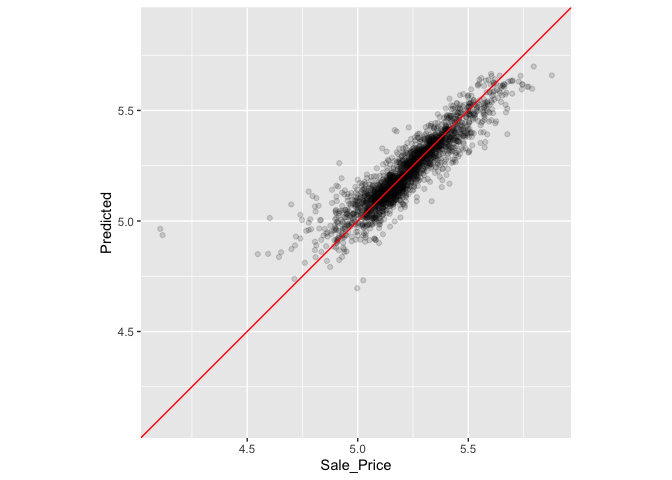

# Chapter 10
## Resampling for Evaluating Performance

There is a gap between our need to measure peformance reliably and the data splits (training and testing) we have available. Typically, we can't decide on which final model ot use with the test set before first assessing model performance.

### 10.1 The Resubstitution Approach

When we measure performance on the same data that we used for training, we say we have resubstituted the date. 

Loading in the Ames data analysis from section 8.8


```r
library(tidymodels)
```

```
## ── Attaching packages ────────────────────────────────────── tidymodels 1.1.1 ──
```

```
## ✔ broom        1.0.5     ✔ recipes      1.0.8
## ✔ dials        1.2.0     ✔ rsample      1.2.0
## ✔ dplyr        1.1.3     ✔ tibble       3.2.1
## ✔ ggplot2      3.4.4     ✔ tidyr        1.3.0
## ✔ infer        1.0.5     ✔ tune         1.1.2
## ✔ modeldata    1.2.0     ✔ workflows    1.1.3
## ✔ parsnip      1.1.1     ✔ workflowsets 1.0.1
## ✔ purrr        1.0.2     ✔ yardstick    1.2.0
```

```
## ── Conflicts ───────────────────────────────────────── tidymodels_conflicts() ──
## ✖ purrr::discard() masks scales::discard()
## ✖ dplyr::filter()  masks stats::filter()
## ✖ dplyr::lag()     masks stats::lag()
## ✖ recipes::step()  masks stats::step()
## • Dig deeper into tidy modeling with R at https://www.tmwr.org
```

```r
data(ames)
ames <- mutate(ames, Sale_Price = log10(Sale_Price))

set.seed(502)
ames_split <- initial_split(ames, prop = 0.80, strata = Sale_Price)
ames_train <- training(ames_split)
ames_test  <-  testing(ames_split)

ames_rec <- 
  recipe(Sale_Price ~ Neighborhood + Gr_Liv_Area + Year_Built + Bldg_Type + 
           Latitude + Longitude, data = ames_train) %>%
  step_log(Gr_Liv_Area, base = 10) %>% 
  step_other(Neighborhood, threshold = 0.01) %>% 
  step_dummy(all_nominal_predictors()) %>% 
  step_interact( ~ Gr_Liv_Area:starts_with("Bldg_Type_") ) %>% 
  step_ns(Latitude, Longitude, deg_free = 20)
  
lm_model <- linear_reg() %>% set_engine("lm")

lm_wflow <- 
  workflow() %>% 
  add_model(lm_model) %>% 
  add_recipe(ames_rec)

lm_fit <- fit(lm_wflow, ames_train)
```

Can also fit a random forests model. Random forests are a tree ensemble method that operates by creating a large number of decision trees from slightly different versions of the training set. This collection of trees makes up the ensemble. When predicting a new sample, each ensemble member makes a separate prediction. These are averaged to create the final ensemble prediction for the new data point. 

We can fit a random forest to the training set via the "ranger" engine, which uses the ranger R package for computation. this model requires no preprocessing.


```r
library(parsnip)
library(ranger)
rf_model <- 
  rand_forest(trees = 1000) %>% 
  set_engine("ranger") %>% 
  set_mode("regression")

rf_wflow <- 
  workflow() %>% 
  add_formula(
    Sale_Price ~ Neighborhood + Gr_Liv_Area + Year_Built + Bldg_Type + 
      Latitude + Longitude) %>% 
  add_model(rf_model) 

rf_fit <- rf_wflow %>% fit(data = ames_train)
```

How should we compare the linear and random forest models? For demonstration, we will predict the training set to produce what is known as an apparent metric or resubstitution metric. This function creates the predictions and formats the results:


```r
estimate_perf <- function(model, dat) {
  # Capture the names of the `model` and `dat` objects
  cl <- match.call()
  obj_name <- as.character(cl$model)
  data_name <- as.character(cl$dat)
  data_name <- gsub("ames_", "", data_name)
  
  # Estimate these metrics:
  reg_metrics <- metric_set(rmse, rsq)
  
  model %>%
    predict(dat) %>%
    bind_cols(dat %>% select(Sale_Price)) %>%
    reg_metrics(Sale_Price, .pred) %>%
    select(-.estimator) %>%
    mutate(object = obj_name, data = data_name)
}
```

Both RMSE and R-squared are computer. The resubstitution statistics are:


```r
estimate_perf(rf_fit, ames_train)
```

```
## # A tibble: 2 × 4
##   .metric .estimate object data 
##   <chr>       <dbl> <chr>  <chr>
## 1 rmse       0.0365 rf_fit train
## 2 rsq        0.960  rf_fit train
```

```r
estimate_perf(lm_fit, ames_train)
```

```
## # A tibble: 2 × 4
##   .metric .estimate object data 
##   <chr>       <dbl> <chr>  <chr>
## 1 rmse       0.0754 lm_fit train
## 2 rsq        0.816  lm_fit train
```

Based on the results, the random forest is much more capable of predicting the sale prices; the RMSE estimate is two-fold better than linear regression, on the log scale, its RMSE is about half as large. 

The next step applies the random forest model to the teest set for final verification:


```r
estimate_perf(rf_fit, ames_test)
```

```
## # A tibble: 2 × 4
##   .metric .estimate object data 
##   <chr>       <dbl> <chr>  <chr>
## 1 rmse       0.0704 rf_fit test 
## 2 rsq        0.852  rf_fit test
```

The test set RMSE estimate is much worse than the training set. Many predictive models are capable of learning complex trens from the data. In statistics, these are commonly referred to as low bias models. 
In this context, bias is the difference between the true pattern or relationships in data and the types of patterns that the model can emulate. Low bias models meaning they can reproduce complex relationships.

For a low bias model, the high degree of predictive capacity can sometimes result in the model nearly memorizing the training set data. For random forest, repredicting the training set will always result in an artificially optimistic estimate of performance. 

The linear regression model is consistent between training and testing, because of its limited complexity.

If the test set should not be used immediately, and repredicting the training set is a bad idea, what should be done? Resampling methods, such as cross-validation or validation sets, are the solution.

### 10.2 Resampling Methods
Resampling methods are empirical simulation systems that emulate the process of using some data for modeling and different data for evaluation. Most resampling methods are iterative, meaning that this process is repeated multiple times. 

Resampling is conducted only on the training set. For each iteration of resampling, the data are partitioned into two subsamples:

1. the model is fit with the analysis set
2. the model is evaluated with the assessment set

The two subsamples are somewhat analogous to training and test sets. Our language of analysis and assessment avoids confusion with the initial split of the data. The partitioning scheme used to create the analysis and assessment sets is usually the defining characteristic of the method.

Suppose 20 iterations of resampling are conducted. This means that 20 separate models are fit on the analysis sets, and the corresponding assessment sets produce 20 sets of performance statistics. The final estimate of performance for a model is the average of the 20 replicates of the statistics. This average has very good generaliztion properities and is far better than the resubstitution estimates. 

#### 10.2.1 Cross-validation
The most common cross-validation method is V-fold cross-validation. The data are randomly partitioned into V sets of roughly equal size (called the folds). Stratified sampling is also an option for assigning folds. For each iteration, one fold is held out for assessment statistics and the remaining folds are substrate for the model. The final resampling estimate of performance averages each of the V replicates. In practice, values of V are most often 5 or 10, 10 is preferred because it is large enough for good results in most situations.

Smaller values of V have large bias but low variance. 10-fold is preferred since noise is reduced by replication, but bias is not. 

The primary input is the training set data frame as well as the number of folds (defaulting to 10).


```r
set.seed(1001)
ames_folds <- vfold_cv(ames_train, v = 10)
ames_folds
```

```
## #  10-fold cross-validation 
## # A tibble: 10 × 2
##    splits             id    
##    <list>             <chr> 
##  1 <split [2107/235]> Fold01
##  2 <split [2107/235]> Fold02
##  3 <split [2108/234]> Fold03
##  4 <split [2108/234]> Fold04
##  5 <split [2108/234]> Fold05
##  6 <split [2108/234]> Fold06
##  7 <split [2108/234]> Fold07
##  8 <split [2108/234]> Fold08
##  9 <split [2108/234]> Fold09
## 10 <split [2108/234]> Fold10
```
The column named splits contains the information on how to split the data. The print method inside of the tibble shows the frequency of samples in analysis and samples in each particular assessment set. These objects also contain a character column called id that labels the partition.

To manually retrieve the partitioned data, the analysis() and assessment() functions return the corresponding data frames.


```r
# For the first fold:
ames_folds$splits[[1]] %>% analysis() %>% dim()
```

```
## [1] 2107   74
```

There are a variety of cross-validation variations.

##### repeated cross-validation
The most important variation on cross-validation is repeated V-fold cross-validation. Depending on data size or other characteristics, the resampling estimate produced by V-fold may be excessively noisy. As with many statistical problems, one way to reduce noise is to gather more data. For cross-validation, this means averaging more than V statistics.

To create R repeats of V-fold cross-validation, the same fold generation process is done R times to generate R collections of V partitions. Now, instead of averaging V statistics, V x R statistics produce the final resampling estimate. Due to the central limit theorem, the summary statistics from each model tend toward a normal distribution, as long as we have a lot of data relative to V x R.

For the Ames data, on average, 10-fold cross-validation uses assessment sets that contain roughly 234 properties. If RMSE is that statistic of choice, we can denote that estimate's standard deviation as sigma. With simple 10-fold cross-validation, the standard error of the mean RMSE is sigma/square root of 10. If this is too noisy, repeats reduce the standard error to sigma/square root of 10R. R is number of replicates.

To create repeats, invoke vfold_cv() with an additional argument repeats:


```r
vfold_cv(ames_train, v = 10, repeats = 5)
```

```
## #  10-fold cross-validation repeated 5 times 
## # A tibble: 50 × 3
##    splits             id      id2   
##    <list>             <chr>   <chr> 
##  1 <split [2107/235]> Repeat1 Fold01
##  2 <split [2107/235]> Repeat1 Fold02
##  3 <split [2108/234]> Repeat1 Fold03
##  4 <split [2108/234]> Repeat1 Fold04
##  5 <split [2108/234]> Repeat1 Fold05
##  6 <split [2108/234]> Repeat1 Fold06
##  7 <split [2108/234]> Repeat1 Fold07
##  8 <split [2108/234]> Repeat1 Fold08
##  9 <split [2108/234]> Repeat1 Fold09
## 10 <split [2108/234]> Repeat1 Fold10
## # ℹ 40 more rows
```

##### Leave-one-out cross-validation
If there are n training set samples, n models are fit using n-1 rows of the training set. Each model predicts the single excluded data point. At the end of resampling, the n predictions are pooled to produced a singal performance statistic. 

Leave-one-out methods are deficient compared to almost any other method. For anything but pathologically small samples, LOO is computationally excessive, adn it may not have good statistical properties. 

##### Monte Carlo cross-validation
Like V-fold cross-validation, it allocates a fixed proportion of data to the assessment sets. The difference between MCCV and regular cross-validation is that, for MCCV, this proportion of the data is randomly selected each time. This results in assessment sets that are not mutually exclusive. To create these resampling objects:


```r
mc_cv(ames_train, prop = 9/10, times = 20)
```

```
## # Monte Carlo cross-validation (0.9/0.1) with 20 resamples  
## # A tibble: 20 × 2
##    splits             id        
##    <list>             <chr>     
##  1 <split [2107/235]> Resample01
##  2 <split [2107/235]> Resample02
##  3 <split [2107/235]> Resample03
##  4 <split [2107/235]> Resample04
##  5 <split [2107/235]> Resample05
##  6 <split [2107/235]> Resample06
##  7 <split [2107/235]> Resample07
##  8 <split [2107/235]> Resample08
##  9 <split [2107/235]> Resample09
## 10 <split [2107/235]> Resample10
## 11 <split [2107/235]> Resample11
## 12 <split [2107/235]> Resample12
## 13 <split [2107/235]> Resample13
## 14 <split [2107/235]> Resample14
## 15 <split [2107/235]> Resample15
## 16 <split [2107/235]> Resample16
## 17 <split [2107/235]> Resample17
## 18 <split [2107/235]> Resample18
## 19 <split [2107/235]> Resample19
## 20 <split [2107/235]> Resample20
```

#### 10.2.2 Validation Sets
A validation set is a single partition that is set aside to estimate performance separate from the test set. The initial available data set is split into a training set, a validation set, and a test set. Often used when the original pool of data is very large. 

With the rsample package, a validation set is like any other resampling object; this type is different only in that is has a single iteration. 

The function validation_set() can take the results of initial_validation_split() and convert it to a rset object that is similar to the ones produced by functions such as vfold_cv().


```r
# Previously:

set.seed(52)
# To put 60% into training, 20% in validation, and 20% in testing:
ames_val_split <- initial_validation_split(ames, prop = c(0.6, 0.2))
ames_val_split
```

```
## <Training/Validation/Testing/Total>
## <1758/586/586/2930>
```

```r
# Object used for resampling: 
val_set <- validation_set(ames_val_split)
val_set
```

```
## # A tibble: 1 × 2
##   splits             id        
##   <list>             <chr>     
## 1 <split [1758/586]> validation
```

#### 10.2.3 Bootstrapping
Bootstrap resampling was originally invented as a method for approximating the sampling distribution of statistics whose theoretical properties are intractable. Using it to estimate model performance is secondary application of the method.

A bootstrap sample of the training set is a sample that is the same size as the training set but is drawn with replacement. This means that some training set data points are selected multiple times for the analysis set. When bootstrapping, the assessment set is often called the out-of-bag sample. 

Using the rsample package, we can create such bootstrap resamples:


```r
bootstraps(ames_train, times = 5)
```

```
## # Bootstrap sampling 
## # A tibble: 5 × 2
##   splits             id        
##   <list>             <chr>     
## 1 <split [2342/867]> Bootstrap1
## 2 <split [2342/869]> Bootstrap2
## 3 <split [2342/859]> Bootstrap3
## 4 <split [2342/858]> Bootstrap4
## 5 <split [2342/873]> Bootstrap5
```

Bootstrap samples produce performance estimates that have very low variance but have significant pessimistic bias. This means that, if the true accuracy of a model is 90%, the bootstrap would tend to estimate the value to be less than 90%. The amount of bias changes over the scale of the performance metric. For example, the bias is likely to be different when the accuracy is 90% versus when it is 70%.

The bootstrap is also used inside of many models. For example, the random forest model mentioned earlier contained 1,000 individual decision trees. Each tree was the product of a different bootstrap sample of the training set. 

#### 10.2.4 Rolling forecasting origin resampling
When the data have a strong time component, a resampling method should support modeling to estimate seasonal and other temporal trends within the data. A technique that randomly samples values from the training set can disrupt the model's ability to estimate these patterns. 

Rolling forecast origin resampling provides a method that emulates how time series data is often partitioned in practice, estimating the model with historical data and evaluating it with the most recent data. For this type of resampling, the size of the initial analysis and assessment sets are specified. The first iteration of resampling uses these sizes, starting from the beginning of the series. The second iteration uses the same data sizes but shifts over by a set number of samples.

Here are two different configurations of this method:

* The analysis set can cumulatively grow (as opposed to remaining the same size). After the first initial analysis set, new samples can accrue without discarding the earlier data.
* The resamples need not increment by one. For example, for large data sets, the incremental block could be a week or month instead of a day.

For a year's worth of data, support that size sets of 30-day blocks define the analysis set. For assessment sets of 30 days with a 29-day skip, we can use the rsample package to specify:


```r
time_slices <- 
  tibble(x = 1:365) %>% 
  rolling_origin(initial = 6 * 30, assess = 30, skip = 29, cumulative = FALSE)

data_range <- function(x) {
  summarize(x, first = min(x), last = max(x))
}

map_dfr(time_slices$splits, ~   analysis(.x) %>% data_range())
```

```
## # A tibble: 6 × 2
##   first  last
##   <int> <int>
## 1     1   180
## 2    31   210
## 3    61   240
## 4    91   270
## 5   121   300
## 6   151   330
```

```r
map_dfr(time_slices$splits, ~ assessment(.x) %>% data_range())
```

```
## # A tibble: 6 × 2
##   first  last
##   <int> <int>
## 1   181   210
## 2   211   240
## 3   241   270
## 4   271   300
## 5   301   330
## 6   331   360
```
### 10.3 Estimating Peformance
To reiterate, the process to use resampling is:

1. During resampling, the analysis set is used to preprocess the data, apply the preprocessing to itself, and use these processed data to fit the model.
2. The preprocessing statistics produced by the analysis set are applied to the assessment set. The predictions from the assessment set estimate peformance on new data. 

This sequence repeats for every resample. If there are B resamples, there are B replicates of each of the performance metrics. The final resampling estimate is the average of these B statistics. If B=1, as with a validation set, the individual statistics represent overall performance.

Let's reconsider the previous random forest. The fit_resamples() function is analogous to fit(), but instead of having a data argument, fit_resamples() has resamples, which expects an rset object like the ones shown in this chapter. The possible interfaces to the function are:


```r
model_spec %>% fit_resamples(formula,  resamples, ...)
model_spec %>% fit_resamples(recipe,   resamples, ...)
workflow   %>% fit_resamples(          resamples, ...)
```

There are a number of other optional arguments, such as:

* metrics: a metric set of performance statistics to compute. By default, regression models use RMSE and R-squared while classification models compute the area under the ROC curve and overall accuracy. 
* control: a list created by control_resamples() with various options. 

The controls arguments include:

* verbose: a logical for printing logging
* extract: a function for retaining objects from each model iteration
* save_pred: a logical for saving the assessment set predictions.

For our example, let's save the predictions in order to visualize the model fit and residuals:


```r
keep_pred <- control_resamples(save_pred = TRUE, save_workflow = TRUE)

set.seed(1003)
rf_res <- 
  rf_wflow %>% 
  fit_resamples(resamples = ames_folds, control = keep_pred)
rf_res
```

```
## # Resampling results
## # 10-fold cross-validation 
## # A tibble: 10 × 5
##    splits             id     .metrics         .notes           .predictions
##    <list>             <chr>  <list>           <list>           <list>      
##  1 <split [2107/235]> Fold01 <tibble [2 × 4]> <tibble [0 × 3]> <tibble>    
##  2 <split [2107/235]> Fold02 <tibble [2 × 4]> <tibble [0 × 3]> <tibble>    
##  3 <split [2108/234]> Fold03 <tibble [2 × 4]> <tibble [0 × 3]> <tibble>    
##  4 <split [2108/234]> Fold04 <tibble [2 × 4]> <tibble [0 × 3]> <tibble>    
##  5 <split [2108/234]> Fold05 <tibble [2 × 4]> <tibble [0 × 3]> <tibble>    
##  6 <split [2108/234]> Fold06 <tibble [2 × 4]> <tibble [0 × 3]> <tibble>    
##  7 <split [2108/234]> Fold07 <tibble [2 × 4]> <tibble [0 × 3]> <tibble>    
##  8 <split [2108/234]> Fold08 <tibble [2 × 4]> <tibble [0 × 3]> <tibble>    
##  9 <split [2108/234]> Fold09 <tibble [2 × 4]> <tibble [0 × 3]> <tibble>    
## 10 <split [2108/234]> Fold10 <tibble [2 × 4]> <tibble [0 × 3]> <tibble>
```

The return value is a tibble similar to the input resamples, along with some extra columns:

* .metrics is a list column of tibbles containing the assessment set performance statistics.
* .notes is another list column of tibbles cataloging any warnings or errors generated during resampling. Note that errors will not stop subsequent execution of resampling.
* .predictions is present when save_pred = TRUE. This list column contains tibbles with the out-of-sample predictions.

These columns can be easily reconfigured using tidyr or with convenience functions that tidymodels provides. For example, to return the performance metrics in a more usable format:


```r
collect_metrics(rf_res)
```

```
## # A tibble: 2 × 6
##   .metric .estimator   mean     n std_err .config             
##   <chr>   <chr>       <dbl> <int>   <dbl> <chr>               
## 1 rmse    standard   0.0721    10 0.00306 Preprocessor1_Model1
## 2 rsq     standard   0.832     10 0.0108  Preprocessor1_Model1
```
These are the resampling estimates averaged over the individual replicates. To get the metrics for each resample, use the option summarize = FALSE

To obtain the assessment set predictions:

```r
assess_res <- collect_predictions(rf_res)
assess_res
```

```
## # A tibble: 2,342 × 5
##    id     .pred  .row Sale_Price .config             
##    <chr>  <dbl> <int>      <dbl> <chr>               
##  1 Fold01  5.10    10       5.09 Preprocessor1_Model1
##  2 Fold01  4.92    27       4.90 Preprocessor1_Model1
##  3 Fold01  5.20    47       5.08 Preprocessor1_Model1
##  4 Fold01  5.13    52       5.10 Preprocessor1_Model1
##  5 Fold01  5.13    59       5.10 Preprocessor1_Model1
##  6 Fold01  5.13    63       5.11 Preprocessor1_Model1
##  7 Fold01  4.87    65       4.91 Preprocessor1_Model1
##  8 Fold01  4.98    66       5.04 Preprocessor1_Model1
##  9 Fold01  4.91    67       4.84 Preprocessor1_Model1
## 10 Fold01  4.92    68       5.01 Preprocessor1_Model1
## # ℹ 2,332 more rows
```
For some resampling methods, such as bootstrap or repeated cross-validation, there will be multiple predictions per row of the original training set. To obtain summarized values (average of the replicate predictions) use collect_predictions(object, summarize = TRUE).

Since this analysis used 10-fold cross-validation, there is one unique prediction for each trainign set sample. These data can generate helpful plots of the model to understand where it potentially failed. 


```r
assess_res %>% 
  ggplot(aes(x = Sale_Price, y = .pred)) + 
  geom_point(alpha = .15) +
  geom_abline(color = "red") + 
  coord_obs_pred() + 
  ylab("Predicted")
```

<!-- -->
There are two houses in the training set with a low observed sale price that are significantly overpredicted by the model. Let's find out which houses these are:


```r
over_predicted <- 
  assess_res %>% 
  mutate(residual = Sale_Price - .pred) %>% 
  arrange(desc(abs(residual))) %>% 
  slice(1:2)
over_predicted
```

```
## # A tibble: 2 × 6
##   id     .pred  .row Sale_Price .config              residual
##   <chr>  <dbl> <int>      <dbl> <chr>                   <dbl>
## 1 Fold09  4.96    32       4.11 Preprocessor1_Model1   -0.857
## 2 Fold08  4.94   317       4.12 Preprocessor1_Model1   -0.819
```

```r
ames_train %>% 
  slice(over_predicted$.row) %>% 
  select(Gr_Liv_Area, Neighborhood, Year_Built, Bedroom_AbvGr, Full_Bath)
```

```
## # A tibble: 2 × 5
##   Gr_Liv_Area Neighborhood           Year_Built Bedroom_AbvGr Full_Bath
##         <int> <fct>                       <int>         <int>     <int>
## 1         832 Old_Town                     1923             2         1
## 2         733 Iowa_DOT_and_Rail_Road       1952             2         1
```
How can we use a validation set instead of cross-validation? From our previous rsample object:


```r
val_res <- rf_wflow %>% fit_resamples(resamples = val_set)
```

```
## Warning in `[.tbl_df`(x, is.finite(x <- as.numeric(x))): NAs introduced by
## coercion
```

```r
val_res
```

```
## # Resampling results
## #  
## # A tibble: 1 × 4
##   splits             id         .metrics         .notes          
##   <list>             <chr>      <list>           <list>          
## 1 <split [1758/586]> validation <tibble [2 × 4]> <tibble [0 × 3]>
```

```r
collect_metrics(val_res)
```

```
## # A tibble: 2 × 6
##   .metric .estimator   mean     n std_err .config             
##   <chr>   <chr>       <dbl> <int>   <dbl> <chr>               
## 1 rmse    standard   0.0725     1      NA Preprocessor1_Model1
## 2 rsq     standard   0.824      1      NA Preprocessor1_Model1
```

### 10.4 Parallel Processing
The models created during resampling are independent of one another. Computations of this kind are sometimes called embarrassingly parallel; each model could be fit simultaneously without issues. The une package uses the foreach package to facilitate parallel computations. These computations could be split across processors on the same computer or across different computers, depending ont he chosen technology. 

For computations conducted on a single computer, the number of possible worker processes is determined by the parallel package.


```r
# The number of physical cores in the hardware:
parallel::detectCores(logical = FALSE)
```

```
## [1] 8
```

```r
# The number of possible independent processes that can be simultaneously used:  
parallel::detectCores(logical = TRUE)
```

```
## [1] 8
```

The difference beween these two values is realted to the computer's processor. For example, most Intel processors use hyperthreading, which creates two virtual cores for each physical core. Most of the spped-ups produced by parallel processing occur when processing uses fewer than the number of physical cores. 

For fit_resamples() and other functions in tune, parallel processing occurs when the user registers a parallele backend package. These R packages define how to exectue parallel processing. On Unix and macOS operating systems, one method of splitting computations is by forking threads. To enable this, load the doMC package and register the number of parallel cores with foreach:


```r
# Unix and macOS only
library(doMC)
```

```
## Loading required package: foreach
```

```
## 
## Attaching package: 'foreach'
```

```
## The following objects are masked from 'package:purrr':
## 
##     accumulate, when
```

```
## Loading required package: iterators
```

```
## Loading required package: parallel
```

```r
registerDoMC(cores = 2)
```

This instructs fit_resamples() to run half of the computation on each of two cores. To reset the computations to sequential processing:


```r
registerDoSEQ()
```

Alternatively, a different approach to parallelizing computations uses network sockets. The doParallel package enables this method.


```r
# All operating systems
library(doParallel)

# Create a cluster object and then register: 
cl <- makePSOCKcluster(2)
registerDoParallel(cl)

# Now run fit_resamples()`...

stopCluster(cl)
```

### 10.5 Saving the Resampled Objects
The models created during resampling are not retained. There is a method for keeping them or soem of their components. The extract option of control_resamples() specifies a function that takes a single argument; we'll use X. When executed, X results in a fitted workflow object, regardless of whether you provided fit_resamples() with a workflow. 

Let's fit a linear regression model using the recipe developed in Chapter 8.


```r
ames_rec <- 
  recipe(Sale_Price ~ Neighborhood + Gr_Liv_Area + Year_Built + Bldg_Type + 
           Latitude + Longitude, data = ames_train) %>%
  step_other(Neighborhood, threshold = 0.01) %>% 
  step_dummy(all_nominal_predictors()) %>% 
  step_interact( ~ Gr_Liv_Area:starts_with("Bldg_Type_") ) %>% 
  step_ns(Latitude, Longitude, deg_free = 20)

lm_wflow <-  
  workflow() %>% 
  add_recipe(ames_rec) %>% 
  add_model(linear_reg() %>% set_engine("lm")) 

lm_fit <- lm_wflow %>% fit(data = ames_train)

# Select the recipe: 
extract_recipe(lm_fit, estimated = TRUE)
```

```
## 
```

```
## ── Recipe ──────────────────────────────────────────────────────────────────────
```

```
## 
```

```
## ── Inputs
```

```
## Number of variables by role
```

```
## outcome:   1
## predictor: 6
```

```
## 
```

```
## ── Training information
```

```
## Training data contained 2342 data points and no incomplete rows.
```

```
## 
```

```
## ── Operations
```

```
## • Collapsing factor levels for: Neighborhood | Trained
```

```
## • Dummy variables from: Neighborhood, Bldg_Type | Trained
```

```
## • Interactions with: Gr_Liv_Area:(Bldg_Type_TwoFmCon + Bldg_Type_Duplex +
##   Bldg_Type_Twnhs + Bldg_Type_TwnhsE) | Trained
```

```
## • Natural splines on: Latitude, Longitude | Trained
```
We can save the linear model coefficients for a fitted model object from a workflow:


```r
get_model <- function(x) {
  extract_fit_parsnip(x) %>% tidy()
}

get_model(lm_fit)
```

```
## # A tibble: 73 × 5
##    term                             estimate  std.error statistic   p.value
##    <chr>                               <dbl>      <dbl>     <dbl>     <dbl>
##  1 (Intercept)                      1.54     0.298         5.16   2.61e-  7
##  2 Gr_Liv_Area                      0.000163 0.00000446   36.4    2.81e-229
##  3 Year_Built                       0.00177  0.000140     12.6    1.93e- 35
##  4 Neighborhood_College_Creek       0.00125  0.0350        0.0357 9.72e-  1
##  5 Neighborhood_Old_Town           -0.0718   0.0129       -5.55   3.18e-  8
##  6 Neighborhood_Edwards            -0.0957   0.0293       -3.27   1.09e-  3
##  7 Neighborhood_Somerset            0.0944   0.0199        4.74   2.31e-  6
##  8 Neighborhood_Northridge_Heights  0.158    0.0363        4.36   1.37e-  5
##  9 Neighborhood_Gilbert             0.0285   0.0330        0.864  3.88e-  1
## 10 Neighborhood_Sawyer             -0.0967   0.0275       -3.52   4.36e-  4
## # ℹ 63 more rows
```

Now let's apply this function to the ten resampled fits. The results of the extraction function is wrapped in the list object and returned in a tibble:


```r
registerDoSEQ()
ctrl <- control_resamples(extract = get_model)
lm_res <- lm_wflow %>%  fit_resamples(resamples = ames_folds, control = ctrl)
lm_res
```

```
## # Resampling results
## # 10-fold cross-validation 
## # A tibble: 10 × 5
##    splits             id     .metrics         .notes           .extracts       
##    <list>             <chr>  <list>           <list>           <list>          
##  1 <split [2107/235]> Fold01 <tibble [2 × 4]> <tibble [0 × 3]> <tibble [1 × 2]>
##  2 <split [2107/235]> Fold02 <tibble [2 × 4]> <tibble [0 × 3]> <tibble [1 × 2]>
##  3 <split [2108/234]> Fold03 <tibble [2 × 4]> <tibble [0 × 3]> <tibble [1 × 2]>
##  4 <split [2108/234]> Fold04 <tibble [2 × 4]> <tibble [0 × 3]> <tibble [1 × 2]>
##  5 <split [2108/234]> Fold05 <tibble [2 × 4]> <tibble [0 × 3]> <tibble [1 × 2]>
##  6 <split [2108/234]> Fold06 <tibble [2 × 4]> <tibble [0 × 3]> <tibble [1 × 2]>
##  7 <split [2108/234]> Fold07 <tibble [2 × 4]> <tibble [0 × 3]> <tibble [1 × 2]>
##  8 <split [2108/234]> Fold08 <tibble [2 × 4]> <tibble [0 × 3]> <tibble [1 × 2]>
##  9 <split [2108/234]> Fold09 <tibble [2 × 4]> <tibble [0 × 3]> <tibble [1 × 2]>
## 10 <split [2108/234]> Fold10 <tibble [2 × 4]> <tibble [0 × 3]> <tibble [1 × 2]>
```
Now there is a .extracts column with nested tibbles. 

```r
lm_res$.extracts[[1]]
```

```
## # A tibble: 1 × 2
##   .extracts         .config             
##   <list>            <chr>               
## 1 <tibble [73 × 5]> Preprocessor1_Model1
```

```r
# To get the results
lm_res$.extracts[[1]][[1]]
```

```
## [[1]]
## # A tibble: 73 × 5
##    term                             estimate  std.error statistic   p.value
##    <chr>                               <dbl>      <dbl>     <dbl>     <dbl>
##  1 (Intercept)                      1.48     0.320         4.62   4.11e-  6
##  2 Gr_Liv_Area                      0.000158 0.00000476   33.2    9.72e-194
##  3 Year_Built                       0.00180  0.000149     12.1    1.57e- 32
##  4 Neighborhood_College_Creek      -0.00163  0.0373       -0.0438 9.65e-  1
##  5 Neighborhood_Old_Town           -0.0757   0.0138       -5.47   4.92e-  8
##  6 Neighborhood_Edwards            -0.109    0.0310       -3.53   4.21e-  4
##  7 Neighborhood_Somerset            0.0832   0.0217        3.83   1.33e-  4
##  8 Neighborhood_Northridge_Heights  0.163    0.0401        4.06   5.19e-  5
##  9 Neighborhood_Gilbert             0.0304   0.0367        0.827  4.08e-  1
## 10 Neighborhood_Sawyer             -0.113    0.0291       -3.88   1.07e-  4
## # ℹ 63 more rows
```

This might appear to be a convoluted method for saving the model results. However, extract is flexible and does not assume that the user will only save a single tibble per resample. For example, the tidy() method might be run on the recipe as well as the model. 

For our more simple example, all of the results can be flattened and collected using:


```r
all_coef <- map_dfr(lm_res$.extracts, ~ .x[[1]][[1]])

# Show the replicates for a single predictor:
filter(all_coef, term == "Year_Built")
```

```
## # A tibble: 10 × 5
##    term       estimate std.error statistic  p.value
##    <chr>         <dbl>     <dbl>     <dbl>    <dbl>
##  1 Year_Built  0.00180  0.000149      12.1 1.57e-32
##  2 Year_Built  0.00180  0.000151      12.0 6.45e-32
##  3 Year_Built  0.00185  0.000150      12.3 1.00e-33
##  4 Year_Built  0.00183  0.000147      12.5 1.90e-34
##  5 Year_Built  0.00184  0.000150      12.2 2.47e-33
##  6 Year_Built  0.00180  0.000150      12.0 3.35e-32
##  7 Year_Built  0.00179  0.000149      12.0 3.52e-32
##  8 Year_Built  0.00185  0.000145      12.7 1.47e-35
##  9 Year_Built  0.00158  0.000146      10.8 2.02e-26
## 10 Year_Built  0.00181  0.000148      12.2 3.02e-33
```

### 10.6 Chapter Summary

* Resampling enables us to determine how well the model works without using the test set.
* An important function from the tune package, called fit_resamples(), was introduced.

The data analysis code, so far, for the Ames data is:


```r
library(tidymodels)
data(ames)
ames <- mutate(ames, Sale_Price = log10(Sale_Price))

set.seed(502)
ames_split <- initial_split(ames, prop = 0.80, strata = Sale_Price)
ames_train <- training(ames_split)
ames_test  <-  testing(ames_split)

ames_rec <- 
  recipe(Sale_Price ~ Neighborhood + Gr_Liv_Area + Year_Built + Bldg_Type + 
           Latitude + Longitude, data = ames_train) %>%
  step_log(Gr_Liv_Area, base = 10) %>% 
  step_other(Neighborhood, threshold = 0.01) %>% 
  step_dummy(all_nominal_predictors()) %>% 
  step_interact( ~ Gr_Liv_Area:starts_with("Bldg_Type_") ) %>% 
  step_ns(Latitude, Longitude, deg_free = 20)

lm_model <- linear_reg() %>% set_engine("lm")

lm_wflow <- 
  workflow() %>% 
  add_model(lm_model) %>% 
  add_recipe(ames_rec)

lm_fit <- fit(lm_wflow, ames_train)

rf_model <- 
  rand_forest(trees = 1000) %>% 
  set_engine("ranger") %>% 
  set_mode("regression")

rf_wflow <- 
  workflow() %>% 
  add_formula(
    Sale_Price ~ Neighborhood + Gr_Liv_Area + Year_Built + Bldg_Type + 
      Latitude + Longitude) %>% 
  add_model(rf_model) 

set.seed(1001)
ames_folds <- vfold_cv(ames_train, v = 10)

keep_pred <- control_resamples(save_pred = TRUE, save_workflow = TRUE)

set.seed(1003)
rf_res <- rf_wflow %>% fit_resamples(resamples = ames_folds, control = keep_pred)
```

