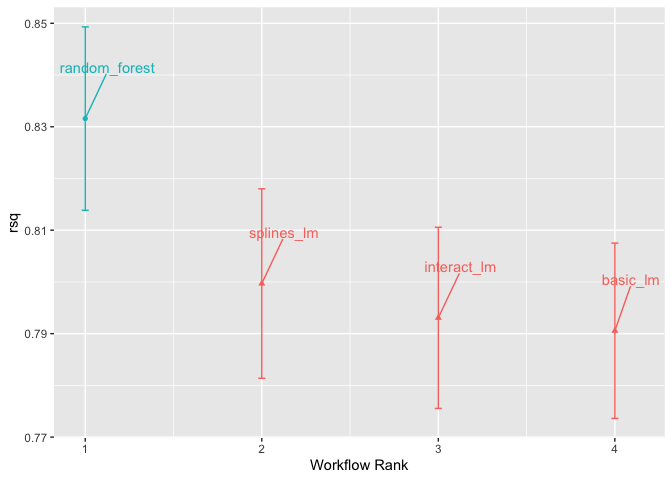
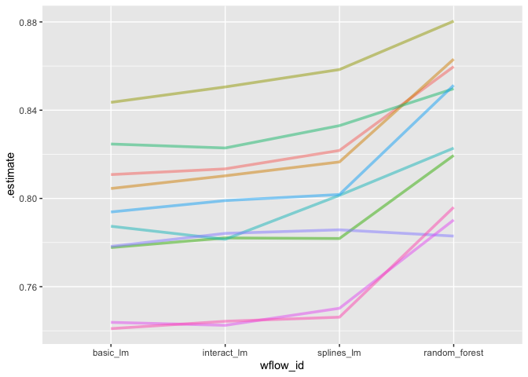
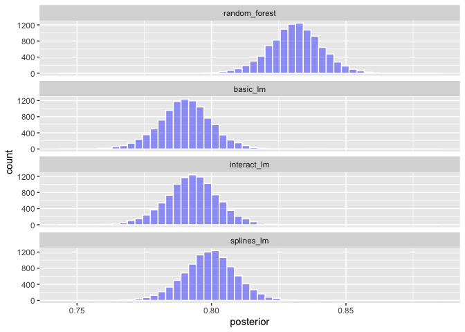
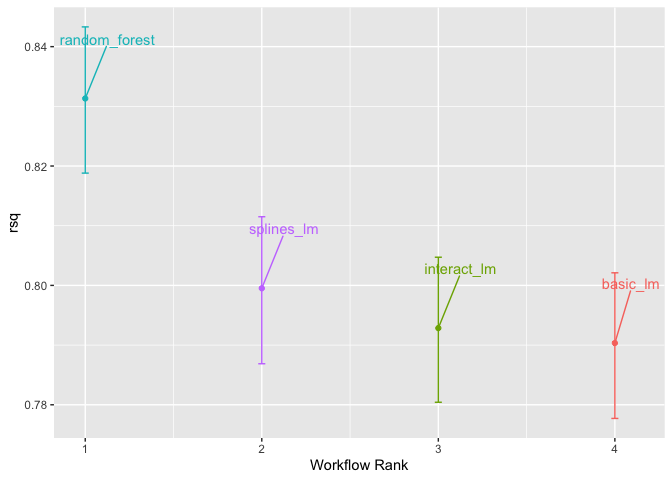
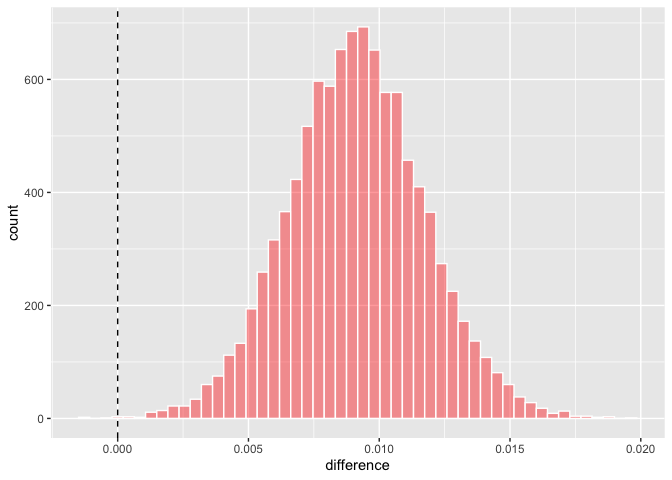
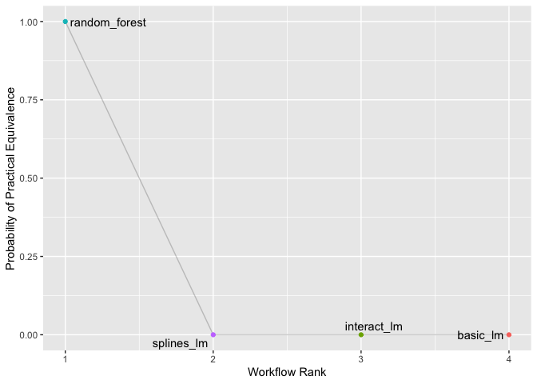

## Comparing Models with Resampling

### 11.1 Creating multiple models with workflow sets
Code from previous chapter


```r
library(tidymodels)
```

```
## ── Attaching packages ────────────────────────────────────── tidymodels 1.1.1 ──
```

```
## ✔ broom        1.0.5     ✔ recipes      1.0.8
## ✔ dials        1.2.0     ✔ rsample      1.2.0
## ✔ dplyr        1.1.3     ✔ tibble       3.2.1
## ✔ ggplot2      3.4.4     ✔ tidyr        1.3.0
## ✔ infer        1.0.5     ✔ tune         1.1.2
## ✔ modeldata    1.2.0     ✔ workflows    1.1.3
## ✔ parsnip      1.1.1     ✔ workflowsets 1.0.1
## ✔ purrr        1.0.2     ✔ yardstick    1.2.0
```

```
## ── Conflicts ───────────────────────────────────────── tidymodels_conflicts() ──
## ✖ purrr::discard() masks scales::discard()
## ✖ dplyr::filter()  masks stats::filter()
## ✖ dplyr::lag()     masks stats::lag()
## ✖ recipes::step()  masks stats::step()
## • Use tidymodels_prefer() to resolve common conflicts.
```

```r
data(ames)
ames <- mutate(ames, Sale_Price = log10(Sale_Price))

set.seed(502)
ames_split <- initial_split(ames, prop = 0.80, strata = Sale_Price)
ames_train <- training(ames_split)
ames_test  <-  testing(ames_split)
```


```r
library(tidymodels)
tidymodels_prefer()

basic_rec <- 
  recipe(Sale_Price ~ Neighborhood + Gr_Liv_Area + Year_Built + Bldg_Type + 
           Latitude + Longitude, data = ames_train) %>%
  step_log(Gr_Liv_Area, base = 10) %>% 
  step_other(Neighborhood, threshold = 0.01) %>% 
  step_dummy(all_nominal_predictors())

interaction_rec <- 
  basic_rec %>% 
  step_interact( ~ Gr_Liv_Area:starts_with("Bldg_Type_") ) 

spline_rec <- 
  interaction_rec %>% 
  step_ns(Latitude, Longitude, deg_free = 50)

preproc <- 
  list(basic = basic_rec, 
       interact = interaction_rec, 
       splines = spline_rec
  )

lm_models <- workflow_set(preproc, list(lm = linear_reg()), cross = FALSE)
lm_models
```

```
## # A workflow set/tibble: 3 × 4
##   wflow_id    info             option    result    
##   <chr>       <list>           <list>    <list>    
## 1 basic_lm    <tibble [1 × 4]> <opts[0]> <list [0]>
## 2 interact_lm <tibble [1 × 4]> <opts[0]> <list [0]>
## 3 splines_lm  <tibble [1 × 4]> <opts[0]> <list [0]>
```

Resample each of these models in turn. Use a purrr-like functon called workflow_map(). This function takes an initial argument of the function apply to the workflows, followed by options to that function. 


```r
set.seed(1001)
ames_folds <- vfold_cv(ames_train, v = 10)

keep_pred <- control_resamples(save_pred = TRUE, save_workflow = TRUE)
```


```r
lm_models <- 
  lm_models %>% 
  workflow_map("fit_resamples", 
               # Options to `workflow_map()`: 
               seed = 1101, verbose = TRUE,
               # Options to `fit_resamples()`: 
               resamples = ames_folds, control = keep_pred)
```

```
## i 1 of 3 resampling: basic_lm
```

```
## ✔ 1 of 3 resampling: basic_lm (516ms)
```

```
## i 2 of 3 resampling: interact_lm
```

```
## ✔ 2 of 3 resampling: interact_lm (573ms)
```

```
## i 3 of 3 resampling: splines_lm
```

```
## ✔ 3 of 3 resampling: splines_lm (1.2s)
```

```r
lm_models
```

```
## # A workflow set/tibble: 3 × 4
##   wflow_id    info             option    result   
##   <chr>       <list>           <list>    <list>   
## 1 basic_lm    <tibble [1 × 4]> <opts[2]> <rsmp[+]>
## 2 interact_lm <tibble [1 × 4]> <opts[2]> <rsmp[+]>
## 3 splines_lm  <tibble [1 × 4]> <opts[2]> <rsmp[+]>
```

There are a few convenience functions for workflow sets, including collect_metrics() to collate the performance statistics. We can filter() to any specific metric we are interested in: 


```r
collect_metrics(lm_models) %>% 
  filter(.metric == "rmse")
```

```
## # A tibble: 3 × 9
##   wflow_id    .config      preproc model .metric .estimator   mean     n std_err
##   <chr>       <chr>        <chr>   <chr> <chr>   <chr>       <dbl> <int>   <dbl>
## 1 basic_lm    Preprocesso… recipe  line… rmse    standard   0.0803    10 0.00264
## 2 interact_lm Preprocesso… recipe  line… rmse    standard   0.0799    10 0.00272
## 3 splines_lm  Preprocesso… recipe  line… rmse    standard   0.0785    10 0.00282
```

We can add the random forest model from the previous chapter to the set by first converting it to its own workflow set then binding rows. This requires that, when the model was resampled, the save_workflow = TRUE option was set in the control function.


```r
rf_model <- 
  rand_forest(trees = 1000) %>% 
  set_engine("ranger") %>% 
  set_mode("regression")

rf_wflow <- 
  workflow() %>% 
  add_formula(
    Sale_Price ~ Neighborhood + Gr_Liv_Area + Year_Built + Bldg_Type + 
      Latitude + Longitude) %>% 
  add_model(rf_model) 

set.seed(1003)
rf_res <- rf_wflow %>% fit_resamples(resamples = ames_folds, control = keep_pred)
```


```r
four_models <- 
  as_workflow_set(random_forest = rf_res) %>% 
  bind_rows(lm_models)
four_models
```

```
## # A workflow set/tibble: 4 × 4
##   wflow_id      info             option    result   
##   <chr>         <list>           <list>    <list>   
## 1 random_forest <tibble [1 × 4]> <opts[0]> <rsmp[+]>
## 2 basic_lm      <tibble [1 × 4]> <opts[2]> <rsmp[+]>
## 3 interact_lm   <tibble [1 × 4]> <opts[2]> <rsmp[+]>
## 4 splines_lm    <tibble [1 × 4]> <opts[2]> <rsmp[+]>
```

The autoplot method, shows confidence intervals for each model in order of fest to worst. This chapter will focus on the coefficient of determination (R-squared) and use metric = "rsq" in the call to set up our plot.


```r
library(ggrepel)
autoplot(four_models, metric = "rsq") +
  geom_text_repel(aes(label = wflow_id), nudge_x = 1/8, nudge_y = 1/100) +
  theme(legend.position = "none")
```

<!-- -->

This plot shows that random forest model is doing the best job and there are minor improvements in the linear models as we add more recipe steps. 

### 11.2 Comparing resampled performance statistics
The difference is small for RMSE and R-squared between linear models, but might be larger than the experimental noise in the system, i.e. considered statistically significant. We can formally test the hypothesis that the additional terms increase R-squared. 

There are some resamples where performance across models tends to be low and others where it tends to be high. In statistics, this is called a resample-to-resample component of variation. To illustrate, let's gather the individual resampling statistics for the linear models and the random forest. We will focus on the R-squared statistic which measures correlation between the observed and predicted sale prices for each house. Let's filter() to keep only the R-squared, reshape the results, and compute how the metrics are correlated with each other. 


```r
library(corrr)
rsq_indiv_estimates <- 
  collect_metrics(four_models, summarize = FALSE) %>% 
  filter(.metric == "rsq") 

rsq_wider <- 
  rsq_indiv_estimates %>% 
  select(wflow_id, .estimate, id) %>% 
  pivot_wider(id_cols = "id", names_from = "wflow_id", values_from = ".estimate")

corrr::correlate(rsq_wider %>% select(-id), quiet = TRUE)
```

```
## # A tibble: 4 × 5
##   term          random_forest basic_lm interact_lm splines_lm
##   <chr>                 <dbl>    <dbl>       <dbl>      <dbl>
## 1 random_forest        NA        0.876       0.878      0.879
## 2 basic_lm              0.876   NA           0.993      0.997
## 3 interact_lm           0.878    0.993      NA          0.987
## 4 splines_lm            0.879    0.997       0.987     NA
```

The correlations are high and indicate that across models, there are large within-resample correlations. 


```r
rsq_indiv_estimates %>% 
  mutate(wflow_id = reorder(wflow_id, .estimate)) %>% 
  ggplot(aes(x = wflow_id, y = .estimate, group = id, color = id)) + 
  geom_line(alpha = .5, linewidth = 1.25) + 
  theme(legend.position = "none")
```

<!-- -->

If the resample-to-resample effect was not real, there would not be any parallel lines. A statistical test for the correlations evaluates whethere the magnitude of these correlations are not simply noise. For the linear models:


```r
rsq_wider %>% 
  with( cor.test(basic_lm, splines_lm) ) %>% 
  tidy() %>% 
  select(estimate, starts_with("conf"))
```

```
## # A tibble: 1 × 3
##   estimate conf.low conf.high
##      <dbl>    <dbl>     <dbl>
## 1    0.997    0.987     0.999
```

The results of the correlation test (the estimate of the correlation and the confidence intervals) show us that the within-resample correlation appears to be real. 

What effect does the extra correlation have on our analysis? Consider the variance of a difference of two variables. The last term, 2Cov[X,Y], is the covariance between two items. If there is a significant positive covariance, then any statistical test of this difference would be critically underpowered comparing the difference in two models. In other words, ignoring the resample-to-resample effect would bias our model comparisons towards finding no differences between models.

It can be helpful to define a relevant practical effect size. Since these analyses focus on the R-squared statistics, the practice effect size is the change in R-squared that we would consider to be a realistic difference that matters. For example, we might think that two models are not practically different if their R-squared values are within +-2%. If this were the case, differences smaller than 2% are not deemed important even if they are statistically significant. Practical significance is subjective. 

### 11.3 Simple hypothesis testing methods

We can use simple hypothesis testing to make formal comparisons between models. In our specific situation, the ANOVA can make model comparisons. Suppose the individual resample R-square statistics serve as the outcome data (i.e. the yij) and the models as the predictors in the ANOVA model. From these model parameters, hypothesis tests are p-values are gneerated to statistically compare models, but we must content with how to handle the resample-to-reample effect. Resample effects can be included as random effects. 

A simple and fast method for comparing two models at a time is to use the differences in R-square value as the otcome data int he ANOVA model. Since the outcomes are matched by resample, the differences do not contain the resample-to-resample effect and, for this reason, the standard ANOVA model is appropriate. 


```r
compare_lm <- 
  rsq_wider %>% 
  mutate(difference = splines_lm - basic_lm)

lm(difference ~ 1, data = compare_lm) %>% 
  tidy(conf.int = TRUE) %>% 
  select(estimate, p.value, starts_with("conf"))
```

```
## # A tibble: 1 × 4
##   estimate   p.value conf.low conf.high
##      <dbl>     <dbl>    <dbl>     <dbl>
## 1  0.00913 0.0000256  0.00650    0.0118
```

```r
# Alternatively, a paired t-test could also be used: 
rsq_wider %>% 
  with( t.test(splines_lm, basic_lm, paired = TRUE) ) %>%
  tidy() %>% 
  select(estimate, p.value, starts_with("conf"))
```

```
## # A tibble: 1 × 4
##   estimate   p.value conf.low conf.high
##      <dbl>     <dbl>    <dbl>     <dbl>
## 1  0.00913 0.0000256  0.00650    0.0118
```

We could evaluate each pair-wise difference in this way. Note that the p-value indicates a statistically significant signal; the collection of spline terms for longitude and latitude do appear to have an effect. However, the difference in R-square is estimated at 0.91%. If our practical effect size were 2%, we might not consider these terms worth including in the model.

What are p-values? From Wasserstein and Lazar (2016): "Informally, a p-value is the probability under a specified statistical model that a statistical summary of the data (e.g. the sample mean difference between two compared groups) would be equal to or more extreme than its observed value." In other words, if this analysis were repeated a large number of times under the null hypothesis of no difference, the p-value reflects how extreme our observed results would be in comparison.

### 11.4 Bayesian Methods

We can take a more general approach to making formal comparisons using random effects and Bayesian statistics. The model is more complex than ANOVA, but the interpretation is more simple and straight forward than the p-value approach. 

In the ANOVA, the residuals are assumed to be independent and follow a Gaussian distribution with zero mean and constant standard deviation of sigma. From this assumption, statistical theory shows that the estimated regression parameters follow a multivariate Gaussian distribution and, from this, p-values and confidence intervals are derived. 

A Bayesian linear model makes additional assumptions. In addition to specifying a distribution for the residuals, we require prior distribution specifications for the model parameters Betaj and sigma. These are distributions for the parameters that the model assumes before being exposed to the observed data. 

These priors set the possible/probable ranges of the model parameters and have no unknown parameters. For example, the prior on sigma indicates that value must be larger than zero, are very right-skewed, and have values that are usuallly less than 3 or 4. 

Note that the regression parameters have a pretty wide prior distribuion, with a standard deviation of 10. In many cases, we might not have a strong opinion about the prior beyond it being symmetric and bell shaped. The large standard deviation implies a fairly uninformative prior; it is not overly restrictive in terms of the possible values that the parameters might take on. This allows the data to have more of an influence during parameter estimation.

The final distributions of the model parameters are combinations of the priors and the likelihood estimates. These posterior distributions of the parameters are the key distribuions of interest. They are a full probablistic description of the model's estimated parameters.

#### A random intercept model

To adapt our Bayesian ANOVA model so that the resamples are adequately modeled, we consider a random intercept model. Here, we assume that the resamples impact the model only by changing the intercept. Note that this constrains the resamples from having a differential impact on the regression parameters Beta; these are assumed to ahve the same relationship across resamples. 

This is not an unreasonable model for resampled statistics which when plotted across models, tend to have fairly parallel effects across models (i.e. little cross-over of lines).

For this model configuration, an additional assumption is made for the prior distribution of random effects. A reasonable assumption for this distribution is another symmetric distribution, such as another bell-shaped curve. Given the effective sample size of 10 in our summary statistic data, let's use a prior that is wider than a standard normal distribution. We'll use a t-distribution with a single degree of freedom (i.e. bi ~ t(1)), whihc has heavier tails than an analogous Gaussian distribution.

The tidyposterior package has functions to fit such Bayesian models for the purpuse of comparing resampled models. The main function is called perf_mod() and it si configured to "just work" for different types of objects. 

* For workflow sets, it creates an ANOVA model where the groups correspond to the workflows. If one of the workflows in the set had data on tuning parameters, the best tuning parameters set for each workflow is used in the Bayesian analysis. In other words, despite the presence of tuning parameters, perf_mod() focuses on making between-workflow comparison.
* For objects that contain a single model that has been tuned using resampling, perf_mod() makes within-model comparisons. In this situation, the grouping variables tested in the Bayesian ANOVA model are the submodels defined by the tuning parameters.
* The perf_mod() function can also take a data frame produced by rsample that has columns of performance metrics associated with two or more model/workflow results. These could have been generated by nonstandard means.

From any of these types of objects, the perf_mod() function determines an appropriate Bayesian model and fits it with the resampling statistics.

The tidyposterior package uses the Stan software for specifying and fitting the models via the rstanarm package. The functions wihtin that package have default priors. The following models uses all default priors except for the random effect which using a t-distribution. The estimation process is iterative and replicated several times in collections called chains. The iter parameter tells the function how long to run the estimation process in each chain. When several chains are used, their results are combined.


```r
library(tidyposterior)
library(rstanarm)
```

```
## Loading required package: Rcpp
```

```
## 
## Attaching package: 'Rcpp'
```

```
## The following object is masked from 'package:rsample':
## 
##     populate
```

```
## This is rstanarm version 2.32.1
```

```
## - See https://mc-stan.org/rstanarm/articles/priors for changes to default priors!
```

```
## - Default priors may change, so it's safest to specify priors, even if equivalent to the defaults.
```

```
## - For execution on a local, multicore CPU with excess RAM we recommend calling
```

```
##   options(mc.cores = parallel::detectCores())
```

```r
# The rstanarm package creates copious amounts of output; those results
# are not shown here but are worth inspecting for potential issues. The
# option `refresh = 0` can be used to eliminate the logging. 

rsq_anova <-
  perf_mod(
    four_models,
    metric = "rsq",
    prior_intercept = rstanarm::student_t(df = 1),
    chains = 4,
    iter = 5000,
    seed = 1102
  )
```

```
## 
## SAMPLING FOR MODEL 'continuous' NOW (CHAIN 1).
## Chain 1: 
## Chain 1: Gradient evaluation took 4.3e-05 seconds
## Chain 1: 1000 transitions using 10 leapfrog steps per transition would take 0.43 seconds.
## Chain 1: Adjust your expectations accordingly!
## Chain 1: 
## Chain 1: 
## Chain 1: Iteration:    1 / 5000 [  0%]  (Warmup)
## Chain 1: Iteration:  500 / 5000 [ 10%]  (Warmup)
## Chain 1: Iteration: 1000 / 5000 [ 20%]  (Warmup)
## Chain 1: Iteration: 1500 / 5000 [ 30%]  (Warmup)
## Chain 1: Iteration: 2000 / 5000 [ 40%]  (Warmup)
## Chain 1: Iteration: 2500 / 5000 [ 50%]  (Warmup)
## Chain 1: Iteration: 2501 / 5000 [ 50%]  (Sampling)
## Chain 1: Iteration: 3000 / 5000 [ 60%]  (Sampling)
## Chain 1: Iteration: 3500 / 5000 [ 70%]  (Sampling)
## Chain 1: Iteration: 4000 / 5000 [ 80%]  (Sampling)
## Chain 1: Iteration: 4500 / 5000 [ 90%]  (Sampling)
## Chain 1: Iteration: 5000 / 5000 [100%]  (Sampling)
## Chain 1: 
## Chain 1:  Elapsed Time: 1.86 seconds (Warm-up)
## Chain 1:                1.109 seconds (Sampling)
## Chain 1:                2.969 seconds (Total)
## Chain 1: 
## 
## SAMPLING FOR MODEL 'continuous' NOW (CHAIN 2).
## Chain 2: 
## Chain 2: Gradient evaluation took 1.2e-05 seconds
## Chain 2: 1000 transitions using 10 leapfrog steps per transition would take 0.12 seconds.
## Chain 2: Adjust your expectations accordingly!
## Chain 2: 
## Chain 2: 
## Chain 2: Iteration:    1 / 5000 [  0%]  (Warmup)
## Chain 2: Iteration:  500 / 5000 [ 10%]  (Warmup)
## Chain 2: Iteration: 1000 / 5000 [ 20%]  (Warmup)
## Chain 2: Iteration: 1500 / 5000 [ 30%]  (Warmup)
## Chain 2: Iteration: 2000 / 5000 [ 40%]  (Warmup)
## Chain 2: Iteration: 2500 / 5000 [ 50%]  (Warmup)
## Chain 2: Iteration: 2501 / 5000 [ 50%]  (Sampling)
## Chain 2: Iteration: 3000 / 5000 [ 60%]  (Sampling)
## Chain 2: Iteration: 3500 / 5000 [ 70%]  (Sampling)
## Chain 2: Iteration: 4000 / 5000 [ 80%]  (Sampling)
## Chain 2: Iteration: 4500 / 5000 [ 90%]  (Sampling)
## Chain 2: Iteration: 5000 / 5000 [100%]  (Sampling)
## Chain 2: 
## Chain 2:  Elapsed Time: 1.808 seconds (Warm-up)
## Chain 2:                1.103 seconds (Sampling)
## Chain 2:                2.911 seconds (Total)
## Chain 2: 
## 
## SAMPLING FOR MODEL 'continuous' NOW (CHAIN 3).
## Chain 3: 
## Chain 3: Gradient evaluation took 1.2e-05 seconds
## Chain 3: 1000 transitions using 10 leapfrog steps per transition would take 0.12 seconds.
## Chain 3: Adjust your expectations accordingly!
## Chain 3: 
## Chain 3: 
## Chain 3: Iteration:    1 / 5000 [  0%]  (Warmup)
## Chain 3: Iteration:  500 / 5000 [ 10%]  (Warmup)
## Chain 3: Iteration: 1000 / 5000 [ 20%]  (Warmup)
## Chain 3: Iteration: 1500 / 5000 [ 30%]  (Warmup)
## Chain 3: Iteration: 2000 / 5000 [ 40%]  (Warmup)
## Chain 3: Iteration: 2500 / 5000 [ 50%]  (Warmup)
## Chain 3: Iteration: 2501 / 5000 [ 50%]  (Sampling)
## Chain 3: Iteration: 3000 / 5000 [ 60%]  (Sampling)
## Chain 3: Iteration: 3500 / 5000 [ 70%]  (Sampling)
## Chain 3: Iteration: 4000 / 5000 [ 80%]  (Sampling)
## Chain 3: Iteration: 4500 / 5000 [ 90%]  (Sampling)
## Chain 3: Iteration: 5000 / 5000 [100%]  (Sampling)
## Chain 3: 
## Chain 3:  Elapsed Time: 1.863 seconds (Warm-up)
## Chain 3:                1.114 seconds (Sampling)
## Chain 3:                2.977 seconds (Total)
## Chain 3: 
## 
## SAMPLING FOR MODEL 'continuous' NOW (CHAIN 4).
## Chain 4: 
## Chain 4: Gradient evaluation took 1.4e-05 seconds
## Chain 4: 1000 transitions using 10 leapfrog steps per transition would take 0.14 seconds.
## Chain 4: Adjust your expectations accordingly!
## Chain 4: 
## Chain 4: 
## Chain 4: Iteration:    1 / 5000 [  0%]  (Warmup)
## Chain 4: Iteration:  500 / 5000 [ 10%]  (Warmup)
## Chain 4: Iteration: 1000 / 5000 [ 20%]  (Warmup)
## Chain 4: Iteration: 1500 / 5000 [ 30%]  (Warmup)
## Chain 4: Iteration: 2000 / 5000 [ 40%]  (Warmup)
## Chain 4: Iteration: 2500 / 5000 [ 50%]  (Warmup)
## Chain 4: Iteration: 2501 / 5000 [ 50%]  (Sampling)
## Chain 4: Iteration: 3000 / 5000 [ 60%]  (Sampling)
## Chain 4: Iteration: 3500 / 5000 [ 70%]  (Sampling)
## Chain 4: Iteration: 4000 / 5000 [ 80%]  (Sampling)
## Chain 4: Iteration: 4500 / 5000 [ 90%]  (Sampling)
## Chain 4: Iteration: 5000 / 5000 [100%]  (Sampling)
## Chain 4: 
## Chain 4:  Elapsed Time: 1.623 seconds (Warm-up)
## Chain 4:                1.075 seconds (Sampling)
## Chain 4:                2.698 seconds (Total)
## Chain 4:
```

The resulting object has information on the resampling process as well as the Stan object embedded within (stan). We are most interested in the posterior distributions of the regression parameters. The tidyposterior package has a tidy() method that extracts these posterior distributions into a tibble:


```r
model_post <- 
  rsq_anova %>% 
  # Take a random sample from the posterior distribution
  # so set the seed again to be reproducible. 
  tidy(seed = 1103) 

glimpse(model_post)
```

```
## Rows: 40,000
## Columns: 2
## $ model     <chr> "random_forest", "basic_lm", "interact_lm", "splines_lm", "r…
## $ posterior <dbl> 0.8264312, 0.7879750, 0.7849230, 0.7958844, 0.8311249, 0.790…
```


```r
model_post %>% 
  mutate(model = forcats::fct_inorder(model)) %>%
  ggplot(aes(x = posterior)) + 
  geom_histogram(bins = 50, color = "white", fill = "blue", alpha = 0.4) + 
  facet_wrap(~ model, ncol = 1)
```

<!-- -->

These histograms describe the estimated probability distributions of the mean R-squared value for each model. There is some overlap, especially for the three linear models.

There is also a basic autoplot() method for the model results.


```r
autoplot(rsq_anova) +
  geom_text_repel(aes(label = workflow), nudge_x = 1/8, nudge_y = 1/100) +
  theme(legend.position = "none")
```

<!-- -->

One aspect of using resampling with Bayesian methods is that, once we have the posteriors for the parameters, it is trivial to get the posterior distributions for combinations of the parameters. For example, to compare the two linear regression models, we are interested in the difference in means. The posterior of this difference is computed by sampling from the individual posteriors and taking the differences. The contrast_models() function can do this. To specify the comparison to make, the list_1 and list_2 parameters take character vectors and compute the differences between the models in those lists (parameterized as list_1 - list_2).


```r
rqs_diff <-
  contrast_models(rsq_anova,
                  list_1 = "splines_lm",
                  list_2 = "basic_lm",
                  seed = 1104)

rqs_diff %>% 
  as_tibble() %>% 
  ggplot(aes(x = difference)) + 
  geom_vline(xintercept = 0, lty = 2) + 
  geom_histogram(bins = 50, color = "white", fill = "red", alpha = 0.4)
```

<!-- -->

The posterior shows that the center of the distribution is greater than zero (indicating that the model with splines typically had larger values) but does overlap with zero to a degree. The summary() method for this object computes the mean of the distribution as well as credible intervals, the Bayesian analog to confidence intervals.


```r
summary(rqs_diff) %>% 
  select(-starts_with("pract"))
```

```
## # A tibble: 1 × 6
##   contrast               probability    mean   lower  upper  size
##   <chr>                        <dbl>   <dbl>   <dbl>  <dbl> <dbl>
## 1 splines_lm vs basic_lm        1.00 0.00913 0.00492 0.0135     0
```

The probability column relfects the proportion of the posterior that is greater than 0. This is the probability that the postive difference is real. The value is not close to zero, providing a strong case for statistical significance, i.e. the idea that statistically the actually difference is not zero.

However, the estimate of the mean difference is fairly close to zero. With a posteriod distribution, we can also compute the probability of being practically significant. In Bayesian analysis, this is a ROPE estimate (Region of Practical Equivalence, Kruschke and Liddell 2018). To estimate this, the size option to the summary function is used:


```r
summary(rqs_diff, size = 0.02) %>% 
  select(contrast, starts_with("pract"))
```

```
## # A tibble: 1 × 4
##   contrast               pract_neg pract_equiv pract_pos
##   <chr>                      <dbl>       <dbl>     <dbl>
## 1 splines_lm vs basic_lm         0           1         0
```

The pract_equiv column is the proportion of the posterior that is within [-size, size] (the columns pract_neg and pract_pos are the proportions that are below and above this interval). This large value indicates that, for our effect size, there is an overwhelming probability that the two models are practically the same. 

The same process could be used to comapre the random forest model to one or both of the linear regressions that were resampled. IN fact, when perf_mod() is used with a workflow set, the autoplot() method can show the pract_equiv results htat compare each workflow to the currect best.


```r
autoplot(rsq_anova, type = "ROPE", size = 0.02) +
  geom_text_repel(aes(label = workflow)) +
  theme(legend.position = "none")
```

<!-- -->

This shows that none of the linear models come close to the random forest model when a 2% practical effect size is used.

#### The effect of the amount of resampling

How does the number of resamples affect these types of formal Bayesian comparisons? More resamples increases the precision of the overall resampling estimate; that precision propagates to this type of analysis. 

If we want to generate intervals, the code is here: https://github.com/tidymodels/TMwR/blob/main/extras/ames_posterior_intervals.R.


```r
ggplot(intervals,
       aes(x = resamples, y = mean)) +
  geom_path() +
  geom_ribbon(aes(ymin = lower, ymax = upper), fill = "red", alpha = .1) +
  labs(x = "Number of Resamples (repeated 10-fold cross-validation)")
```

The width of the intervals decreases as more resamples are added. Clearly, going from ten samples to thirty has a larger impact than going from 80 to 100. There are diminishing returns for using a "large" number of resamples. 
