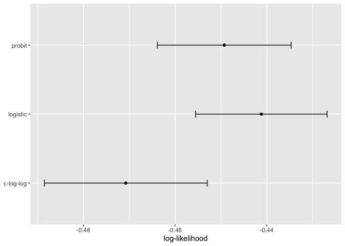
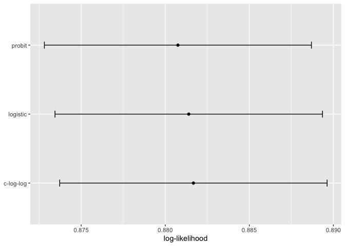

## 12 Model Tuning and the Dangers of Overfitting

tuning parameters or hyperparamters are unknonw structural or other kind of values that have significant impact on the model but cannot be direclty estimated from the data. 

### 12.1 Model Paramters

KNN: K-nearest neighbors, the number of nearest neighbors is a good example of a tuning paramter or hyperparamter that cannot be directly estimated from the data. 

### 12.2 Tuning paramters for different types of models

Examples of tuning parameters or hyperparameters:

1. Boosting is an ensemble method that combines a series of base models, each of which is created sequentially and depends on the previous models. The number of boosting iterations is an important tuning parameter that usually requires optimization.
2. In the classic single-layer artificial neural network (aka multilayer perceptron), the predictors are combined using two or more hidden units. The hidden units are linear combinations of the predictors that are captured in an activation function. The number of hidden units and the type of activation function are important structural tuning parameters. 
3. Modern gradient descent methods are improved by finding the right optimization parameters. Examples include learning rates, momentum, and the number of optimization iterations/epochs. 

In some cases, preprocessing techniques require tuning:

1. In PCA or its supervised cousin called partial least squares, the predictors are replaced with new, artificial features that have better properties related to collinearity. The number of extracted components can be tuned.
2. Imputation methods estimate missing predictor values using the complete values of one or more predictors. The number of neighbors in KNN modulates the amount of averaging and can be tuned. 

Some classical statistical models also have structural parameters:

1. In binary regression, the logit link is commonly used (i.e. logisitic regression). Other link functions, such as the probit and complementary log-log are also available.
2. Non-Bayesian logitudinal and repeated measures models require a specification for the covariance or correlation structure of the data. Options include compound symmetric (aka exchaneable), autoregressive, Toeplitz, and others.

A counterexample where it is inappropriate to tune a parameter is the prior distribution required for Bayesian analysis. The prior encapsualtes the analyst's belief about the distribution of a quantity before evidence or data are taken into account. In Section 11.4, we used a Bayesian ANOVA model, and we were unclear about what the prior should be for the regression paramters. We chose a t-distrubiton with one degree of freedom for the prior since it has heavier tails; this reflects our added uncertainty. Our prior belief should not be subject to optimization. Tuning parameters are typically optimized for performance whereas priors should not be tweaked to get "the right results".

### 12.3 What do we optimize?

How should we evaluate models when we optimize tuning parameters?

For cases where the statistical properties of the tuning parameter are tractable, common statistical properties can be used as the objective function. For example, in the case of binary logistic regression, the link function can be chosen by maximizing the liklihood or information criteria. However, these results may not align with results acheieved using accuracy-oriented properties. For example, Friedman (2001) optimized the number of trees in a boosted tree ensemble and found different results when maximiing the likelihood and accuracy.

In example, since the number of model parameters does not vary between link types, the statistical approach is to compute the (log) likelihood for each model and determine the model with the largest value. 

For a data frame training_set, let's create a function to compute the different models and extract the likelihood statistics for the training set (using broom::glance()):


```r
library(tidymodels)
```

```
## ── Attaching packages ────────────────────────────────────── tidymodels 1.1.1 ──
```

```
## ✔ broom        1.0.5     ✔ recipes      1.0.8
## ✔ dials        1.2.0     ✔ rsample      1.2.0
## ✔ dplyr        1.1.3     ✔ tibble       3.2.1
## ✔ ggplot2      3.4.4     ✔ tidyr        1.3.0
## ✔ infer        1.0.5     ✔ tune         1.1.2
## ✔ modeldata    1.2.0     ✔ workflows    1.1.3
## ✔ parsnip      1.1.1     ✔ workflowsets 1.0.1
## ✔ purrr        1.0.2     ✔ yardstick    1.2.0
```

```
## ── Conflicts ───────────────────────────────────────── tidymodels_conflicts() ──
## ✖ purrr::discard() masks scales::discard()
## ✖ dplyr::filter()  masks stats::filter()
## ✖ dplyr::lag()     masks stats::lag()
## ✖ recipes::step()  masks stats::step()
## • Dig deeper into tidy modeling with R at https://www.tmwr.org
```

```r
tidymodels_prefer()

data(two_class_dat)

set.seed(91)
split <- initial_split(two_class_dat)

training_set <- training(split)
testing_set  <-  testing(split)
```


```r
llhood <- function(...) {
  logistic_reg() %>% 
    set_engine("glm", ...) %>% 
    fit(Class ~ ., data = training_set) %>% 
    glance() %>% 
    select(logLik)
}

bind_rows(
  llhood(),
  llhood(family = binomial(link = "probit")),
  llhood(family = binomial(link = "cloglog"))
) %>% 
  mutate(link = c("logit", "probit", "c-log-log"))  %>% 
  arrange(desc(logLik))
```

```
## # A tibble: 3 × 2
##   logLik link     
##    <dbl> <chr>    
## 1  -258. logit    
## 2  -262. probit   
## 3  -270. c-log-log
```

According to these results, the logistic model has the best statistical properties. One way of improving this analysis is to resample the statistics and separate the modeling data from the data used for performance estimation. With this small data set, repeated 10-fold cross-validation is a good choice for resampling. In the yardstick package, the mn_log_loss() function is used to estimate the negative log-likelihood.


```r
set.seed(1201)
rs <- vfold_cv(training_set, repeats = 10)

# Return the individual resampled performance estimates:
lloss <- function(...) {
  perf_meas <- metric_set(roc_auc, mn_log_loss)
    
  logistic_reg() %>% 
    set_engine("glm", ...) %>% 
    fit_resamples(Class ~ A + B, rs, metrics = perf_meas) %>% 
    collect_metrics(summarize = FALSE) %>%
    select(id, id2, .metric, .estimate)
}

resampled_res <- 
  bind_rows(
    lloss() %>% mutate(model = "logistic"),
    lloss(family = binomial(link = "probit")) %>% mutate(model = "probit"),
    lloss(family = binomial(link = "cloglog")) %>% mutate(model = "c-log-log")     
  ) %>%
  # Convert log-loss to log-likelihood:
  mutate(.estimate = ifelse(.metric == "mn_log_loss", -.estimate, .estimate)) %>% 
  group_by(model, .metric) %>% 
  summarize(
    mean = mean(.estimate, na.rm = TRUE),
    std_err = sd(.estimate, na.rm = TRUE) / sqrt(n()), 
    .groups = "drop"
  )
```

```
## → A | warning: glm.fit: fitted probabilities numerically 0 or 1 occurred
```

```
## 
There were issues with some computations   A: x1

There were issues with some computations   A: x1
```

```r
resampled_res %>% 
  filter(.metric == "mn_log_loss") %>% 
  ggplot(aes(x = mean, y = model)) + 
  geom_point() + 
  geom_errorbar(aes(xmin = mean - 1.64 * std_err, xmax = mean + 1.64 * std_err),
                width = .1) + 
  labs(y = NULL, x = "log-likelihood")
```

<!-- -->

The value produced by broom::glance() is the sum while yardstick::mn_log_loss() is an average.

These results exhibit evidence that the choice of the link function matters somewhat. Although tere is an overlap in the confidence intervals, the logistic model has the best results. 

What about a different metric? The results of area under the ROC curve for each resample reflect the discriminative ability of the models across numerous probability thresholds and show a lack of difference. 


```r
resampled_res %>% 
  filter(.metric == "roc_auc") %>% 
  ggplot(aes(x = mean, y = model)) + 
  geom_point() + 
  geom_errorbar(aes(xmin = mean - 1.64 * std_err, xmax = mean + 1.64 * std_err),
                width = .1) + 
  labs(y = NULL, x = "log-likelihood")
```

<!-- -->

Given the overlap of the intervals, as well as the scale of the x-axis, any of these options could be used. 

### 12.4 The consequences of poor parameter estimates

Many tuning parameters modulate the amount of model complexity. More complexity often implies more malleability in the patterns that a model can emulate. While this is an advantage when the underlying motifs in the data are complex, it can also lead to overinterpretation of chance patterns that would not reproduce in new data. Overfitting is the situation where a model adapts too much to the training data; it performs well for the data used to build the model but poorly for new data. 

We fit neural network classification models to the same two-class data from the previous section, varying the number of hidden units. Using the area under the ROC curve as a performance metric, the effectiveness of the model on the training set increases as more hidden units are added. The neural network very quickly begins to overinterpret patterns that it sees in the training set. 

The single unit model does not adapt very flexibly to the data since it is contrainsted to be linear. A model with four hidden units begins to show signs of overfitting with an unrealistic boundary for values away from the data mainstream. this is caused by a single data point from the first class in the upper-right corner of the data. These patterns do not repeat in the test set. 

In general, we must use a quantitative approach for detecting overfitting. 

### 12.5 Two general strategies for optimization

1. Grid search is when we predefine a set of parameter values to evalute. The main choices involved in grid search are how to make the grid and how many parameter combinations to evaluate. Grid search is often judged as inefficient since the number of grid points required to cover the parameter space can become unmanageable with the curse of dimensionality. 
2. Iterative search or sequential search is where we sequentially discover new parameter combinations based on previous results. Almost any nonlinear optimization method is appropriate, although some are more efficient than others. 

### 12.6 Tuning parameters in tidymodels

It is possible to tune

* the threshold for combining neighborhoods into an "other". category with the arguement name threshold
* the number of degrees of freedom in a natural spline (deg_free)
* the number of data points required to execute a split in a tree-based model (min_n)
* the amount of regularization in penalized models (penalty)

For parsnip model specifications, there are two kinds of parameter arguments. Main arguments are those that are most often optimized for performance and are available in multiple engines. The main tuning paramters are top-level arguments to the model specification function. For example, the rand_forest() function has main arguments trees, min_n, and mtry since these are most frequently specified or optimized.

A secondary set of tuning parameters are engine specific. These are either infrequently optimized or are specific only to certain engines. Again using random forests as an example, the ranger package contains some arguments that are not used by other packages. One example is gain penalization, which regularizes the predictor selection in the tree induction process. This parameter can help modulate the trade-off between the number of predictors used in the ensemble and performance. The names of this argument in ranger() is regularization.factor. To sepecify a value via a parsnip model specification, it is added as a supplemental argument to set_engine().


```r
rand_forest(trees = 2000, min_n = 10) %>%
  set_engine("ranger", regularization_factor = 0.5)
```

```
## Random Forest Model Specification (unknown mode)
## 
## Main Arguments:
##   trees = 2000
##   min_n = 10
## 
## Engine-Specific Arguments:
##   regularization_factor = 0.5
## 
## Computational engine: ranger
```

How can we signal to tidymodels functions which arguments should be optimized? Parameters are marked for tuning by assinging them a value of tune(). For the single layer neural network, the number of hidden units is designated for tuning using:


```r
neural_net_spec <- 
  mlp(hidden_units = tune()) %>%
  set_mode("regression") %>%
  set_engine("keras")
```

The tune() function doesn't execute any particular parameter value; it only returns an expression.


```r
tune()
```

```
## tune()
```

Embedding this tune() value in an argument will tag the parameter for optimization. The model tuning functions parse the model specification and/or recipe to discover the tagged parameters. These functions can automatically configure and process these parameters since they understand their characteristics (e.g. the range of possible values, etc.)

To enumerate the tuning parameters for an object, use the extract_parameter_set_dials() function:


```r
extract_parameter_set_dials(neural_net_spec)
```

```
## Collection of 1 parameters for tuning
## 
##    identifier         type    object
##  hidden_units hidden_units nparam[+]
```

The results show a value of nparam[+], indicating that the number of hidden units is a numeric parameter.

There is an optional identification argument that associates a name with the parameters. This can come in handy when the same kind of parameter is being tuned in different places. For example, with the Ames housing data, the recipe encoded both longitude and latitude with spline functions. If we want to tune the two spline functions to potentially have different levels of smoothness, we call step_ns() twice, once for each predictor. To make the parameters identifiable, the identification argument can take any character string:


```r
data(ames)
ames <- mutate(ames, Sale_Price = log10(Sale_Price))

set.seed(502)
ames_split <- initial_split(ames, prop = 0.80, strata = Sale_Price)
ames_train <- training(ames_split)
ames_test  <-  testing(ames_split)
```


```r
ames_rec <- 
  recipe(Sale_Price ~ Neighborhood + Gr_Liv_Area + Year_Built + Bldg_Type + 
           Latitude + Longitude, data = ames_train)  %>%
  step_log(Gr_Liv_Area, base = 10) %>% 
  step_other(Neighborhood, threshold = tune()) %>% 
  step_dummy(all_nominal_predictors()) %>% 
  step_interact( ~ Gr_Liv_Area:starts_with("Bldg_Type_") ) %>% 
  step_ns(Longitude, deg_free = tune("longitude df")) %>% 
  step_ns(Latitude,  deg_free = tune("latitude df"))

recipes_param <- extract_parameter_set_dials(ames_rec)
recipes_param
```

```
## Collection of 3 parameters for tuning
## 
##    identifier      type    object
##     threshold threshold nparam[+]
##  longitude df  deg_free nparam[+]
##   latitude df  deg_free nparam[+]
```

Note that the identifier and type columns are not the same for both of the spline parameters. 

When a recipe and model specification are combined using a workflow, both sets of parameters are shown:


```r
wflow_param <- 
  workflow() %>% 
  add_recipe(ames_rec) %>% 
  add_model(neural_net_spec) %>% 
  extract_parameter_set_dials()
wflow_param
```

```
## Collection of 4 parameters for tuning
## 
##    identifier         type    object
##  hidden_units hidden_units nparam[+]
##     threshold    threshold nparam[+]
##  longitude df     deg_free nparam[+]
##   latitude df     deg_free nparam[+]
```

Each tuning parameter argument has a corresponding function in the dials package. In the vast majority of the cases, the function has the same name as the parameter argument:


```r
hidden_units()
```

```
## # Hidden Units (quantitative)
## Range: [1, 10]
```

```r
threshold()
```

```
## Threshold (quantitative)
## Range: [0, 1]
```

The deg_free parameter is a countexample, the notion of degress of freedome comes up in a variety of different contexts. When used with splines there is a specialized dials function called spline_degree() that is, by default, invoked for splines.


```r
spline_degree()
```

```
## Spline Degrees of Freedom (quantitative)
## Range: [1, 10]
```

The dials package also has a convenience function for extracting a particular parameter object:


```r
# identify the parameter using the id value:
wflow_param %>% extract_parameter_dials("threshold")
```

```
## Threshold (quantitative)
## Range: [0, 0.1]
```

Inside the parameter set, the range of the parameters can also be updated in place:


```r
extract_parameter_set_dials(ames_rec) %>% 
  update(threshold = threshold(c(0.8, 1.0)))
```

```
## Collection of 3 parameters for tuning
## 
##    identifier      type    object
##     threshold threshold nparam[+]
##  longitude df  deg_free nparam[+]
##   latitude df  deg_free nparam[+]
```

The parameter sets created by extract_parameter_set_dials() are consumed by the tidymodels tuning functions (when needed). If the defaults for the tuning parameter objects require modification, a modified parameter set is passed to the appropriate tuning function. 
In some cases, it is easy to have reasonable defaults for the range of possible values. In other cases, the parameter range is critical and cannot be assumed. The primary tuning parameter for random forest models is the number of predictor columns that are randomly sampled for each split in the tree, using denoted as mtry(). Without knowing the number of predictors, this parameter range cannot be preconfigured and requires finalization.


```r
rf_spec <- 
  rand_forest(mtry = tune()) %>% 
  set_engine("ranger", regularization.factor = tune("regularization")) %>%
  set_mode("regression")

rf_param <- extract_parameter_set_dials(rf_spec)
rf_param
```

```
## Collection of 2 parameters for tuning
## 
##      identifier                  type    object
##            mtry                  mtry nparam[?]
##  regularization regularization.factor nparam[+]
## 
## Model parameters needing finalization:
##    # Randomly Selected Predictors ('mtry')
## 
## See `?dials::finalize` or `?dials::update.parameters` for more information.
```

Complere parameter objects have [+] in their summary; a value of [?] indicates taht at least one end of the possible range is missing. There are two methods for handling this. The first is to use update(), to add a range based on what you known about the data dimensions. 


```r
rf_param %>% 
  update(mtry = mtry(c(1, 70)))
```

```
## Collection of 2 parameters for tuning
## 
##      identifier                  type    object
##            mtry                  mtry nparam[+]
##  regularization regularization.factor nparam[+]
```

However, this approach might not work if a recipe is attached to a workflow that uses steps that either add or substract columns. If those steps are not slated for tuning, the finalize() function can execute the recipe once to obtain the dimensions:


```r
pca_rec <- 
  recipe(Sale_Price ~ ., data = ames_train) %>% 
  # Select the square-footage predictors and extract their PCA components:
  step_normalize(contains("SF")) %>% 
  # Select the number of components needed to capture 95% of
  # the variance in the predictors. 
  step_pca(contains("SF"), threshold = .95)
  
updated_param <- 
  workflow() %>% 
  add_model(rf_spec) %>% 
  add_recipe(pca_rec) %>% 
  extract_parameter_set_dials() %>% 
  finalize(ames_train)
updated_param
```

```
## Collection of 2 parameters for tuning
## 
##      identifier                  type    object
##            mtry                  mtry nparam[+]
##  regularization regularization.factor nparam[+]
```

```r
updated_param %>% extract_parameter_dials("mtry")
```

```
## # Randomly Selected Predictors (quantitative)
## Range: [1, 74]
```

When the recipe is prepared, the finalize() function learns to set the upper range of mtry to 74 predictors.

Additionally, the results of extract_parameter_set_dials() will include engine-specific parameters (if any). They are discovered in the same wa as the main arguments and included in the parameter set. The dials package contains parameter functions for all potentially tunable engine-specific paramters.


```r
rf_param
```

```
## Collection of 2 parameters for tuning
## 
##      identifier                  type    object
##            mtry                  mtry nparam[?]
##  regularization regularization.factor nparam[+]
## 
## Model parameters needing finalization:
##    # Randomly Selected Predictors ('mtry')
## 
## See `?dials::finalize` or `?dials::update.parameters` for more information.
```

```r
regularization_factor()
```

```
## Gain Penalization (quantitative)
## Range: [0, 1]
```

Finally, some tuning parameters are best associated with transformations. A good example of this is the penalty parameter associated with many regularized regression models. This parameter is nonnegative and it is common to vary its values in log units. The primary dials parameter object indicates taht a transformation is used by default:


```r
penalty()
```

```
## Amount of Regularization (quantitative)
## Transformer: log-10 [1e-100, Inf]
## Range (transformed scale): [-10, 0]
```

This is important to know, especially when altering the range. New range values must be in the transformed units.


```r
# correct method to have penalty values between 0.1 and 1.0
penalty(c(-1, 0)) %>% value_sample(1000) %>% summary()
```

```
##    Min. 1st Qu.  Median    Mean 3rd Qu.    Max. 
##  0.1002  0.1796  0.3284  0.4007  0.5914  0.9957
```

```r
# incorrect:
penalty(c(0.1, 1.0)) %>% value_sample(1000) %>% summary()
```

```
##    Min. 1st Qu.  Median    Mean 3rd Qu.    Max. 
##   1.261   2.081   3.437   4.151   5.781   9.996
```

The scale can be changed if desired with the trans argument. You can use natural units but the same range:


```r
penalty(trans = NULL, range = 10^c(-10, 0))
```

```
## Amount of Regularization (quantitative)
## Range: [1e-10, 1]
```

