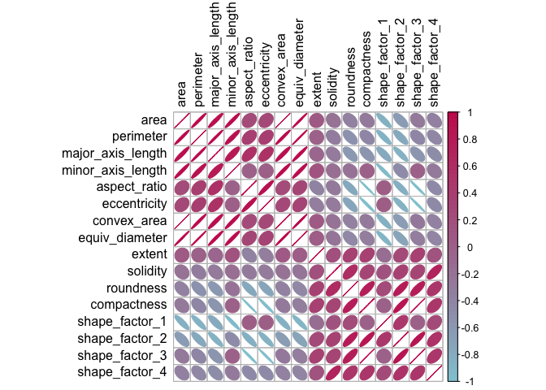
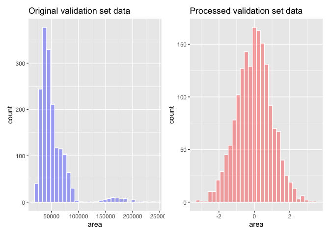
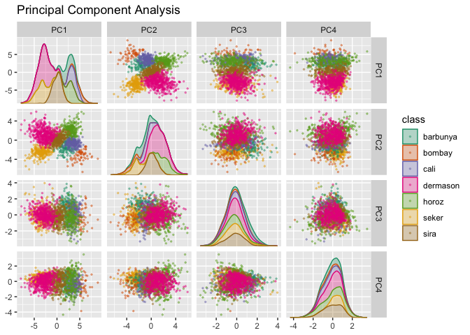
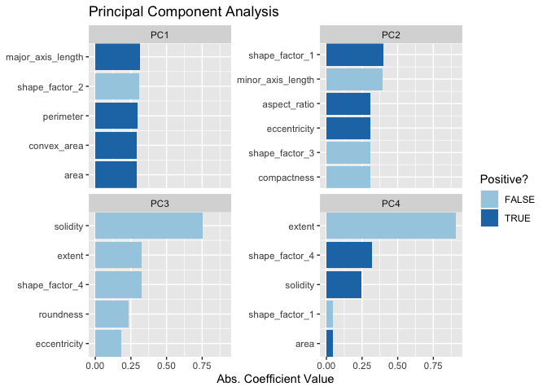
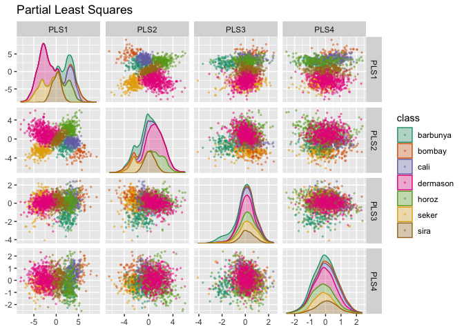
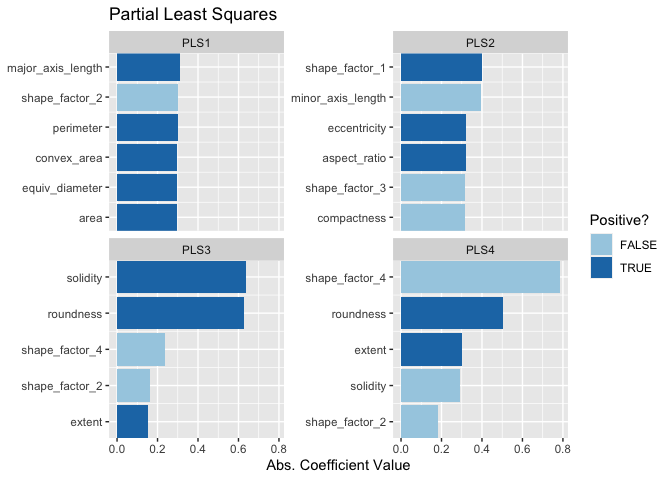
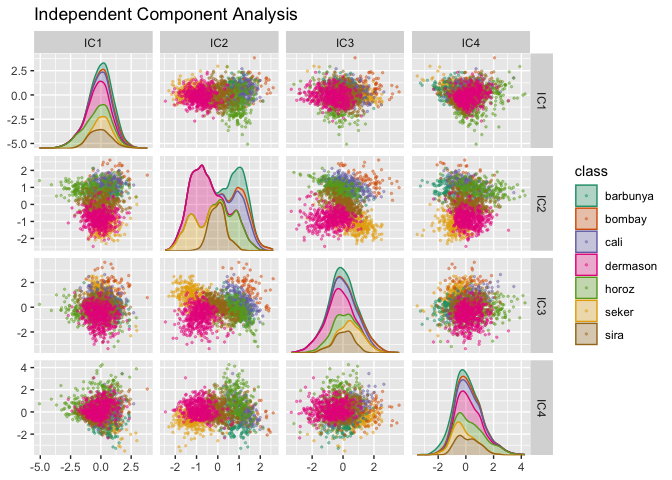
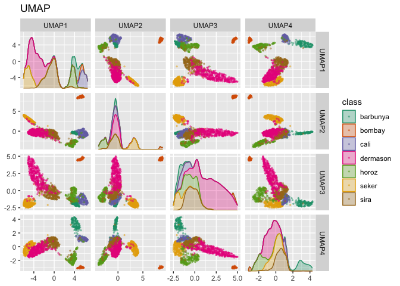
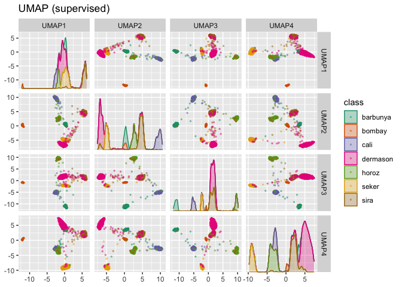

## Dimensionality Reduction

Dimensionality reduction transforms a data set from a high-dimensional space into a low-dimensional space.

### 16.1 What problems can dimensionality reduction solve?

Dimensionality reduction can be used either in feature engineering or in exploratory data analysis. Consequences of high-dimensional data:

1. debugging the data is difficult when there are hundreds of thousands of dimensions
2. having a multitude of predictors can harm the model, e.g. number of predictors should be less than the number of data points used to fit the model
3. multicollinearity, where between-predictor correlations can negatively impact the mathematical operations used to estimate a model.

Most dimensionality reduction techniques can only be effective when there are such relationships between predictors that can be exploited.

Principal component analysis (PCA) is one of the most straightforward methods for reducting the number of columns in the data set b/c it relies on linear methods and is unsupervised (i.e. does not consider the outcome data).

The dimensionality reduction methods discussed in this chapter are generally NOT feature selection methods. Methods such as PCA represent the original predictors using a smaller subset of new features. All of the original predictors are required to compute these new features. The exception to this are sparse methods that have the ability to completely remove the impact of predictors when creating the new features. 


```r
library(tidymodels)
```

```
## ── Attaching packages ────────────────────────────────────── tidymodels 1.1.1 ──
```

```
## ✔ broom        1.0.5     ✔ recipes      1.0.8
## ✔ dials        1.2.0     ✔ rsample      1.2.0
## ✔ dplyr        1.1.3     ✔ tibble       3.2.1
## ✔ ggplot2      3.4.4     ✔ tidyr        1.3.0
## ✔ infer        1.0.5     ✔ tune         1.1.2
## ✔ modeldata    1.2.0     ✔ workflows    1.1.3
## ✔ parsnip      1.1.1     ✔ workflowsets 1.0.1
## ✔ purrr        1.0.2     ✔ yardstick    1.2.0
```

```
## ── Conflicts ───────────────────────────────────────── tidymodels_conflicts() ──
## ✖ purrr::discard() masks scales::discard()
## ✖ dplyr::filter()  masks stats::filter()
## ✖ dplyr::lag()     masks stats::lag()
## ✖ recipes::step()  masks stats::step()
## • Search for functions across packages at https://www.tidymodels.org/find/
```

```r
tidymodels_prefer()
library(baguette)
library(beans)
library(bestNormalize)
library(corrplot)
```

```
## corrplot 0.92 loaded
```

```r
library(discrim)
library(embed)
library(ggforce)
library(klaR)
```

```
## Loading required package: MASS
```

```
## 
## Attaching package: 'MASS'
```

```
## The following object is masked from 'package:bestNormalize':
## 
##     boxcox
```

```
## The following object is masked from 'package:dplyr':
## 
##     select
```

```r
library(learntidymodels)
```

```
## Loading required package: tidyverse
```

```
## ── Attaching core tidyverse packages ──────────────────────── tidyverse 2.0.0 ──
## ✔ forcats   1.0.0     ✔ readr     2.1.4
## ✔ lubridate 1.9.2     ✔ stringr   1.5.0
## ── Conflicts ────────────────────────────────────────── tidyverse_conflicts() ──
## ✖ readr::col_factor() masks scales::col_factor()
## ✖ purrr::discard()    masks scales::discard()
## ✖ dplyr::filter()     masks stats::filter()
## ✖ stringr::fixed()    masks recipes::fixed()
## ✖ dplyr::lag()        masks stats::lag()
## ✖ MASS::select()      masks dplyr::select()
## ✖ readr::spec()       masks yardstick::spec()
## ℹ Use the conflicted package (<http://conflicted.r-lib.org/>) to force all conflicts to become errors
```

```r
library(mixOmics)
```

```
## Loading required package: lattice
## 
## Loaded mixOmics 6.22.0
## Thank you for using mixOmics!
## Tutorials: http://mixomics.org
## Bookdown vignette: https://mixomicsteam.github.io/Bookdown
## Questions, issues: Follow the prompts at http://mixomics.org/contact-us
## Cite us:  citation('mixOmics')
```

```r
library(uwot)
```

```
## Loading required package: Matrix
## 
## Attaching package: 'Matrix'
## 
## The following objects are masked from 'package:tidyr':
## 
##     expand, pack, unpack
```

```r
library(patchwork)
library(fastICA)
library(mda)
```

```
## Loading required package: class
## Loaded mda 0.5-4
```

```r
library(earth)
```

```
## Loading required package: Formula
## Loading required package: plotmo
## Loading required package: plotrix
## 
## Attaching package: 'plotrix'
## 
## The following object is masked from 'package:scales':
## 
##     rescale
## 
## Loading required package: TeachingDemos
## 
## Attaching package: 'TeachingDemos'
## 
## The following object is masked from 'package:klaR':
## 
##     triplot
```

### 16.2 A picture is worth a thousand...beans

Let's walk through how to use dimensionality reduction with recipes for an example data set. In the bean data, 16 morphology features were computed.

We start by holding back a testing set with initial_split(). The remaining data are split into training and validation sets.


```r
set.seed(1601)
bean_split <- initial_validation_split(beans, strata = class, prop = c(0.75, 0.125))
```

```
## Warning: Too little data to stratify.
## • Resampling will be unstratified.
```

```r
bean_split
```

```
## <Training/Validation/Testing/Total>
## <10206/1702/1703/13611>
```

```r
# Return data frames:
bean_train <- training(bean_split)
bean_test <- testing(bean_split)
bean_validation <- validation(bean_split)


set.seed(1602)
# Return an 'rset' object to use with the tune functions:
bean_val <- validation_set(bean_split)
bean_val$splits[[1]]
```

```
## <Training/Validation/Total>
## <10206/1702/11908>
```

To visually assess how well different methods perform, we can estimate the methods on the training set (n=10,206 beans) and display the results using the validation set (n=1,702). 

Before beginning any dimensionality reduction, we can spend some time investigating our data. Let's take a look at the correlation strucutre of the data.


```r
tmwr_cols <- colorRampPalette(c("#91CBD765", "#CA225E"))
bean_train %>% 
  select(-class) %>% 
  cor() %>% 
  corrplot(col = tmwr_cols(200), tl.col = "black", method = "ellipse")
```

<!-- -->

Many of these predictors are highly correlated, such as area and perimeter or shape factors 2 and 3. While we don't take the time to do it here, it is also important to see if this correlation structure significantly changes across the outcome categories. 

### 16.3 A starter recipe

It's time to look at the beans data in a smaller space. We can start with a basic recipe to preprocess the data prior to any dimensionality reduction steps. Several predictors are ratios and so are likely to have skewed distributions. Such distributions can wreak havoc on variance calculations. The bestNormalize package has a step that can enforce a symmetric distribution for the predictors. We'll use this to mitigate the issue of skewed distributions. 


```r
bean_rec <-
  # Use the training data from the bean_val split object
  recipe(class ~ ., data = bean_train) %>%
  step_zv(all_numeric_predictors()) %>%
  step_orderNorm(all_numeric_predictors()) %>% 
  step_normalize(all_numeric_predictors())
```

Remember that when invoking the recipe() function, the steps are not estimated or executed in any way.

### 16.4 Recipes in the wild

A workflow containing a recipe uses fit() to estimate the recipe and model, then predict() to process the data and make model predictions. There are analogous functions in the recipes package that can be used for the same purpose:

* prep(recipe, training) fits the recipe to the training set
* bake(recipe, new_data) applies the recipe operations to new_data.

#### 16.4.1 Preparing a recipe

Let's estimate bean_rec using the training set data, with prep(bean_rec).


```r
bean_rec_trained <- prep(bean_rec)
bean_rec_trained
```

```
## 
```

```
## ── Recipe ──────────────────────────────────────────────────────────────────────
```

```
## 
```

```
## ── Inputs
```

```
## Number of variables by role
```

```
## outcome:    1
## predictor: 16
```

```
## 
```

```
## ── Training information
```

```
## Training data contained 10206 data points and no incomplete rows.
```

```
## 
```

```
## ── Operations
```

```
## • Zero variance filter removed: <none> | Trained
```

```
## • orderNorm transformation on: area, perimeter, ... | Trained
```

```
## • Centering and scaling for: area, perimeter, major_axis_length, ... | Trained
```

Note in the output that the steps have been trained and that the selectors are no longer general (i.e. all_numeric_predictors()); they now show the actual columns that were selected. Also, prep(bean_rec) does not require the training argument. You can pass any data into that argument, but omitting it means that the original data from the call to recipe() will be used. In our case this was the training set data.

One important argument to prep() is retain. When retain=TRUE (the default), the estimated version of the training set is kept within the recipe. This data set has been pre-processed using all of the steps listed in the recipe. Since prep() has to execute the recipe as it proceeds, it may be advantageous to keep this version of the training set so that, if that data set is to be used later, redundant calculations can be avoided. However, if the training set is big, it may be problematic to keep such a large amount of data in memory. Use retain=FALSE ot avoid this.

Once new steps are added to this recipe, reapplying prep() will estimate only the untrained steps.This will come in handy when we try different feature extraction methods.

If you encounter errors when working with a recipe, prep() can be used with its verbose option to troubleshoot.


```r
bean_rec_trained %>% 
  step_dummy(cornbread) %>%  # <- not a real predictor
  prep(verbose = TRUE)
```

Another option that can help you understand when happens in the analysis is log_changes


```r
show_variables <- 
  bean_rec %>% 
  prep(log_changes = TRUE)
```

```
## step_zv (zv_RLYwH): same number of columns
## 
## step_orderNorm (orderNorm_Jx8oD): same number of columns
## 
## step_normalize (normalize_GU75D): same number of columns
```

#### 16.4.2 Baking the recipe

Using bake() with a recipe is much like using predict() with a model: the operations estimated from the training set are applied to any data, like testing data or new data at prediction time.

For example, the validation set samples can be processed:


```r
bean_val_processed <- bake(bean_rec_trained, new_data = bean_validation)
```

Histograms of the area predictor before and after the recipe was prepared.


```r
p1 <- 
  bean_validation %>% 
  ggplot(aes(x = area)) + 
  geom_histogram(bins = 30, color = "white", fill = "blue", alpha = 1/3) + 
  ggtitle("Original validation set data")

p2 <- 
  bean_val_processed %>% 
  ggplot(aes(x = area)) + 
  geom_histogram(bins = 30, color = "white", fill = "red", alpha = 1/3) + 
  ggtitle("Processed validation set data")

p1 + p2
```

<!-- -->

Two important aspects of bake() are worth noting here. First, as previously mentioned, using prep(recipe, retain=TRUE) keeps the existing processed version of the training set in the recipe. This enables the user to use bake(recipe, new_data=NULL), which returns that data set without further computations. 


```r
bake(bean_rec_trained, new_data = NULL) %>% nrow()
```

```
## [1] 10206
```

```r
bean_train %>% nrow()
```

```
## [1] 10206
```

If the training set is not pathologically large, using this value to retain can save a lot of computational time. Second, additional selectors can be used in the call to specify which columns to return. The default selector is everything(), but more specific directives can be used.

### 16.5 Feature extraction techniques

Since recipes are the primary option in tidymodels for dimensionality reduction, let's write a function that will estimate the transformation and plot the resulting data in a scatter plot matrix via the ggforce package. 


```r
plot_validation_results <- function(recipe, dat = bean_validation) {
  recipe %>%
    # Estimate any additional steps
    prep() %>%
    # Process the data (the validation set by default)
    bake(new_data = dat) %>%
    # Create the scatterplot matrix
    ggplot(aes(x = .panel_x, y = .panel_y, color = class, fill = class)) +
    geom_point(alpha = 0.4, size = 0.5) +
    geom_autodensity(alpha = .3) +
    facet_matrix(vars(-class), layer.diag = 2) + 
    scale_color_brewer(palette = "Dark2") + 
    scale_fill_brewer(palette = "Dark2")
}
```

### 16.5.1 PCA

PCA is an unsupervised method that used linear combinations of the predictors to define new features. These features attempt to account for as much variation as possible in the original data. We add step_pca() to the original recipe and use our function to visualize the results on the validation set. 


```r
bean_rec_trained %>%
  step_pca(all_numeric_predictors(), num_comp = 4) %>%
  plot_validation_results() + 
  ggtitle("Principal Component Analysis")
```

<!-- -->

We see that the first two components PC1 and PC2, especially when used together, do an effective job distinguishing between or separating the classes. This may lead us to expect that the overall problem of classifying these beans will not be especially difficult. 

For these data, it turns out that the PCA components that explain the most variation in the predictors also happen to be predictive of the classes. What features are driving performance? The learntidymodels package has functions that can help visualize the top features for each component. We'll need the prepared recipe; the PCA step is added in the following code alogn with a call to prep().


```r
bean_rec_trained %>%
  step_pca(all_numeric_predictors(), num_comp = 4) %>% 
  prep() %>% 
  plot_top_loadings(component_number <= 4, n = 5) + 
  scale_fill_brewer(palette = "Paired") +
  ggtitle("Principal Component Analysis")
```

<!-- -->

The top loadings are mostly related to the cluster of correlated predictors: perimeter, area, major axis length, and convex area. These are all related to bean size. Measures of elongation appear to dominate the second PCA component. 

### 16.5.2 Partial least squares

PLS is a supervised version of PCA. It tries to find components that simultaneously maximize the variation in the predictors while also maximizing the relationship between those components and the outcome. 


```r
bean_rec_trained %>%
  step_pls(all_numeric_predictors(), outcome = "class", num_comp = 4) %>%
  plot_validation_results() + 
  ggtitle("Partial Least Squares")
```

<!-- -->

The first two PLS components are nearly identical to the first two PCA components. 


```r
bean_rec_trained %>%
  step_pls(all_numeric_predictors(), outcome = "class", num_comp = 4) %>%
  prep() %>% 
  plot_top_loadings(component_number <= 4, n = 5, type = "pls") + 
  scale_fill_brewer(palette = "Paired") +
  ggtitle("Partial Least Squares")
```

<!-- -->

### 16.5.3 Independent component analysis

ICA is slightly different than PCA in that it finds components that are as statistically independent from one another as possible (as opposed to being uncorrelated). It can be thought of as maximizing the "non-Gaussianity" of the ICA components, or separating information instead of compressing information like PCA. 


```r
bean_rec_trained %>%
  step_ica(all_numeric_predictors(), num_comp = 4) %>%
  plot_validation_results() + 
  ggtitle("Independent Component Analysis")
```

<!-- -->

Inspecting this plot, there does not appear to be much separation between the classes in the few components when using ICA. These independent components do not separate the bean types.

### 16.5.4 Uniform manifold approximation and projection

UMAP is similar to the popular t-SNE method for nonlinear dimensions reduction. In the original high-dimensional space, UMAP uses a distance-based nearest neighbor method to find local areas of the data where the data points are more likely to be related. The relationship between data points is saved as a directed graph model where most points are not connected. 

From there, UMAP translates points in the graph to the reduced dimensional space. To do this, the algorithm has an optimization process that uses cross-entropy to map data points to the smaller set of features so that the graph is well approximated. 

To create the mapping, the embed package contains a step function for this method.


```r
bean_rec_trained %>%
  step_umap(all_numeric_predictors(), num_comp = 4) %>%
  plot_validation_results() +
  ggtitle("UMAP")
```

<!-- -->

While the between-cluster space is pronounced, the clusters can contain a heterogenous mixture of classes. 

There is also a supervised version of UMAP:


```r
bean_rec_trained %>%
  step_umap(all_numeric_predictors(), outcome = "class", num_comp = 4) %>%
  plot_validation_results() +
  ggtitle("UMAP (supervised)")
```

<!-- -->

The supervised method looks promising for modeling the data.

UMAP is a powerful method to reduce the feature space. However, it can be very sensitive to tuning parameters (e.g. the number of neighbors and so on). For this reason, it would help to experiment with a few of the parameters to assess how robust the results are for these data.

### 16.6 Modeling

Both the PLS and UMAP methods are worth investigating in conjuction with different models. Let's explore a variety of different models with these dimensionality reduction techniques (along with no transformation at all): a single layer neural network, bagged trees, flexible discriminant analysis (FDA), naive Bayes, and regularized discriminant analysis (RDA). 

Now that we are back in "modeling mode", we'll create a series of model specifications and then use a workflow set to tune the models in the following code. Note that the model parameters are tuned in conjunction with the recipe parameters (e.g. size of the reduced dimension, UMAP parameters).


```r
mlp_spec <-
  mlp(hidden_units = tune(), penalty = tune(), epochs = tune()) %>%
  set_engine('nnet') %>%
  set_mode('classification')

bagging_spec <-
  bag_tree() %>%
  set_engine('rpart') %>%
  set_mode('classification')

fda_spec <-
  discrim_flexible(
    prod_degree = tune()
  ) %>%
  set_engine('earth')

rda_spec <-
  discrim_regularized(frac_common_cov = tune(), frac_identity = tune()) %>%
  set_engine('klaR')

bayes_spec <-
  naive_Bayes() %>%
  set_engine('klaR')
```

We also need recipes for the dimensionality reduction methods we'll try. Let's start with a base recipe bean_rec and then extend it with different dimensionality reduction steps.


```r
bean_rec <-
  recipe(class ~ ., data = bean_train) %>%
  step_zv(all_numeric_predictors()) %>%
  step_orderNorm(all_numeric_predictors()) %>%
  step_normalize(all_numeric_predictors())

pls_rec <- 
  bean_rec %>% 
  step_pls(all_numeric_predictors(), outcome = "class", num_comp = tune())

umap_rec <-
  bean_rec %>%
  step_umap(
    all_numeric_predictors(),
    outcome = "class",
    num_comp = tune(),
    neighbors = tune(),
    min_dist = tune()
  )
```

Once again, the workflowsets package takes the preprocessors and models and crosses them. The control option parallel_over is set so that the parallel processing can work simultaneously across tuning parameter combinations. The workflow_map() function applies grid search to optimize the model/preprocessing parameters (if any) across 10 parameter combinations. The multiclass area under the ROC curve is estimated on the validation set.


```r
ctrl <- control_grid(parallel_over = "everything")
bean_res <- 
  workflow_set(
    preproc = list(basic = class ~., pls = pls_rec, umap = umap_rec), 
    models = list(bayes = bayes_spec, fda = fda_spec,
                  rda = rda_spec, bag = bagging_spec,
                  mlp = mlp_spec)
  ) %>% 
  workflow_map(
    verbose = TRUE,
    seed = 1603,
    resamples = bean_val,
    grid = 10,
    metrics = metric_set(roc_auc),
    control = ctrl
  )
```

```
## i	No tuning parameters. `fit_resamples()` will be attempted
```

```
## i  1 of 15 resampling: basic_bayes
```

```
## Warning in `[.tbl_df`(x, is.finite(x <- as.numeric(x))): NAs introduced by
## coercion
```

```
## → A | warning: Numerical 0 probability for all classes with observation 1, Numerical 0 probability for all classes with observation 10, Numerical 0 probability for all classes with observation 31, Numerical 0 probability for all classes with observation 62, Numerical 0 probability for all classes with observation 94, Numerical 0 probability for all classes with observation 182, Numerical 0 probability for all classes with observation 219, Numerical 0 probability for all classes with observation 252, Numerical 0 probability for all classes with observation 253, Numerical 0 probability for all classes with observation 254, Numerical 0 probability for all classes with observation 255, Numerical 0 probability for all classes with observation 257, Numerical 0 probability for all classes with observation 260, Numerical 0 probability for all classes with observation 262, Numerical 0 probability for all classes with observation 269, Numerical 0 probability for all classes with observation 308, Numerical 0 probability for all classes with observation 314, Numerical 0 probability for all classes with observation 319, Numerical 0 probability for all classes with observation 320, Numerical 0 probability for all classes with observation 394, Numerical 0 probability for all classes with observation 416, Numerical 0 probability for all classes with observation 418, Numerical 0 probability for all classes with observation 419, Numerical 0 probability for all classes with observation 433, Numerical 0 probability for all classes with observation 436, Numerical 0 probability for all classes with observation 440, Numerical 0 probability for all classes with observation 442, Numerical 0 probability for all classes with observation 445, Numerical 0 probability for all classes with observation 476, Numerical 0 probability for all classes with observation 480, Numerical 0 probability for all classes with observation 481, Numerical 0 probability for all classes with observation 482, Numerical 0 probability for all classes with observation 483, Numerical 0 probability for all classes with observation 645, Numerical 0 probability for all classes with observation 669, Numerical 0 probability for all classes with observation 678, Numerical 0 probability for all classes with observation 680, Numerical 0 probability for all classes with observation 681, Numerical 0 probability for all classes with observation 682, Numerical 0 probability for all classes with observation 683, Numerical 0 probability for all classes with observation 684, Numerical 0 probability for all classes with observation 686, Numerical 0 probability for all classes with observation 689, Numerical 0 probability for all classes with observation 720, Numerical 0 probability for all classes with observation 724, Numerical 0 probability for all classes with observation 728, Numerical 0 probability for all classes with observation 761, Numerical 0 probability for all classes with observation 762, Numerical 0 probability for all classes with observation 777, Numerical 0 probability for all classes with observation 798, Numerical 0 probability for all classes with observation 799, Numerical 0 probability for all classes with observation 863, Numerical 0 probability for all classes with observation 909, Numerical 0 probability for all classes with observation 916, Numerical 0 probability for all classes with observation 918, Numerical 0 probability for all classes with observation 922, Numerical 0 probability for all classes with observation 923, Numerical 0 probability for all classes with observation 924, Numerical 0 probability for all classes with observation 925, Numerical 0 probability for all classes with observation 966, Numerical 0 probability for all classes with observation 990, Numerical 0 probability for all classes with observation 1005, Numerical 0 probability for all classes with observation 1240, Numerical 0 probability for all classes with observation 1265, Numerical 0 probability for all classes with observation 1266, Numerical 0 probability for all classes with observation 1267, Numerical 0 probability for all classes with observation 1268, Numerical 0 probability for all classes with observation 1270, Numerical 0 probability for all classes with observation 1277, Numerical 0 probability for all classes with observation 1278, Numerical 0 probability for all classes with observation 1291, Numerical 0 probability for all classes with observation 1296, Numerical 0 probability for all classes with observation 1307, Numerical 0 probability for all classes with observation 1329, Numerical 0 probability for all classes with observation 1353, Numerical 0 probability for all classes with observation 1376, Numerical 0 probability for all classes with observation 1499, Numerical 0 probability for all classes with observation 1506, Numerical 0 probability for all classes with observation 1549, Numerical 0 probability for all classes with observation 1568, Numerical 0 probability for all classes with observation 1590, Numerical 0 probability for all classes with observation 1640, Numerical 0 probability for all classes with observation 1660
```

```
## 
There were issues with some computations   A: x1

There were issues with some computations   A: x1
## ✔  1 of 15 resampling: basic_bayes (2.6s)
## i  2 of 15 tuning:     basic_fda
```

```
## Warning in `[.tbl_df`(x, is.finite(x <- as.numeric(x))): NAs introduced by
## coercion
```

```
## ✔  2 of 15 tuning:     basic_fda (1.6s)
## i  3 of 15 tuning:     basic_rda
```

```
## Warning in `[.tbl_df`(x, is.finite(x <- as.numeric(x))): NAs introduced by
## coercion
```

```
## ✔  3 of 15 tuning:     basic_rda (4.4s)
## i	No tuning parameters. `fit_resamples()` will be attempted
## i  4 of 15 resampling: basic_bag
```

```
## Warning in `[.tbl_df`(x, is.finite(x <- as.numeric(x))): NAs introduced by
## coercion
```

```
## ✔  4 of 15 resampling: basic_bag (1.2s)
## i  5 of 15 tuning:     basic_mlp
```

```
## Warning in `[.tbl_df`(x, is.finite(x <- as.numeric(x))): NAs introduced by
## coercion
```

```
## ✔  5 of 15 tuning:     basic_mlp (4.2s)
## i  6 of 15 tuning:     pls_bayes
```

```
## Warning in `[.tbl_df`(x, is.finite(x <- as.numeric(x))): NAs introduced by
## coercion
```

```
## ✔  6 of 15 tuning:     pls_bayes (5.9s)
## i  7 of 15 tuning:     pls_fda
```

```
## Warning in `[.tbl_df`(x, is.finite(x <- as.numeric(x))): NAs introduced by
## coercion
```

```
## ✔  7 of 15 tuning:     pls_fda (7s)
## i  8 of 15 tuning:     pls_rda
```

```
## Warning in `[.tbl_df`(x, is.finite(x <- as.numeric(x))): NAs introduced by
## coercion
```

```
## ✔  8 of 15 tuning:     pls_rda (13.7s)
## i  9 of 15 tuning:     pls_bag
```

```
## Warning in `[.tbl_df`(x, is.finite(x <- as.numeric(x))): NAs introduced by
## coercion
```

```
## ✔  9 of 15 tuning:     pls_bag (6.3s)
## i 10 of 15 tuning:     pls_mlp
```

```
## Warning in `[.tbl_df`(x, is.finite(x <- as.numeric(x))): NAs introduced by
## coercion
```

```
## ✔ 10 of 15 tuning:     pls_mlp (24.1s)
## i 11 of 15 tuning:     umap_bayes
```

```
## Warning in `[.tbl_df`(x, is.finite(x <- as.numeric(x))): NAs introduced by
## coercion
```

```
## → A | warning: Numerical 0 probability for all classes with observation 59, Numerical 0 probability for all classes with observation 128, Numerical 0 probability for all classes with observation 179, Numerical 0 probability for all classes with observation 196, Numerical 0 probability for all classes with observation 219, Numerical 0 probability for all classes with observation 245, Numerical 0 probability for all classes with observation 251, Numerical 0 probability for all classes with observation 256, Numerical 0 probability for all classes with observation 257, Numerical 0 probability for all classes with observation 262, Numerical 0 probability for all classes with observation 263, Numerical 0 probability for all classes with observation 269, Numerical 0 probability for all classes with observation 273, Numerical 0 probability for all classes with observation 286, Numerical 0 probability for all classes with observation 287, Numerical 0 probability for all classes with observation 296, Numerical 0 probability for all classes with observation 317, Numerical 0 probability for all classes with observation 338, Numerical 0 probability for all classes with observation 366, Numerical 0 probability for all classes with observation 368, Numerical 0 probability for all classes with observation 386, Numerical 0 probability for all classes with observation 395, Numerical 0 probability for all classes with observation 398, Numerical 0 probability for all classes with observation 442, Numerical 0 probability for all classes with observation 445, Numerical 0 probability for all classes with observation 488, Numerical 0 probability for all classes with observation 490, Numerical 0 probability for all classes with observation 492, Numerical 0 probability for all classes with observation 494, Numerical 0 probability for all classes with observation 496, Numerical 0 probability for all classes with observation 500, Numerical 0 probability for all classes with observation 510, Numerical 0 probability for all classes with observation 511, Numerical 0 probability for all classes with observation 518, Numerical 0 probability for all classes with observation 683, Numerical 0 probability for all classes with observation 731, Numerical 0 probability for all classes with observation 798, Numerical 0 probability for all classes with observation 799, Numerical 0 probability for all classes with observation 904, Numerical 0 probability for all classes with observation 922, Numerical 0 probability for all classes with observation 924, Numerical 0 probability for all classes with observation 943, Numerical 0 probability for all classes with observation 948, Numerical 0 probability for all classes with observation 958, Numerical 0 probability for all classes with observation 959, Numerical 0 probability for all classes with observation 960, Numerical 0 probability for all classes with observation 964, Numerical 0 probability for all classes with observation 966, Numerical 0 probability for all classes with observation 967, Numerical 0 probability for all classes with observation 972, Numerical 0 probability for all classes with observation 975, Numerical 0 probability for all classes with observation 980, Numerical 0 probability for all classes with observation 981, Numerical 0 probability for all classes with observation 982, Numerical 0 probability for all classes with observation 987, Numerical 0 probability for all classes with observation 995, Numerical 0 probability for all classes with observation 996, Numerical 0 probability for all classes with observation 998, Numerical 0 probability for all classes with observation 1002, Numerical 0 probability for all classes with observation 1005, Numerical 0 probability for all classes with observation 1007, Numerical 0 probability for all classes with observation 1030, Numerical 0 probability for all classes with observation 1073, Numerical 0 probability for all classes with observation 1088, Numerical 0 probability for all classes with observation 1152, Numerical 0 probability for all classes with observation 1188, Numerical 0 probability for all classes with observation 1228, Numerical 0 probability for all classes with observation 1246, Numerical 0 probability for all classes with observation 1250, Numerical 0 probability for all classes with observation 1251, Numerical 0 probability for all classes with observation 1263, Numerical 0 probability for all classes with observation 1264, Numerical 0 probability for all classes with observation 1566, Numerical 0 probability for all classes with observation 1568, Numerical 0 probability for all classes with observation 1575, Numerical 0 probability for all classes with observation 1587, Numerical 0 probability for all classes with observation 1614, Numerical 0 probability for all classes with observation 1617, Numerical 0 probability for all classes with observation 1625, Numerical 0 probability for all classes with observation 1627, Numerical 0 probability for all classes with observation 1631, Numerical 0 probability for all classes with observation 1632, Numerical 0 probability for all classes with observation 1638, Numerical 0 probability for all classes with observation 1640, Numerical 0 probability for all classes with observation 1660, Numerical 0 probability for all classes with observation 1665, Numerical 0 probability for all classes with observation 1666, Numerical 0 probability for all classes with observation 1667, Numerical 0 probability for all classes with observation 1671, Numerical 0 probability for all classes with observation 1674, Numerical 0 probability for all classes with observation 1678, Numerical 0 probability for all classes with observation 1692, Numerical 0 probability for all classes with observation 1697, Numerical 0 probability for all classes with observation 1698, Numerical 0 probability for all classes with observation 1701
## 
There were issues with some computations   A: x1

                                                 
→ B | warning: Numerical 0 probability for all classes with observation 59, Numerical 0 probability for all classes with observation 436, Numerical 0 probability for all classes with observation 445, Numerical 0 probability for all classes with observation 966, Numerical 0 probability for all classes with observation 1251, Numerical 0 probability for all classes with observation 1575, Numerical 0 probability for all classes with observation 1666, Numerical 0 probability for all classes with observation 1692
## There were issues with some computations   A: x1

There were issues with some computations   A: x1   B: x1

                                                         
→ C | warning: Numerical 0 probability for all classes with observation 54, Numerical 0 probability for all classes with observation 59, Numerical 0 probability for all classes with observation 128, Numerical 0 probability for all classes with observation 179, Numerical 0 probability for all classes with observation 196, Numerical 0 probability for all classes with observation 219, Numerical 0 probability for all classes with observation 245, Numerical 0 probability for all classes with observation 251, Numerical 0 probability for all classes with observation 257, Numerical 0 probability for all classes with observation 262, Numerical 0 probability for all classes with observation 263, Numerical 0 probability for all classes with observation 269, Numerical 0 probability for all classes with observation 273, Numerical 0 probability for all classes with observation 282, Numerical 0 probability for all classes with observation 286, Numerical 0 probability for all classes with observation 287, Numerical 0 probability for all classes with observation 292, Numerical 0 probability for all classes with observation 296, Numerical 0 probability for all classes with observation 317, Numerical 0 probability for all classes with observation 338, Numerical 0 probability for all classes with observation 366, Numerical 0 probability for all classes with observation 368, Numerical 0 probability for all classes with observation 386, Numerical 0 probability for all classes with observation 395, Numerical 0 probability for all classes with observation 417, Numerical 0 probability for all classes with observation 436, Numerical 0 probability for all classes with observation 442, Numerical 0 probability for all classes with observation 445, Numerical 0 probability for all classes with observation 492, Numerical 0 probability for all classes with observation 494, Numerical 0 probability for all classes with observation 496, Numerical 0 probability for all classes with observation 518, Numerical 0 probability for all classes with observation 683, Numerical 0 probability for all classes with observation 685, Numerical 0 probability for all classes with observation 686, Numerical 0 probability for all classes with observation 691, Numerical 0 probability for all classes with observation 731, Numerical 0 probability for all classes with observation 799, Numerical 0 probability for all classes with observation 875, Numerical 0 probability for all classes with observation 904, Numerical 0 probability for all classes with observation 922, Numerical 0 probability for all classes with observation 924, Numerical 0 probability for all classes with observation 929, Numerical 0 probability for all classes with observation 930, Numerical 0 probability for all classes with observation 932, Numerical 0 probability for all classes with observation 936, Numerical 0 probability for all classes with observation 937, Numerical 0 probability for all classes with observation 939, Numerical 0 probability for all classes with observation 940, Numerical 0 probability for all classes with observation 941, Numerical 0 probability for all classes with observation 942, Numerical 0 probability for all classes with observation 943, Numerical 0 probability for all classes with observation 944, Numerical 0 probability for all classes with observation 948, Numerical 0 probability for all classes with observation 951, Numerical 0 probability for all classes with observation 954, Numerical 0 probability for all classes with observation 955, Numerical 0 probability for all classes with observation 956, Numerical 0 probability for all classes with observation 957, Numerical 0 probability for all classes with observation 958, Numerical 0 probability for all classes with observation 959, Numerical 0 probability for all classes with observation 960, Numerical 0 probability for all classes with observation 963, Numerical 0 probability for all classes with observation 964, Numerical 0 probability for all classes with observation 965, Numerical 0 probability for all classes with observation 966, Numerical 0 probability for all classes with observation 967, Numerical 0 probability for all classes with observation 968, Numerical 0 probability for all classes with observation 970, Numerical 0 probability for all classes with observation 972, Numerical 0 probability for all classes with observation 975, Numerical 0 probability for all classes with observation 976, Numerical 0 probability for all classes with observation 979, Numerical 0 probability for all classes with observation 980, Numerical 0 probability for all classes with observation 981, Numerical 0 probability for all classes with observation 982, Numerical 0 probability for all classes with observation 986, Numerical 0 probability for all classes with observation 987, Numerical 0 probability for all classes with observation 988, Numerical 0 probability for all classes with observation 991, Numerical 0 probability for all classes with observation 992, Numerical 0 probability for all classes with observation 993, Numerical 0 probability for all classes with observation 995, Numerical 0 probability for all classes with observation 996, Numerical 0 probability for all classes with observation 998, Numerical 0 probability for all classes with observation 1000, Numerical 0 probability for all classes with observation 1002, Numerical 0 probability for all classes with observation 1004, Numerical 0 probability for all classes with observation 1005, Numerical 0 probability for all classes with observation 1007, Numerical 0 probability for all classes with observation 1030, Numerical 0 probability for all classes with observation 1057, Numerical 0 probability for all classes with observation 1073, Numerical 0 probability for all classes with observation 1088, Numerical 0 probability for all classes with observation 1135, Numerical 0 probability for all classes with observation 1152, Numerical 0 probability for all classes with observation 1186, Numerical 0 probability for all classes with observation 1188, Numerical 0 probability for all classes with observation 1228, Numerical 0 probability for all classes with observation 1240, Numerical 0 probability for all classes with observation 1246, Numerical 0 probability for all classes with observation 1250, Numerical 0 probability for all classes with observation 1251, Numerical 0 probability for all classes with observation 1263, Numerical 0 probability for all classes with observation 1264, Numerical 0 probability for all classes with observation 1376, Numerical 0 probability for all classes with observation 1506, Numerical 0 probability for all classes with observation 1549, Numerical 0 probability for all classes with observation 1559, Numerical 0 probability for all classes with observation 1566, Numerical 0 probability for all classes with observation 1568, Numerical 0 probability for all classes with observation 1575, Numerical 0 probability for all classes with observation 1587, Numerical 0 probability for all classes with observation 1590, Numerical 0 probability for all classes with observation 1606, Numerical 0 probability for all classes with observation 1613, Numerical 0 probability for all classes with observation 1614, Numerical 0 probability for all classes with observation 1616, Numerical 0 probability for all classes with observation 1617, Numerical 0 probability for all classes with observation 1625, Numerical 0 probability for all classes with observation 1627, Numerical 0 probability for all classes with observation 1628, Numerical 0 probability for all classes with observation 1631, Numerical 0 probability for all classes with observation 1632, Numerical 0 probability for all classes with observation 1634, Numerical 0 probability for all classes with observation 1637, Numerical 0 probability for all classes with observation 1638, Numerical 0 probability for all classes with observation 1640, Numerical 0 probability for all classes with observation 1641, Numerical 0 probability for all classes with observation 1643, Numerical 0 probability for all classes with observation 1648, Numerical 0 probability for all classes with observation 1650, Numerical 0 probability for all classes with observation 1651, Numerical 0 probability for all classes with observation 1652, Numerical 0 probability for all classes with observation 1656, Numerical 0 probability for all classes with observation 1658, Numerical 0 probability for all classes with observation 1660, Numerical 0 probability for all classes with observation 1664, Numerical 0 probability for all classes with observation 1665, Numerical 0 probability for all classes with observation 1666, Numerical 0 probability for all classes with observation 1667, Numerical 0 probability for all classes with observation 1671, Numerical 0 probability for all classes with observation 1672, Numerical 0 probability for all classes with observation 1673, Numerical 0 probability for all classes with observation 1674, Numerical 0 probability for all classes with observation 1675, Numerical 0 probability for all classes with observation 1676, Numerical 0 probability for all classes with observation 1677, Numerical 0 probability for all classes with observation 1678, Numerical 0 probability for all classes with observation 1679, Numerical 0 probability for all classes with observation 1680, Numerical 0 probability for all classes with observation 1681, Numerical 0 probability for all classes with observation 1683, Numerical 0 probability for all classes with observation 1686, Numerical 0 probability for all classes with observation 1688, Numerical 0 probability for all classes with observation 1689, Numerical 0 probability for all classes with observation 1691, Numerical 0 probability for all classes with observation 1692, Numerical 0 probability for all classes with observation 1694, Numerical 0 probability for all classes with observation 1695, Numerical 0 probability for all classes with observation 1696, Numerical 0 probability for all classes with observation 1697, Numerical 0 probability for all classes with observation 1698, Numerical 0 probability for all classes with observation 1701, Numerical 0 probability for all classes with observation 1702
## There were issues with some computations   A: x1   B: x1

There were issues with some computations   A: x1   B: x1   C: x1

                                                                 
→ D | warning: Numerical 0 probability for all classes with observation 179, Numerical 0 probability for all classes with observation 219, Numerical 0 probability for all classes with observation 273, Numerical 0 probability for all classes with observation 922, Numerical 0 probability for all classes with observation 930, Numerical 0 probability for all classes with observation 965, Numerical 0 probability for all classes with observation 1568
## There were issues with some computations   A: x1   B: x1   C: x1

There were issues with some computations   A: x1   B: x1   C: x1   D: x1

                                                                         
→ E | warning: Numerical 0 probability for all classes with observation 54, Numerical 0 probability for all classes with observation 59, Numerical 0 probability for all classes with observation 128, Numerical 0 probability for all classes with observation 179, Numerical 0 probability for all classes with observation 196, Numerical 0 probability for all classes with observation 245, Numerical 0 probability for all classes with observation 251, Numerical 0 probability for all classes with observation 262, Numerical 0 probability for all classes with observation 263, Numerical 0 probability for all classes with observation 269, Numerical 0 probability for all classes with observation 273, Numerical 0 probability for all classes with observation 286, Numerical 0 probability for all classes with observation 287, Numerical 0 probability for all classes with observation 296, Numerical 0 probability for all classes with observation 317, Numerical 0 probability for all classes with observation 338, Numerical 0 probability for all classes with observation 366, Numerical 0 probability for all classes with observation 368, Numerical 0 probability for all classes with observation 379, Numerical 0 probability for all classes with observation 381, Numerical 0 probability for all classes with observation 386, Numerical 0 probability for all classes with observation 395, Numerical 0 probability for all classes with observation 417, Numerical 0 probability for all classes with observation 436, Numerical 0 probability for all classes with observation 442, Numerical 0 probability for all classes with observation 445, Numerical 0 probability for all classes with observation 488, Numerical 0 probability for all classes with observation 490, Numerical 0 probability for all classes with observation 492, Numerical 0 probability for all classes with observation 494, Numerical 0 probability for all classes with observation 496, Numerical 0 probability for all classes with observation 516, Numerical 0 probability for all classes with observation 518, Numerical 0 probability for all classes with observation 520, Numerical 0 probability for all classes with observation 683, Numerical 0 probability for all classes with observation 685, Numerical 0 probability for all classes with observation 686, Numerical 0 probability for all classes with observation 691, Numerical 0 probability for all classes with observation 731, Numerical 0 probability for all classes with observation 798, Numerical 0 probability for all classes with observation 799, Numerical 0 probability for all classes with observation 904, Numerical 0 probability for all classes with observation 922, Numerical 0 probability for all classes with observation 924, Numerical 0 probability for all classes with observation 929, Numerical 0 probability for all classes with observation 930, Numerical 0 probability for all classes with observation 932, Numerical 0 probability for all classes with observation 936, Numerical 0 probability for all classes with observation 937, Numerical 0 probability for all classes with observation 939, Numerical 0 probability for all classes with observation 940, Numerical 0 probability for all classes with observation 941, Numerical 0 probability for all classes with observation 942, Numerical 0 probability for all classes with observation 943, Numerical 0 probability for all classes with observation 944, Numerical 0 probability for all classes with observation 948, Numerical 0 probability for all classes with observation 951, Numerical 0 probability for all classes with observation 954, Numerical 0 probability for all classes with observation 955, Numerical 0 probability for all classes with observation 956, Numerical 0 probability for all classes with observation 957, Numerical 0 probability for all classes with observation 958, Numerical 0 probability for all classes with observation 959, Numerical 0 probability for all classes with observation 960, Numerical 0 probability for all classes with observation 963, Numerical 0 probability for all classes with observation 964, Numerical 0 probability for all classes with observation 965, Numerical 0 probability for all classes with observation 966, Numerical 0 probability for all classes with observation 967, Numerical 0 probability for all classes with observation 968, Numerical 0 probability for all classes with observation 970, Numerical 0 probability for all classes with observation 972, Numerical 0 probability for all classes with observation 975, Numerical 0 probability for all classes with observation 976, Numerical 0 probability for all classes with observation 979, Numerical 0 probability for all classes with observation 980, Numerical 0 probability for all classes with observation 981, Numerical 0 probability for all classes with observation 982, Numerical 0 probability for all classes with observation 986, Numerical 0 probability for all classes with observation 987, Numerical 0 probability for all classes with observation 988, Numerical 0 probability for all classes with observation 992, Numerical 0 probability for all classes with observation 993, Numerical 0 probability for all classes with observation 995, Numerical 0 probability for all classes with observation 996, Numerical 0 probability for all classes with observation 998, Numerical 0 probability for all classes with observation 1000, Numerical 0 probability for all classes with observation 1002, Numerical 0 probability for all classes with observation 1004, Numerical 0 probability for all classes with observation 1005, Numerical 0 probability for all classes with observation 1007, Numerical 0 probability for all classes with observation 1014, Numerical 0 probability for all classes with observation 1030, Numerical 0 probability for all classes with observation 1057, Numerical 0 probability for all classes with observation 1073, Numerical 0 probability for all classes with observation 1135, Numerical 0 probability for all classes with observation 1152, Numerical 0 probability for all classes with observation 1188, Numerical 0 probability for all classes with observation 1228, Numerical 0 probability for all classes with observation 1246, Numerical 0 probability for all classes with observation 1250, Numerical 0 probability for all classes with observation 1251, Numerical 0 probability for all classes with observation 1263, Numerical 0 probability for all classes with observation 1264, Numerical 0 probability for all classes with observation 1506, Numerical 0 probability for all classes with observation 1549, Numerical 0 probability for all classes with observation 1559, Numerical 0 probability for all classes with observation 1566, Numerical 0 probability for all classes with observation 1568, Numerical 0 probability for all classes with observation 1575, Numerical 0 probability for all classes with observation 1587, Numerical 0 probability for all classes with observation 1590, Numerical 0 probability for all classes with observation 1596, Numerical 0 probability for all classes with observation 1606, Numerical 0 probability for all classes with observation 1613, Numerical 0 probability for all classes with observation 1614, Numerical 0 probability for all classes with observation 1616, Numerical 0 probability for all classes with observation 1617, Numerical 0 probability for all classes with observation 1625, Numerical 0 probability for all classes with observation 1627, Numerical 0 probability for all classes with observation 1628, Numerical 0 probability for all classes with observation 1631, Numerical 0 probability for all classes with observation 1632, Numerical 0 probability for all classes with observation 1634, Numerical 0 probability for all classes with observation 1637, Numerical 0 probability for all classes with observation 1638, Numerical 0 probability for all classes with observation 1640, Numerical 0 probability for all classes with observation 1643, Numerical 0 probability for all classes with observation 1646, Numerical 0 probability for all classes with observation 1648, Numerical 0 probability for all classes with observation 1649, Numerical 0 probability for all classes with observation 1650, Numerical 0 probability for all classes with observation 1651, Numerical 0 probability for all classes with observation 1652, Numerical 0 probability for all classes with observation 1656, Numerical 0 probability for all classes with observation 1658, Numerical 0 probability for all classes with observation 1660, Numerical 0 probability for all classes with observation 1664, Numerical 0 probability for all classes with observation 1665, Numerical 0 probability for all classes with observation 1666, Numerical 0 probability for all classes with observation 1667, Numerical 0 probability for all classes with observation 1671, Numerical 0 probability for all classes with observation 1672, Numerical 0 probability for all classes with observation 1673, Numerical 0 probability for all classes with observation 1674, Numerical 0 probability for all classes with observation 1675, Numerical 0 probability for all classes with observation 1676, Numerical 0 probability for all classes with observation 1677, Numerical 0 probability for all classes with observation 1678, Numerical 0 probability for all classes with observation 1679, Numerical 0 probability for all classes with observation 1680, Numerical 0 probability for all classes with observation 1681, Numerical 0 probability for all classes with observation 1683, Numerical 0 probability for all classes with observation 1686, Numerical 0 probability for all classes with observation 1688, Numerical 0 probability for all classes with observation 1689, Numerical 0 probability for all classes with observation 1691, Numerical 0 probability for all classes with observation 1692, Numerical 0 probability for all classes with observation 1694, Numerical 0 probability for all classes with observation 1695, Numerical 0 probability for all classes with observation 1696, Numerical 0 probability for all classes with observation 1697, Numerical 0 probability for all classes with observation 1698, Numerical 0 probability for all classes with observation 1701, Numerical 0 probability for all classes with observation 1702
## There were issues with some computations   A: x1   B: x1   C: x1   D: x1

There were issues with some computations   A: x1   B: x1   C: x1   D: x1   E: x1

                                                                                 
→ F | warning: Numerical 0 probability for all classes with observation 54, Numerical 0 probability for all classes with observation 89, Numerical 0 probability for all classes with observation 179, Numerical 0 probability for all classes with observation 196, Numerical 0 probability for all classes with observation 219, Numerical 0 probability for all classes with observation 245, Numerical 0 probability for all classes with observation 251, Numerical 0 probability for all classes with observation 257, Numerical 0 probability for all classes with observation 262, Numerical 0 probability for all classes with observation 263, Numerical 0 probability for all classes with observation 269, Numerical 0 probability for all classes with observation 273, Numerical 0 probability for all classes with observation 282, Numerical 0 probability for all classes with observation 286, Numerical 0 probability for all classes with observation 287, Numerical 0 probability for all classes with observation 292, Numerical 0 probability for all classes with observation 296, Numerical 0 probability for all classes with observation 317, Numerical 0 probability for all classes with observation 338, Numerical 0 probability for all classes with observation 366, Numerical 0 probability for all classes with observation 368, Numerical 0 probability for all classes with observation 395, Numerical 0 probability for all classes with observation 442, Numerical 0 probability for all classes with observation 488, Numerical 0 probability for all classes with observation 490, Numerical 0 probability for all classes with observation 492, Numerical 0 probability for all classes with observation 494, Numerical 0 probability for all classes with observation 496, Numerical 0 probability for all classes with observation 510, Numerical 0 probability for all classes with observation 518, Numerical 0 probability for all classes with observation 691, Numerical 0 probability for all classes with observation 731, Numerical 0 probability for all classes with observation 798, Numerical 0 probability for all classes with observation 799, Numerical 0 probability for all classes with observation 904, Numerical 0 probability for all classes with observation 922, Numerical 0 probability for all classes with observation 924, Numerical 0 probability for all classes with observation 966, Numerical 0 probability for all classes with observation 980, Numerical 0 probability for all classes with observation 995, Numerical 0 probability for all classes with observation 1030, Numerical 0 probability for all classes with observation 1057, Numerical 0 probability for all classes with observation 1073, Numerical 0 probability for all classes with observation 1188, Numerical 0 probability for all classes with observation 1228, Numerical 0 probability for all classes with observation 1251, Numerical 0 probability for all classes with observation 1263, Numerical 0 probability for all classes with observation 1376, Numerical 0 probability for all classes with observation 1559, Numerical 0 probability for all classes with observation 1566, Numerical 0 probability for all classes with observation 1568, Numerical 0 probability for all classes with observation 1575, Numerical 0 probability for all classes with observation 1606, Numerical 0 probability for all classes with observation 1613, Numerical 0 probability for all classes with observation 1638, Numerical 0 probability for all classes with observation 1666, Numerical 0 probability for all classes with observation 1692
## There were issues with some computations   A: x1   B: x1   C: x1   D: x1   E: x1

There were issues with some computations   A: x1   B: x1   C: x1   D: x1   E: x…

                                                                                 
→ G | warning: Numerical 0 probability for all classes with observation 54, Numerical 0 probability for all classes with observation 59, Numerical 0 probability for all classes with observation 128, Numerical 0 probability for all classes with observation 179, Numerical 0 probability for all classes with observation 196, Numerical 0 probability for all classes with observation 219, Numerical 0 probability for all classes with observation 245, Numerical 0 probability for all classes with observation 251, Numerical 0 probability for all classes with observation 257, Numerical 0 probability for all classes with observation 262, Numerical 0 probability for all classes with observation 263, Numerical 0 probability for all classes with observation 269, Numerical 0 probability for all classes with observation 273, Numerical 0 probability for all classes with observation 282, Numerical 0 probability for all classes with observation 286, Numerical 0 probability for all classes with observation 287, Numerical 0 probability for all classes with observation 296, Numerical 0 probability for all classes with observation 317, Numerical 0 probability for all classes with observation 338, Numerical 0 probability for all classes with observation 366, Numerical 0 probability for all classes with observation 368, Numerical 0 probability for all classes with observation 379, Numerical 0 probability for all classes with observation 381, Numerical 0 probability for all classes with observation 386, Numerical 0 probability for all classes with observation 395, Numerical 0 probability for all classes with observation 417, Numerical 0 probability for all classes with observation 436, Numerical 0 probability for all classes with observation 442, Numerical 0 probability for all classes with observation 445, Numerical 0 probability for all classes with observation 488, Numerical 0 probability for all classes with observation 490, Numerical 0 probability for all classes with observation 492, Numerical 0 probability for all classes with observation 494, Numerical 0 probability for all classes with observation 496, Numerical 0 probability for all classes with observation 500, Numerical 0 probability for all classes with observation 510, Numerical 0 probability for all classes with observation 518, Numerical 0 probability for all classes with observation 520, Numerical 0 probability for all classes with observation 683, Numerical 0 probability for all classes with observation 685, Numerical 0 probability for all classes with observation 691, Numerical 0 probability for all classes with observation 731, Numerical 0 probability for all classes with observation 798, Numerical 0 probability for all classes with observation 799, Numerical 0 probability for all classes with observation 904, Numerical 0 probability for all classes with observation 922, Numerical 0 probability for all classes with observation 924, Numerical 0 probability for all classes with observation 929, Numerical 0 probability for all classes with observation 930, Numerical 0 probability for all classes with observation 932, Numerical 0 probability for all classes with observation 936, Numerical 0 probability for all classes with observation 937, Numerical 0 probability for all classes with observation 939, Numerical 0 probability for all classes with observation 940, Numerical 0 probability for all classes with observation 941, Numerical 0 probability for all classes with observation 942, Numerical 0 probability for all classes with observation 943, Numerical 0 probability for all classes with observation 948, Numerical 0 probability for all classes with observation 951, Numerical 0 probability for all classes with observation 954, Numerical 0 probability for all classes with observation 955, Numerical 0 probability for all classes with observation 956, Numerical 0 probability for all classes with observation 957, Numerical 0 probability for all classes with observation 958, Numerical 0 probability for all classes with observation 959, Numerical 0 probability for all classes with observation 960, Numerical 0 probability for all classes with observation 963, Numerical 0 probability for all classes with observation 964, Numerical 0 probability for all classes with observation 965, Numerical 0 probability for all classes with observation 966, Numerical 0 probability for all classes with observation 967, Numerical 0 probability for all classes with observation 970, Numerical 0 probability for all classes with observation 972, Numerical 0 probability for all classes with observation 975, Numerical 0 probability for all classes with observation 976, Numerical 0 probability for all classes with observation 979, Numerical 0 probability for all classes with observation 980, Numerical 0 probability for all classes with observation 981, Numerical 0 probability for all classes with observation 982, Numerical 0 probability for all classes with observation 986, Numerical 0 probability for all classes with observation 987, Numerical 0 probability for all classes with observation 988, Numerical 0 probability for all classes with observation 992, Numerical 0 probability for all classes with observation 993, Numerical 0 probability for all classes with observation 995, Numerical 0 probability for all classes with observation 996, Numerical 0 probability for all classes with observation 998, Numerical 0 probability for all classes with observation 1000, Numerical 0 probability for all classes with observation 1002, Numerical 0 probability for all classes with observation 1004, Numerical 0 probability for all classes with observation 1005, Numerical 0 probability for all classes with observation 1007, Numerical 0 probability for all classes with observation 1014, Numerical 0 probability for all classes with observation 1030, Numerical 0 probability for all classes with observation 1057, Numerical 0 probability for all classes with observation 1073, Numerical 0 probability for all classes with observation 1152, Numerical 0 probability for all classes with observation 1188, Numerical 0 probability for all classes with observation 1228, Numerical 0 probability for all classes with observation 1246, Numerical 0 probability for all classes with observation 1250, Numerical 0 probability for all classes with observation 1251, Numerical 0 probability for all classes with observation 1263, Numerical 0 probability for all classes with observation 1264, Numerical 0 probability for all classes with observation 1506, Numerical 0 probability for all classes with observation 1549, Numerical 0 probability for all classes with observation 1559, Numerical 0 probability for all classes with observation 1566, Numerical 0 probability for all classes with observation 1568, Numerical 0 probability for all classes with observation 1575, Numerical 0 probability for all classes with observation 1587, Numerical 0 probability for all classes with observation 1590, Numerical 0 probability for all classes with observation 1606, Numerical 0 probability for all classes with observation 1613, Numerical 0 probability for all classes with observation 1614, Numerical 0 probability for all classes with observation 1616, Numerical 0 probability for all classes with observation 1617, Numerical 0 probability for all classes with observation 1625, Numerical 0 probability for all classes with observation 1627, Numerical 0 probability for all classes with observation 1628, Numerical 0 probability for all classes with observation 1631, Numerical 0 probability for all classes with observation 1632, Numerical 0 probability for all classes with observation 1634, Numerical 0 probability for all classes with observation 1637, Numerical 0 probability for all classes with observation 1638, Numerical 0 probability for all classes with observation 1640, Numerical 0 probability for all classes with observation 1641, Numerical 0 probability for all classes with observation 1643, Numerical 0 probability for all classes with observation 1648, Numerical 0 probability for all classes with observation 1650, Numerical 0 probability for all classes with observation 1651, Numerical 0 probability for all classes with observation 1652, Numerical 0 probability for all classes with observation 1656, Numerical 0 probability for all classes with observation 1658, Numerical 0 probability for all classes with observation 1660, Numerical 0 probability for all classes with observation 1664, Numerical 0 probability for all classes with observation 1665, Numerical 0 probability for all classes with observation 1666, Numerical 0 probability for all classes with observation 1667, Numerical 0 probability for all classes with observation 1671, Numerical 0 probability for all classes with observation 1672, Numerical 0 probability for all classes with observation 1673, Numerical 0 probability for all classes with observation 1674, Numerical 0 probability for all classes with observation 1675, Numerical 0 probability for all classes with observation 1676, Numerical 0 probability for all classes with observation 1677, Numerical 0 probability for all classes with observation 1678, Numerical 0 probability for all classes with observation 1679, Numerical 0 probability for all classes with observation 1680, Numerical 0 probability for all classes with observation 1681, Numerical 0 probability for all classes with observation 1683, Numerical 0 probability for all classes with observation 1686, Numerical 0 probability for all classes with observation 1688, Numerical 0 probability for all classes with observation 1689, Numerical 0 probability for all classes with observation 1691, Numerical 0 probability for all classes with observation 1694, Numerical 0 probability for all classes with observation 1695, Numerical 0 probability for all classes with observation 1696, Numerical 0 probability for all classes with observation 1697, Numerical 0 probability for all classes with observation 1698, Numerical 0 probability for all classes with observation 1701, Numerical 0 probability for all classes with observation 1702
## There were issues with some computations   A: x1   B: x1   C: x1   D: x1   E: x…

There were issues with some computations   A: x1   B: x1   C: x1   D: x1   E: x…

                                                                                 
→ H | warning: Numerical 0 probability for all classes with observation 54, Numerical 0 probability for all classes with observation 59, Numerical 0 probability for all classes with observation 128, Numerical 0 probability for all classes with observation 179, Numerical 0 probability for all classes with observation 196, Numerical 0 probability for all classes with observation 219, Numerical 0 probability for all classes with observation 245, Numerical 0 probability for all classes with observation 251, Numerical 0 probability for all classes with observation 257, Numerical 0 probability for all classes with observation 262, Numerical 0 probability for all classes with observation 263, Numerical 0 probability for all classes with observation 269, Numerical 0 probability for all classes with observation 273, Numerical 0 probability for all classes with observation 281, Numerical 0 probability for all classes with observation 286, Numerical 0 probability for all classes with observation 287, Numerical 0 probability for all classes with observation 296, Numerical 0 probability for all classes with observation 317, Numerical 0 probability for all classes with observation 338, Numerical 0 probability for all classes with observation 366, Numerical 0 probability for all classes with observation 368, Numerical 0 probability for all classes with observation 381, Numerical 0 probability for all classes with observation 386, Numerical 0 probability for all classes with observation 395, Numerical 0 probability for all classes with observation 398, Numerical 0 probability for all classes with observation 417, Numerical 0 probability for all classes with observation 442, Numerical 0 probability for all classes with observation 445, Numerical 0 probability for all classes with observation 488, Numerical 0 probability for all classes with observation 490, Numerical 0 probability for all classes with observation 492, Numerical 0 probability for all classes with observation 494, Numerical 0 probability for all classes with observation 496, Numerical 0 probability for all classes with observation 500, Numerical 0 probability for all classes with observation 518, Numerical 0 probability for all classes with observation 683, Numerical 0 probability for all classes with observation 685, Numerical 0 probability for all classes with observation 686, Numerical 0 probability for all classes with observation 691, Numerical 0 probability for all classes with observation 731, Numerical 0 probability for all classes with observation 798, Numerical 0 probability for all classes with observation 799, Numerical 0 probability for all classes with observation 904, Numerical 0 probability for all classes with observation 922, Numerical 0 probability for all classes with observation 924, Numerical 0 probability for all classes with observation 929, Numerical 0 probability for all classes with observation 930, Numerical 0 probability for all classes with observation 932, Numerical 0 probability for all classes with observation 936, Numerical 0 probability for all classes with observation 940, Numerical 0 probability for all classes with observation 941, Numerical 0 probability for all classes with observation 943, Numerical 0 probability for all classes with observation 948, Numerical 0 probability for all classes with observation 954, Numerical 0 probability for all classes with observation 955, Numerical 0 probability for all classes with observation 957, Numerical 0 probability for all classes with observation 958, Numerical 0 probability for all classes with observation 959, Numerical 0 probability for all classes with observation 960, Numerical 0 probability for all classes with observation 963, Numerical 0 probability for all classes with observation 964, Numerical 0 probability for all classes with observation 965, Numerical 0 probability for all classes with observation 966, Numerical 0 probability for all classes with observation 967, Numerical 0 probability for all classes with observation 970, Numerical 0 probability for all classes with observation 972, Numerical 0 probability for all classes with observation 975, Numerical 0 probability for all classes with observation 976, Numerical 0 probability for all classes with observation 979, Numerical 0 probability for all classes with observation 980, Numerical 0 probability for all classes with observation 981, Numerical 0 probability for all classes with observation 982, Numerical 0 probability for all classes with observation 986, Numerical 0 probability for all classes with observation 987, Numerical 0 probability for all classes with observation 988, Numerical 0 probability for all classes with observation 992, Numerical 0 probability for all classes with observation 993, Numerical 0 probability for all classes with observation 995, Numerical 0 probability for all classes with observation 996, Numerical 0 probability for all classes with observation 998, Numerical 0 probability for all classes with observation 1000, Numerical 0 probability for all classes with observation 1002, Numerical 0 probability for all classes with observation 1005, Numerical 0 probability for all classes with observation 1007, Numerical 0 probability for all classes with observation 1030, Numerical 0 probability for all classes with observation 1073, Numerical 0 probability for all classes with observation 1088, Numerical 0 probability for all classes with observation 1135, Numerical 0 probability for all classes with observation 1152, Numerical 0 probability for all classes with observation 1188, Numerical 0 probability for all classes with observation 1228, Numerical 0 probability for all classes with observation 1246, Numerical 0 probability for all classes with observation 1250, Numerical 0 probability for all classes with observation 1251, Numerical 0 probability for all classes with observation 1263, Numerical 0 probability for all classes with observation 1264, Numerical 0 probability for all classes with observation 1559, Numerical 0 probability for all classes with observation 1566, Numerical 0 probability for all classes with observation 1568, Numerical 0 probability for all classes with observation 1575, Numerical 0 probability for all classes with observation 1587, Numerical 0 probability for all classes with observation 1590, Numerical 0 probability for all classes with observation 1606, Numerical 0 probability for all classes with observation 1613, Numerical 0 probability for all classes with observation 1614, Numerical 0 probability for all classes with observation 1617, Numerical 0 probability for all classes with observation 1625, Numerical 0 probability for all classes with observation 1627, Numerical 0 probability for all classes with observation 1628, Numerical 0 probability for all classes with observation 1631, Numerical 0 probability for all classes with observation 1632, Numerical 0 probability for all classes with observation 1634, Numerical 0 probability for all classes with observation 1638, Numerical 0 probability for all classes with observation 1640, Numerical 0 probability for all classes with observation 1643, Numerical 0 probability for all classes with observation 1648, Numerical 0 probability for all classes with observation 1650, Numerical 0 probability for all classes with observation 1651, Numerical 0 probability for all classes with observation 1652, Numerical 0 probability for all classes with observation 1658, Numerical 0 probability for all classes with observation 1660, Numerical 0 probability for all classes with observation 1664, Numerical 0 probability for all classes with observation 1665, Numerical 0 probability for all classes with observation 1666, Numerical 0 probability for all classes with observation 1667, Numerical 0 probability for all classes with observation 1671, Numerical 0 probability for all classes with observation 1672, Numerical 0 probability for all classes with observation 1673, Numerical 0 probability for all classes with observation 1674, Numerical 0 probability for all classes with observation 1675, Numerical 0 probability for all classes with observation 1676, Numerical 0 probability for all classes with observation 1677, Numerical 0 probability for all classes with observation 1678, Numerical 0 probability for all classes with observation 1679, Numerical 0 probability for all classes with observation 1680, Numerical 0 probability for all classes with observation 1681, Numerical 0 probability for all classes with observation 1683, Numerical 0 probability for all classes with observation 1686, Numerical 0 probability for all classes with observation 1688, Numerical 0 probability for all classes with observation 1689, Numerical 0 probability for all classes with observation 1691, Numerical 0 probability for all classes with observation 1692, Numerical 0 probability for all classes with observation 1694, Numerical 0 probability for all classes with observation 1695, Numerical 0 probability for all classes with observation 1696, Numerical 0 probability for all classes with observation 1697, Numerical 0 probability for all classes with observation 1698, Numerical 0 probability for all classes with observation 1701, Numerical 0 probability for all classes with observation 1702
## There were issues with some computations   A: x1   B: x1   C: x1   D: x1   E: x…

There were issues with some computations   A: x1   B: x1   C: x1   D: x1   E: x…

There were issues with some computations   A: x1   B: x1   C: x1   D: x1   E: x…
## ✔ 11 of 15 tuning:     umap_bayes (3m 14.1s)
## i 12 of 15 tuning:     umap_fda
```

```
## Warning in `[.tbl_df`(x, is.finite(x <- as.numeric(x))): NAs introduced by
## coercion
```

```
## ✔ 12 of 15 tuning:     umap_fda (3m 5.5s)
## i 13 of 15 tuning:     umap_rda
```

```
## Warning in `[.tbl_df`(x, is.finite(x <- as.numeric(x))): NAs introduced by
## coercion
```

```
## ✔ 13 of 15 tuning:     umap_rda (3m 7.2s)
## i 14 of 15 tuning:     umap_bag
```

```
## Warning in `[.tbl_df`(x, is.finite(x <- as.numeric(x))): NAs introduced by
## coercion
```

```
## ✔ 14 of 15 tuning:     umap_bag (3m 10.1s)
## i 15 of 15 tuning:     umap_mlp
```

```
## Warning in `[.tbl_df`(x, is.finite(x <- as.numeric(x))): NAs introduced by
## coercion
```

```
## ✔ 15 of 15 tuning:     umap_mlp (3m 22.2s)
```

We can rank the models by their validation set estimates of the area under the ROC curves


```r
rankings <- 
  rank_results(bean_res, select_best = TRUE) %>% 
  mutate(method = map_chr(wflow_id, ~ str_split(.x, "_", simplify = TRUE)[1])) 

tidymodels_prefer()
filter(rankings, rank <= 5) %>% dplyr::select(rank, mean, model, method)
```

```
## # A tibble: 5 × 4
##    rank  mean model               method
##   <int> <dbl> <chr>               <chr> 
## 1     1 0.996 mlp                 pls   
## 2     2 0.996 discrim_regularized pls   
## 3     3 0.995 discrim_flexible    basic 
## 4     4 0.995 naive_Bayes         pls   
## 5     5 0.994 naive_Bayes         basic
```

It is clear from these results that most models give very good performance; there are a few bad choices here. For demonstrations, we'll use the RDA model with PLS features as the final model. We will finalize the workflow with the numerically best parameters, fit it to the training set, then evaluate with the test set. 


```r
rda_res <- 
  bean_res %>% 
  extract_workflow("pls_rda") %>% 
  finalize_workflow(
    bean_res %>% 
      extract_workflow_set_result("pls_rda") %>% 
      select_best(metric = "roc_auc")
  ) %>% 
  last_fit(split = bean_split, metrics = metric_set(roc_auc))

rda_wflow_fit <- extract_workflow(rda_res)
```

What are the results of our metric on the testing set?

```r
collect_metrics(rda_res)
```

```
## # A tibble: 1 × 4
##   .metric .estimator .estimate .config             
##   <chr>   <chr>          <dbl> <chr>               
## 1 roc_auc hand_till      0.995 Preprocessor1_Model1
```

