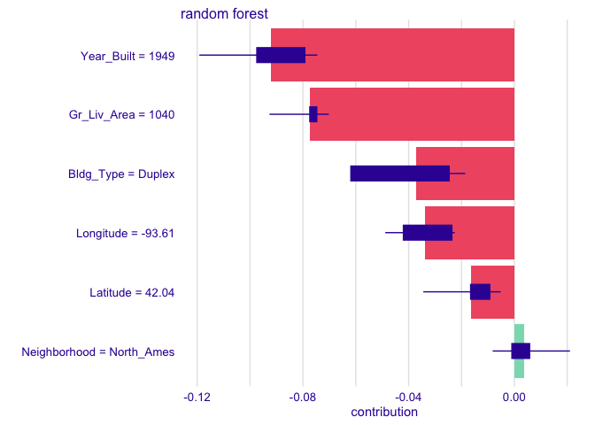
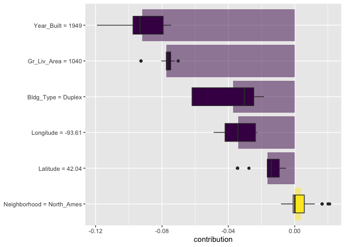
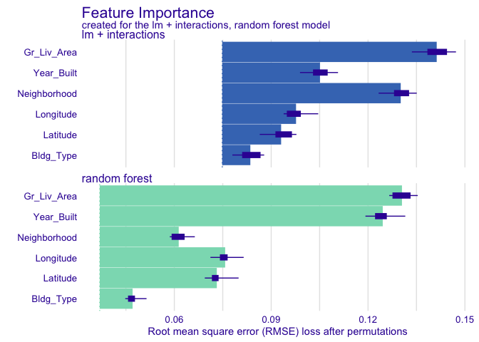
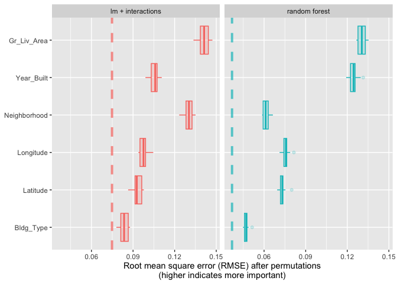
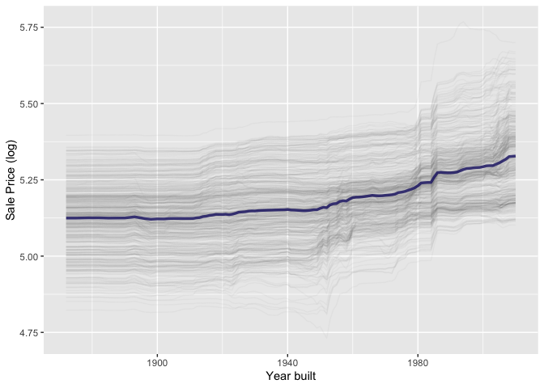
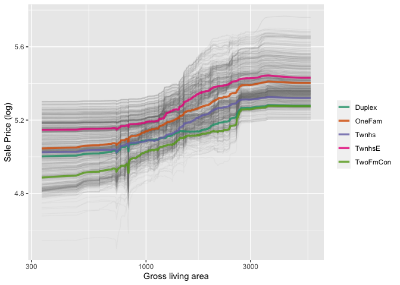
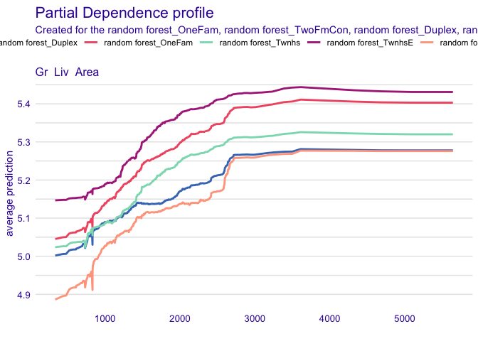
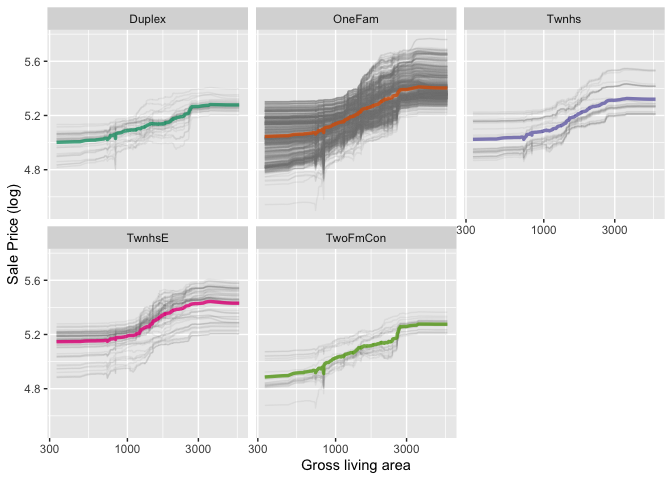
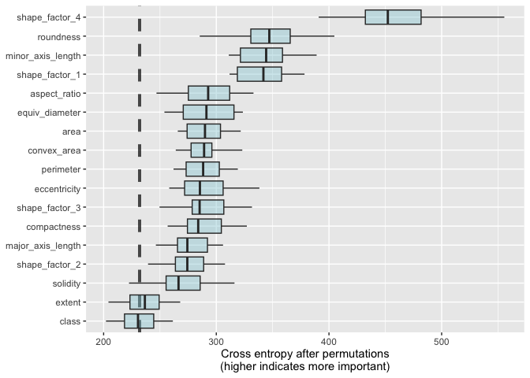

# 18 Explaining Models and Predictions

In Section 1.2, we outlined a taxonomy of models and suggested that models typically are built as one or more of descriptive, inferential, or predictive. We suggested that model performance can be important for all modeling applications. Similarly, model explanations, answering why a model makes the predictions it does, can be important whether the purpose of your model is largely descriptive, to test a hypothesis, or to make a prediction. Answering the question "why" allows modeling practitioners to understand which features were important in predictions and even how model predictions would change under different values for the features. 

For some models, like linear regression, it is usually clear how to explain why the model makes its predictions. The strucuture of a linear model contains coefficients for each predictor that are typically straightforward to interpret. For other models, like random forests that can capture nonlinear behavior by design, it is less transparent how to explain the model's predictions from only the structure of the model itself. Instead, we can apply model explainer algorithms to generate understanding of predictions. 

There are two types of model explanations, global and local. Global model explanations provide an overall understanding aggregated over a whole set of observations; local model explanations provide information about a prediction for a single observation. 

## 18.1 Software for model explanations

The tidymodels framework does not itself contain software for model explanations. Instead, models trained and evaluated with tidymodels can be explained with other supplementary software in R packages such as lime, vip, and DALEX. We often choose:

* vip functions when we want to use model-based methods that take advantage of model structure (and are often faster)
* DALEX functions when we want to use model-agnostic methods that can be applied to any model

In chapters 10 and 11, we trained and compared several models to predict the price of homes in Ames, IA, including a linear model with interactions and a random forest model. 

Let's build model-agnostic explainers for both of these models to find out why they make these predictions. We can use the DALEXtra add-on package for DALEX, which provides support for tidymodels.


```r
library(tidymodels)
```

```
## ── Attaching packages ────────────────────────────────────── tidymodels 1.1.1 ──
```

```
## ✔ broom        1.0.5     ✔ recipes      1.0.8
## ✔ dials        1.2.0     ✔ rsample      1.2.0
## ✔ dplyr        1.1.3     ✔ tibble       3.2.1
## ✔ ggplot2      3.4.4     ✔ tidyr        1.3.0
## ✔ infer        1.0.5     ✔ tune         1.1.2
## ✔ modeldata    1.2.0     ✔ workflows    1.1.3
## ✔ parsnip      1.1.1     ✔ workflowsets 1.0.1
## ✔ purrr        1.0.2     ✔ yardstick    1.2.0
```

```
## ── Conflicts ───────────────────────────────────────── tidymodels_conflicts() ──
## ✖ purrr::discard() masks scales::discard()
## ✖ dplyr::filter()  masks stats::filter()
## ✖ dplyr::lag()     masks stats::lag()
## ✖ recipes::step()  masks stats::step()
## • Search for functions across packages at https://www.tidymodels.org/find/
```

```r
library(DALEX)
```

```
## Welcome to DALEX (version: 2.4.3).
## Find examples and detailed introduction at: http://ema.drwhy.ai/
## Additional features will be available after installation of: ggpubr.
## Use 'install_dependencies()' to get all suggested dependencies
```

```
## 
## Attaching package: 'DALEX'
```

```
## The following object is masked from 'package:dplyr':
## 
##     explain
```

```r
library(DALEXtra)
library(vip)
```

```
## 
## Attaching package: 'vip'
```

```
## The following object is masked from 'package:DALEX':
## 
##     titanic
```

```
## The following object is masked from 'package:utils':
## 
##     vi
```

```r
library(forcats)
library(beans)
library(bestNormalize)
library(embed)
library(purrr)
```

Code from Chapter 10


```r
data(ames)
ames <- mutate(ames, Sale_Price = log10(Sale_Price))

set.seed(502)
ames_split <- initial_split(ames, prop = 0.80, strata = Sale_Price)
ames_train <- training(ames_split)
ames_test  <-  testing(ames_split)

ames_rec <- 
  recipe(Sale_Price ~ Neighborhood + Gr_Liv_Area + Year_Built + Bldg_Type + 
           Latitude + Longitude, data = ames_train) %>%
  step_log(Gr_Liv_Area, base = 10) %>% 
  step_other(Neighborhood, threshold = 0.01) %>% 
  step_dummy(all_nominal_predictors()) %>% 
  step_interact( ~ Gr_Liv_Area:starts_with("Bldg_Type_") ) %>% 
  step_ns(Latitude, Longitude, deg_free = 20)

lm_model <- linear_reg() %>% set_engine("lm")

lm_wflow <- 
  workflow() %>% 
  add_model(lm_model) %>% 
  add_recipe(ames_rec)

lm_fit <- fit(lm_wflow, ames_train)

rf_model <- 
  rand_forest(trees = 1000) %>% 
  set_engine("ranger") %>% 
  set_mode("regression")

rf_wflow <- 
  workflow() %>% 
  add_formula(
    Sale_Price ~ Neighborhood + Gr_Liv_Area + Year_Built + Bldg_Type + 
      Latitude + Longitude) %>% 
  add_model(rf_model) 

set.seed(1001)
ames_folds <- vfold_cv(ames_train, v = 10)

keep_pred <- control_resamples(save_pred = TRUE, save_workflow = TRUE)

set.seed(1003)
rf_res <- rf_wflow %>% fit_resamples(resamples = ames_folds, control = keep_pred)

rf_model <- 
  rand_forest(trees = 1000) %>% 
  set_engine("ranger") %>% 
  set_mode("regression")

rf_wflow <- 
  workflow() %>% 
  add_formula(
    Sale_Price ~ Neighborhood + Gr_Liv_Area + Year_Built + Bldg_Type + 
      Latitude + Longitude) %>% 
  add_model(rf_model) 

rf_fit <- rf_wflow %>% fit(data = ames_train)
```

To compute any kind of model explanation, global or local, using DALEX, we first prepare the appropriate data and then create an explainer for each model:


```r
vip_features <- c("Neighborhood", "Gr_Liv_Area", "Year_Built", 
                  "Bldg_Type", "Latitude", "Longitude")

vip_train <- 
  ames_train %>% 
  select(all_of(vip_features))

explainer_lm <- 
  explain_tidymodels(
    lm_fit, 
    data = vip_train, 
    y = ames_train$Sale_Price,
    label = "lm + interactions",
    verbose = FALSE
  )

explainer_rf <- 
  explain_tidymodels(
    rf_fit, 
    data = vip_train, 
    y = ames_train$Sale_Price,
    label = "random forest",
    verbose = FALSE
  )
```

Dealing with significant feature engineering transformations during model explainability highlights some options we have. We can quantify global or local model explanations either in terms of:

* original, basic predictors as they existed without significant feature engineering transformations, or
* derived features, such as those created via dimensionality reduction or interactions and spline terms, as in this example.

## 18.2 Local explanations

Local model explanations provide information about a prediction for a single observation. For example, let's consider an older duplex in the North Ames neighborhood.


```r
duplex = vip_train[120,]
duplex
```

```
## # A tibble: 1 × 6
##   Neighborhood Gr_Liv_Area Year_Built Bldg_Type Latitude Longitude
##   <fct>              <int>      <int> <fct>        <dbl>     <dbl>
## 1 North_Ames          1040       1949 Duplex        42.0     -93.6
```

There are multiple possible approaches to understanding why a model predicts a given price for this duplex. One is a break-down explanation, implemented with the DALEX function predict_parts(); it computes how contributions attributed to individual features change the mean model's prediction for a particular observation, like our duplex. For the linear model, the duplex status (Bldg_Type=3),size, longitude, and age all contribute the most to the price being driven down by the intercept. 


```r
lm_breakdown <- predict_parts(explainer = explainer_lm, new_observation = duplex)
lm_breakdown
```

```
##                                              contribution
## lm + interactions: intercept                        5.221
## lm + interactions: Gr_Liv_Area = 1040              -0.082
## lm + interactions: Bldg_Type = Duplex              -0.049
## lm + interactions: Longitude = -93.608903          -0.043
## lm + interactions: Year_Built = 1949               -0.039
## lm + interactions: Latitude = 42.035841            -0.007
## lm + interactions: Neighborhood = North_Ames        0.001
## lm + interactions: prediction                       5.002
```

Mine says Bldg_Type = Duplex not Bldg_Type = 3

Since this linear model was trained using spline terms for latitude and longitude, the contribution to price for longitude shown here combines the effects of all of its individual spline terms. The contribution is in terms of the original longitude feature, not the derived spline features. 

The most important features are slightly different for the random forest model, with the size, age, and duplex status being most important.


```r
rf_breakdown <- predict_parts(explainer = explainer_rf, new_observation = duplex)
rf_breakdown
```

```
##                                          contribution
## random forest: intercept                        5.221
## random forest: Year_Built = 1949               -0.076
## random forest: Gr_Liv_Area = 1040              -0.077
## random forest: Bldg_Type = Duplex              -0.024
## random forest: Longitude = -93.608903          -0.041
## random forest: Latitude = 42.035841            -0.027
## random forest: Neighborhood = North_Ames       -0.008
## random forest: prediction                       4.968
```

If we choose the order for the random forest model explanation to be the same as the default for the linear model (chosen via a heuristic), we can change the relative importance of the features. Model break-down explanations liek these depend on the order of the features.


```r
predict_parts(
  explainer = explainer_rf, 
  new_observation = duplex,
  order = lm_breakdown$variable_name
)
```

```
##                                          contribution
## random forest: intercept                        5.221
## random forest: Gr_Liv_Area = 1040              -0.076
## random forest: Bldg_Type = Duplex              -0.019
## random forest: Longitude = -93.608903          -0.023
## random forest: Year_Built = 1949               -0.100
## random forest: Latitude = 42.035841            -0.027
## random forest: Neighborhood = North_Ames       -0.008
## random forest: prediction                       4.968
```

We can use the fact taht these break-down explanations change based on order to compute the most important features over all (or many) possible orderings. This is the idea behind Shapley Additive Explanations, where the average contributions of features are computed under different combinations or "coalitions" of feature orderings. Let's compute SHAP attributions for our duplex B=20 random orderings. 


```r
set.seed(1801)
shap_duplex <- 
  predict_parts(
    explainer = explainer_rf, 
    new_observation = duplex, 
    type = "shap",
    B = 20
  )
```

We could use the default plot method from DALEX by calling plot(shap_duplex), or we can access the underlying data and create a custom plot. 


```r
plot(shap_duplex)
```

<!-- -->

The box plots display the distribution of contributions across all the orderings we tried, and the bars display the average attribution for each feature.


```r
shap_duplex %>%
  group_by(variable) %>%
  mutate(mean_val = mean(contribution)) %>%
  ungroup() %>%
  mutate(variable = fct_reorder(variable, abs(mean_val))) %>%
  ggplot(aes(contribution, variable, fill = mean_val > 0)) +
  geom_col(data = ~distinct(., variable, mean_val), 
           aes(mean_val, variable), 
           alpha = 0.5) +
  geom_boxplot(width = 0.5) +
  theme(legend.position = "none") +
  scale_fill_viridis_d() +
  labs(y = NULL)
```

<!-- -->

What about a different observation in our data set? Let's look at a larger, newer one-family home in the Gilbert neighborhood:


```r
big_house <- vip_train[1269,]
big_house
```

```
## # A tibble: 1 × 6
##   Neighborhood Gr_Liv_Area Year_Built Bldg_Type Latitude Longitude
##   <fct>              <int>      <int> <fct>        <dbl>     <dbl>
## 1 Gilbert             2267       2002 OneFam        42.1     -93.6
```

We can compute SHAP average attributions for this house in the same way.


```r
set.seed(1802)
shap_house <- 
  predict_parts(
    explainer = explainer_rf, 
    new_observation = big_house, 
    type = "shap",
    B = 20
  )
```

Unlike the duplex, the size and age of this house contribute to its price being higher. 

## 18.3 Global explanations

Global model explanations, also called global feature importance or variable importance, help us understand which features are most important in driving the predictions of the linear and random forest models overall, aggregated over the whole training set. While the previous section addressed which variables or features are most important in predicting sale price for an individual home, global feature importance addresses the most important variables for a model in aggregate. 

One way to compute variable importance is to permute the features. We can permute or shuffle the values of a feature predict from a model, and then measure how much worse the model fits the data compared to before shuffling. 

If shuffling a column causes a large degradation in model performance, it is important; if shuffling a column's values doesn't make much difference to how the model performs, it must not be an important variable. This approach can be applied to any kind of model (it is model agnostic) and the results are straightforward to understand.

Using DALEX, we compute this kind of variable importance via the model_parts() function.


```r
set.seed(1803)
vip_lm <- model_parts(explainer_lm, loss_function = loss_root_mean_square)
set.seed(1804)
vip_rf <- model_parts(explainer_rf, loss_function = loss_root_mean_square)
```

Again, we could use the default plot method from DALEX by calling plot(vip_lm, vip_rf) but the underlying data is available for exploration, analysis, and plotting.


```r
plot(vip_lm, vip_rf)
```

<!-- -->


```r
ggplot_imp <- function(...) {
  obj <- list(...)
  metric_name <- attr(obj[[1]], "loss_name")
  metric_lab <- paste(metric_name, 
                      "after permutations\n(higher indicates more important)")
  
  full_vip <- bind_rows(obj) %>%
    filter(variable != "_baseline_")
  
  perm_vals <- full_vip %>% 
    filter(variable == "_full_model_") %>% 
    group_by(label) %>% 
    summarise(dropout_loss = mean(dropout_loss))
  
  p <- full_vip %>%
    filter(variable != "_full_model_") %>% 
    mutate(variable = fct_reorder(variable, dropout_loss)) %>%
    ggplot(aes(dropout_loss, variable)) 
  if(length(obj) > 1) {
    p <- p + 
      facet_wrap(vars(label)) +
      geom_vline(data = perm_vals, aes(xintercept = dropout_loss, color = label),
                 linewidth = 1.4, lty = 2, alpha = 0.7) +
      geom_boxplot(aes(color = label, fill = label), alpha = 0.2)
  } else {
    p <- p + 
      geom_vline(data = perm_vals, aes(xintercept = dropout_loss),
                 linewidth = 1.4, lty = 2, alpha = 0.7) +
      geom_boxplot(fill = "#91CBD765", alpha = 0.4)
    
  }
  p +
    theme(legend.position = "none") +
    labs(x = metric_lab, 
         y = NULL,  fill = NULL,  color = NULL)
}
```


```r
ggplot_imp(vip_lm, vip_rf)
```

<!-- -->

The dashed line in each panel shows the RMSE for the full model, either the linear model or the random forest model. Features farther to the right are more important, because permuting them results in higher RMSE. There is quite a lot of interesting information to learn from this plot; for example, neighborhood is quite important in the linear model with interactions/splines but the second least important feature for the random forest model. 

## 18.4 Building global explanations from local explanations

So far in this chapter, we have focused on local model explanations for a single observation (via Shapley additive explanations) and global model explanations for a data set as a whole (via permutting features). It is also possible to build global model explanations by aggregating local model explanations, as with partial dependence profiles.

Partial dependence profiles show that the expected value of a model prediction, like the predicted price of a home in Ames, changes as a function of a feature, like the age or gross living area.

One way to build such a profile is by aggregating or averaging profiles for individual observations. A profile showing how an individual observation's prediction changes as a function of a given feature is called an ICE (individual conditional expectation) profile or a CP (ceteris paribus) profile. We can compute such individual profiles (for 500 of the observations in our training set) and then aggregate them using the DALEX function model_profile()


```r
set.seed(1805)
pdp_age <- model_profile(explainer_rf, N = 500, variables = "Year_Built")
```

Let's create another function for plotting the underlying data in this object.


```r
ggplot_pdp <- function(obj, x) {
  
  p <- 
    as_tibble(obj$agr_profiles) %>%
    mutate(`_label_` = stringr::str_remove(`_label_`, "^[^_]*_")) %>%
    ggplot(aes(`_x_`, `_yhat_`)) +
    geom_line(data = as_tibble(obj$cp_profiles),
              aes(x = {{ x }}, group = `_ids_`),
              linewidth = 0.5, alpha = 0.05, color = "gray50")
  
  num_colors <- n_distinct(obj$agr_profiles$`_label_`)
  
  if (num_colors > 1) {
    p <- p + geom_line(aes(color = `_label_`), linewidth = 1.2, alpha = 0.8)
  } else {
    p <- p + geom_line(color = "midnightblue", linewidth = 1.2, alpha = 0.8)
  }
  
  p
}
```

Using this function, we can see the nonlinear behavior of the random forest model.


```r
ggplot_pdp(pdp_age, Year_Built)  +
  labs(x = "Year built", 
       y = "Sale Price (log)", 
       color = NULL)
```

<!-- -->

Sale price for houses build in different years is most flat, with a modest rise after about 1960. Partial dependence profiles can be computed for any other feature in the model, and also for groups in the data, such as Bldg_Type. Let's use 1,000 observations for these profiles. 


```r
set.seed(1806)
pdp_liv <- model_profile(explainer_rf, N = 1000, 
                         variables = "Gr_Liv_Area", 
                         groups = "Bldg_Type")
```

```
## Warning in FUN(X[[i]], ...): Variable: < Gr_Liv_Area > has more than 201 unique
## values and all of them will be used as variable splits in calculating variable
## profiles. Use the `variable_splits` parameter to mannualy change this
## behaviour. If you believe this warning to be a false positive, raise issue at
## <https://github.com/ModelOriented/ingredients/issues>.
```

```r
ggplot_pdp(pdp_liv, Gr_Liv_Area) +
  scale_x_log10() +
  scale_color_brewer(palette = "Dark2") +
  labs(x = "Gross living area", 
       y = "Sale Price (log)", 
       color = NULL)
```

<!-- -->

We see that sale price increases the most between 1000 and 3000 square square feet of living area, and that different home types (like single family home or different types of townhouses) mostly exhibit similar increasing trends in price with more living space. 
We have the option of using plot(pdp_liv) for default DALEX plots, but since we are making plots with the underlying data here, we can even facet by one of the features to visualize if the predictions change differently and highlighting the imbalance in these subgroups.


```r
plot(pdp_liv) 
```

<!-- -->


```r
as_tibble(pdp_liv$agr_profiles) %>%
  mutate(Bldg_Type = stringr::str_remove(`_label_`, "random forest_")) %>%
  ggplot(aes(`_x_`, `_yhat_`, color = Bldg_Type)) +
  geom_line(data = as_tibble(pdp_liv$cp_profiles),
            aes(x = Gr_Liv_Area, group = `_ids_`),
            linewidth = 0.5, alpha = 0.1, color = "gray50") +
  geom_line(linewidth = 1.2, alpha = 0.8, show.legend = FALSE) +
  scale_x_log10() +
  facet_wrap(~Bldg_Type) +
  scale_color_brewer(palette = "Dark2") +
  labs(x = "Gross living area", 
       y = "Sale Price (log)", 
       color = NULL)
```

<!-- -->

There is no one correct approach for building model explanations, and the options outlined in this chapter are not exhaustive

## 18.5 Back to Beans!

In chapter 16, we discussed how to use dimensionality reduction as a feature engineering or preprocessing step when modeling high-dimensional data. For our example data set of dry bean morphology measures predicting bean type, we saw great results from partial least squares (PLS) dimensionality reduction combined with a regularized discriminant analysis model. Which of those morphological characteristics were most important in the bean type predictions? We can use the same approach outlined throughout this chapter to create a model-agnostic explainer and compute, say, global model explanations via model_parts():


```r
set.seed(1601)
bean_split <- initial_validation_split(beans, strata = class, prop = c(0.75, 0.125))
```

```
## Warning: Too little data to stratify.
## • Resampling will be unstratified.
```

```r
bean_split
```

```
## <Training/Validation/Testing/Total>
## <10206/1702/1703/13611>
```

```r
# Return data frames:
bean_train <- training(bean_split)
bean_test <- testing(bean_split)
bean_validation <- validation(bean_split)

set.seed(1602)
# Return an 'rset' object to use with the tune functions:
bean_val <- validation_set(bean_split)
bean_val$splits[[1]]
```

```
## <Training/Validation/Total>
## <10206/1702/11908>
```


```r
bean_rec <-
  recipe(class ~ ., data = bean_train) %>%
  step_zv(all_numeric_predictors()) %>%
  step_orderNorm(all_numeric_predictors()) %>%
  step_normalize(all_numeric_predictors())

pls_rec <- 
  bean_rec %>% 
  step_pls(all_numeric_predictors(), outcome = "class", num_comp = tune())
```


```r
library(klaR)
```

```
## Loading required package: MASS
```

```
## 
## Attaching package: 'MASS'
```

```
## The following object is masked from 'package:bestNormalize':
## 
##     boxcox
```

```
## The following object is masked from 'package:dplyr':
## 
##     select
```

```
## Registered S3 method overwritten by 'questionr':
##   method            from 
##   print.description DALEX
```

```r
library(parsnip)
library(discrim)
```

```
## 
## Attaching package: 'discrim'
```

```
## The following object is masked from 'package:dials':
## 
##     smoothness
```

```r
rda_spec <-
  discrim_regularized(frac_common_cov = tune(), frac_identity = tune()) %>%
  set_engine('klaR')
```


```r
ctrl <- control_grid(parallel_over = "everything")
bean_res <- 
  workflow_set(
    preproc = list(basic = class ~., pls = pls_rec),
    models = list(rda = rda_spec)
  ) %>% 
  workflow_map(
    verbose = TRUE,
    seed = 1603,
    resamples = bean_val,
    grid = 10,
    metrics = metric_set(roc_auc),
    control = ctrl
  )
```

```
## i 1 of 2 tuning:     basic_rda
```

```
## Warning in `[.tbl_df`(x, is.finite(x <- as.numeric(x))): NAs introduced by
## coercion
```

```
## ✔ 1 of 2 tuning:     basic_rda (5s)
```

```
## i 2 of 2 tuning:     pls_rda
```

```
## Warning in `[.tbl_df`(x, is.finite(x <- as.numeric(x))): NAs introduced by
## coercion
```

```
## ✔ 2 of 2 tuning:     pls_rda (15.8s)
```


```r
rda_res <- 
  bean_res %>% 
  extract_workflow("pls_rda") %>% 
  finalize_workflow(
    bean_res %>% 
      extract_workflow_set_result("pls_rda") %>% 
      select_best(metric = "roc_auc")
  ) %>% 
  last_fit(split = bean_split, metrics = metric_set(roc_auc))

rda_wflow_fit <- extract_workflow(rda_res)
```


```r
set.seed(1807)
vip_beans <- 
  explain_tidymodels(
    rda_wflow_fit, 
    data = bean_train, 
    y = bean_train$class,
    label = "RDA",
    verbose = FALSE
  ) %>% 
  model_parts() 
```

Had to delete the %>% select(-class) part of the code with bean_train


```r
ggplot_imp(vip_beans)
```

<!-- -->

This figure shows us that shape factors are among the most important features for predicting bean type, especailly shape factor 4, a measure of solidity that takes into account the area A, major axis L, and minor axis l. 

We can see that shape factor 1 (the ratio of the major axis to the area), the minor axis length, and roundness are the next most important bean characteristics for predicting bean variety
