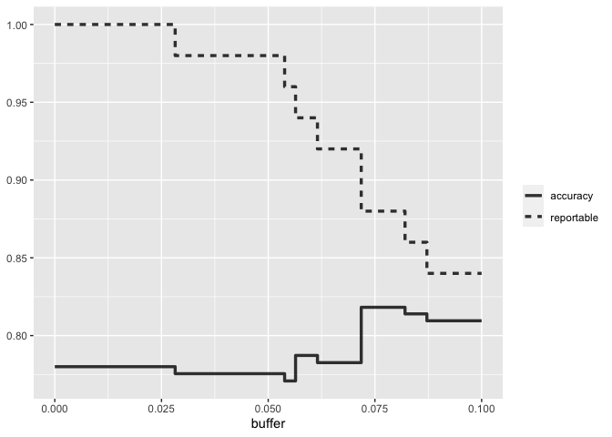
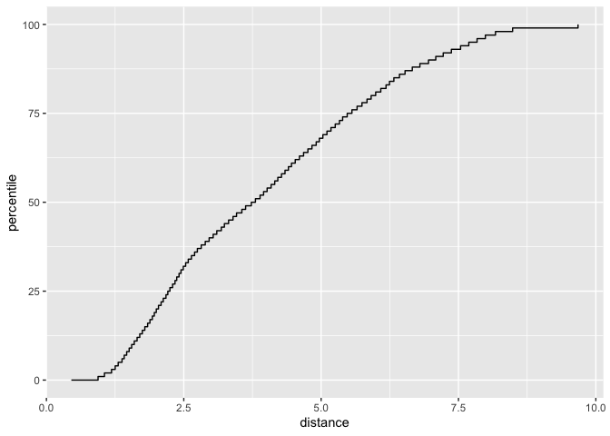

## When should you trust your predictions?

When a new data point in well outside of the range of data used to create the model, making a prediction may be an inappropriate extrapolation. A more qualitative example of an inappropriate prediction would be when the model is used in a completely different context.
For example, a model build on human breast cancer cells should not be applied to stomach cells. We can produce a prediction but it is unlikely to be applicable to the different cell type. This chapter covers two methods for quantifying the potential quality of a prediction:

* Equivocal zones use the predicted values to alert the user that results may be suspect.
* Applicability uses the predictors to measure the amount of extrapolation (if any) for new samples. 

### 19.1 Equivocal Results

The equivocal zone is the range of results in which the prediction should not be reported to patients, for example, some range of COVID-19 test results that are too uncertain to be reported to the patient. 


```r
library(tidymodels)
```

```
## ── Attaching packages ────────────────────────────────────── tidymodels 1.1.1 ──
```

```
## ✔ broom        1.0.5     ✔ recipes      1.0.8
## ✔ dials        1.2.0     ✔ rsample      1.2.0
## ✔ dplyr        1.1.3     ✔ tibble       3.2.1
## ✔ ggplot2      3.4.4     ✔ tidyr        1.3.0
## ✔ infer        1.0.5     ✔ tune         1.1.2
## ✔ modeldata    1.2.0     ✔ workflows    1.1.4
## ✔ parsnip      1.2.1     ✔ workflowsets 1.0.1
## ✔ purrr        1.0.2     ✔ yardstick    1.3.1
```

```
## ── Conflicts ───────────────────────────────────────── tidymodels_conflicts() ──
## ✖ purrr::discard() masks scales::discard()
## ✖ dplyr::filter()  masks stats::filter()
## ✖ dplyr::lag()     masks stats::lag()
## ✖ recipes::step()  masks stats::step()
## • Use tidymodels_prefer() to resolve common conflicts.
```

```r
tidymodels_prefer()

simulate_two_classes <- 
  function (n, error = 0.1, eqn = quote(-1 - 2 * x - 0.2 * x^2 + 2 * y^2))  {
    # Slightly correlated predictors
    sigma <- matrix(c(1, 0.7, 0.7, 1), nrow = 2, ncol = 2)
    dat <- MASS::mvrnorm(n = n, mu = c(0, 0), Sigma = sigma)
    colnames(dat) <- c("x", "y")
    cls <- paste0("class_", 1:2)
    dat <- 
      as_tibble(dat) %>% 
      mutate(
        linear_pred = !!eqn,
        # Add some misclassification noise
        linear_pred = linear_pred + rnorm(n, sd = error),
        prob = binomial()$linkinv(linear_pred),
        class = ifelse(prob > runif(n), cls[1], cls[2]),
        class = factor(class, levels = cls)
      )
    dplyr::select(dat, x, y, class)
  }

set.seed(1901)
training_set <- simulate_two_classes(200)
testing_set  <- simulate_two_classes(50)
```


```r
two_class_mod <- 
  logistic_reg() %>% 
  set_engine("stan", seed = 1902) %>% 
  fit(class ~ . + I(x^2)+ I(y^2), data = training_set)
print(two_class_mod, digits = 3)
```

```
## parsnip model object
## 
## stan_glm
##  family:       binomial [logit]
##  formula:      class ~ . + I(x^2) + I(y^2)
##  observations: 200
##  predictors:   5
## ------
##             Median MAD_SD
## (Intercept)  1.092  0.287
## x            2.290  0.423
## y            0.314  0.354
## I(x^2)       0.077  0.307
## I(y^2)      -2.465  0.424
## 
## ------
## * For help interpreting the printed output see ?print.stanreg
## * For info on the priors used see ?prior_summary.stanreg
```

One simple method for disqualifying some results is to call them "equivocal" if the values are within some range around 50% (or the appropriate probability cutoff for a certain situation). Depending on the problem the model is being applied to, this might indicate we should collect another measurement or we require more information before a trustworthy prediction is possible.

We could base the width of the band around the cutoff on how performance improves when the uncertain results are removed. However, we should also estimate the reportable rate (the expected proportion of usable results). For example, it would not be useful in real-world situations to have perfect performance but release predictions on only 2% of the samples passed to the model.


```r
test_pred <- augment(two_class_mod, testing_set)
test_pred %>% head()
```

```
## # A tibble: 6 × 6
##   .pred_class .pred_class_1 .pred_class_2      x      y class  
##   <fct>               <dbl>         <dbl>  <dbl>  <dbl> <fct>  
## 1 class_2           0.0256          0.974  1.12  -0.176 class_2
## 2 class_1           0.555           0.445 -0.126 -0.582 class_2
## 3 class_2           0.00620         0.994  1.92   0.615 class_2
## 4 class_2           0.472           0.528 -0.400  0.252 class_2
## 5 class_2           0.163           0.837  1.30   1.09  class_1
## 6 class_2           0.0317          0.968  2.59   1.36  class_2
```

With tidymodels, the probably package contains functions for equivocal zones. For cases with two classes, the make_two_class_pred() function creates a factor-like column that has the predicted classes with an equivocal zone. 


```r
library(probably)

lvls <- levels(training_set$class)

test_pred <- 
  test_pred %>% 
  mutate(.pred_with_eqz = make_two_class_pred(.pred_class_1, lvls, buffer = 0.15))

test_pred %>% count(.pred_with_eqz)
```

```
## # A tibble: 3 × 2
##   .pred_with_eqz     n
##       <clss_prd> <int>
## 1           [EQ]     9
## 2        class_1    20
## 3        class_2    21
```

Rows that are within 0.50 +- 0.15 are given a value of [EQ].

Since the factor levels are the same as the original data, confusion matrices and other statistics can be computed without error. When using standard functions from the yardstick package, the equivocal results are converted to NA and are not used in the calculations that use the hard class predictions.


```r
# All data
test_pred %>% conf_mat(class, .pred_class)
```

```
##           Truth
## Prediction class_1 class_2
##    class_1      20       6
##    class_2       5      19
```


```r
# Reportable results only: 
test_pred %>% conf_mat(class, .pred_with_eqz)
```

```
##           Truth
## Prediction class_1 class_2
##    class_1      17       3
##    class_2       5      16
```

An is_equivocal() function is available for filtering these rows from the data


```r
# A function to change the buffer then compute performance.
eq_zone_results <- function(buffer) {
  test_pred <- 
    test_pred %>% 
    mutate(.pred_with_eqz = make_two_class_pred(.pred_class_1, lvls, buffer = buffer))
  acc <- test_pred %>% accuracy(class, .pred_with_eqz)
  rep_rate <- reportable_rate(test_pred$.pred_with_eqz)
  tibble(accuracy = acc$.estimate, reportable = rep_rate, buffer = buffer)
}

# Evaluate a sequence of buffers and plot the results. 
map(seq(0, .1, length.out = 40), eq_zone_results) %>% 
  list_rbind() %>% 
  pivot_longer(c(-buffer), names_to = "statistic", values_to = "value") %>% 
  ggplot(aes(x = buffer, y = value, lty = statistic)) + 
  geom_step(linewidth = 1.2, alpha = 0.8) + 
  labs(y = NULL, lty = NULL)
```

<!-- -->

Accuracy improves by a few percentage points but at the cost of nearly 10% of predictions being unusable. The value of such a compromise depends on how the model predictions will be used.

This analysis focused on using the predicted class probability to disqualify points, since this is a fundamental measure of uncertainty in classification models. A slightly better approache would be to use the standard error of the class probability. Since we used a Bayesian model, the probability estimates we found are actually the mean of the posterior predictive distribution. In other words, the Bayesian model gives us a distribution for the class probability. Measuring the standard deviation of this distribution gives us a standard error of prediction of the probability. In most cases, this value is directly related to the mean class probability. 

One important aspect of the standard error of prediction is that it takes into account more than just the class probability. In cases where there is significant extrapolation or aberrant predictor values, the standard error might increase. The benefit of using the standard error of prediction is that it might also flag predictions that are problematic (as opposed to simply uncertain). One reason we used the Bayesian model is that it naturally estimates the standard error of prediction; not many models can calculate this. For our test set, using type = "pred_int" will produce upper and lower limits and the std_error adds a column for that quantity. 


```r
test_pred <- 
  test_pred %>% 
  bind_cols(
    predict(two_class_mod, testing_set, type = "pred_int", std_error = TRUE)
  )
```

### 19.2 Determining model applicability

Equivocal zones try to measure the reliability of a prediction based on the model outputs. It may be that model statistics, such as the standard error of prediction, cannot measure the impact of extrapolation, and so we need another way to assess whether to trust a prediction and answer, "Is our model applicable for predicting a specific data point?"

The goal is to predict the number of customers entering the Clark and Lake train station each day.


```r
library(modeldata)

data(Chicago)

Chicago <- Chicago %>% select(ridership, date, one_of(stations))

n <- nrow(Chicago)

Chicago_train <- Chicago %>% slice(1:(n - 14))
Chicago_test  <- Chicago %>% slice((n - 13):n)
```

The main predictors are lagged ridership at different train stations as well as the date. The ridership predictors are highly correlated with on another. In the following recipe, the date column is expanded into several new features, and the ridership predictors are represented using partial least squares components. PLS is a supervised version of PCA where the new features have been decorrelated but are predictive of the outcome data.


```r
base_recipe <-
  recipe(ridership ~ ., data = Chicago_train) %>%
  # Create date features
  step_date(date) %>%
  step_holiday(date, keep_original_cols = FALSE) %>%
  # Create dummy variables from factor columns
  step_dummy(all_nominal()) %>%
  # Remove any columns with a single unique value
  step_zv(all_predictors()) %>%
  step_normalize(!!!stations)%>%
  step_pls(!!!stations, num_comp = 10, outcome = vars(ridership))

lm_spec <-
  linear_reg() %>%
  set_engine("lm") 

lm_wflow <-
  workflow() %>%
  add_recipe(base_recipe) %>%
  add_model(lm_spec)

set.seed(1902)
lm_fit <- fit(lm_wflow, data = Chicago_train)
```

How well do the data fit on the test set? We can predict() for the test set to find both predictions and prediction intervals.


```r
res_test <-
  predict(lm_fit, Chicago_test) %>%
  bind_cols(
    predict(lm_fit, Chicago_test, type = "pred_int"),
    Chicago_test
  )

res_test %>% select(date, ridership, starts_with(".pred"))
```

```
## # A tibble: 14 × 5
##    date       ridership .pred .pred_lower .pred_upper
##    <date>         <dbl> <dbl>       <dbl>       <dbl>
##  1 2016-08-15     20.6  20.3        16.2         24.5
##  2 2016-08-16     21.0  21.3        17.1         25.4
##  3 2016-08-17     21.0  21.4        17.3         25.6
##  4 2016-08-18     21.3  21.4        17.3         25.5
##  5 2016-08-19     20.4  20.9        16.7         25.0
##  6 2016-08-20      6.22  7.52        3.34        11.7
##  7 2016-08-21      6.62  6.34        2.19        10.5
##  8 2016-08-22     21.2  20.2        16.1         24.3
##  9 2016-08-23     21.3  21.3        17.1         25.4
## 10 2016-08-24     20.7  21.5        17.4         25.6
## 11 2016-08-25     21.3  21.4        17.3         25.5
## 12 2016-08-26     20.5  20.7        16.5         24.8
## 13 2016-08-27      6.27  8.31        4.18        12.4
## 14 2016-08-28      5.63  7.18        3.05        11.3
```

```r
res_test %>% rmse(ridership, .pred)
```

```
## # A tibble: 1 × 3
##   .metric .estimator .estimate
##   <chr>   <chr>          <dbl>
## 1 rmse    standard       0.865
```

These are fairly good results.

Given the scale of the ridership numbers, these results look particularly good for such a simple model. If this model were deployed how well would it have done a few years later in June 2020? The model successfully makes a prediction, as a predictive model almost alwasy will when given input data.


```r
load("Chicago_2020.RData")

res_2020 <-
  predict(lm_fit, Chicago_2020) %>%
  bind_cols(
    predict(lm_fit, Chicago_2020, type = "pred_int"),
    Chicago_2020
  ) 

res_2020 %>% select(date, contains(".pred"))
```

```
## # A tibble: 14 × 4
##    date       .pred .pred_lower .pred_upper
##    <date>     <dbl>       <dbl>       <dbl>
##  1 2020-06-01 20.1        15.9         24.3
##  2 2020-06-02 21.4        17.2         25.6
##  3 2020-06-03 21.5        17.3         25.6
##  4 2020-06-04 21.3        17.1         25.4
##  5 2020-06-05 20.7        16.6         24.9
##  6 2020-06-06  9.04        4.88        13.2
##  7 2020-06-07  7.84        3.69        12.0
##  8 2020-06-08 20.3        16.1         24.4
##  9 2020-06-09 21.4        17.2         25.6
## 10 2020-06-10 21.5        17.3         25.7
## 11 2020-06-11 21.2        17.0         25.4
## 12 2020-06-12 20.7        16.5         24.9
## 13 2020-06-13  9.02        4.86        13.2
## 14 2020-06-14  7.90        3.74        12.1
```

The prediction intervals are about the same width, even thoguh these data are well beyond the time period of the original training set. However, given the global pandemic in 2020, the performance of these data are abysmal:


```r
res_2020 %>% select(date, ridership, starts_with(".pred"))
```

```
## # A tibble: 14 × 5
##    date       ridership .pred .pred_lower .pred_upper
##    <date>         <dbl> <dbl>       <dbl>       <dbl>
##  1 2020-06-01     0.002 20.1        15.9         24.3
##  2 2020-06-02     0.005 21.4        17.2         25.6
##  3 2020-06-03     0.566 21.5        17.3         25.6
##  4 2020-06-04     1.66  21.3        17.1         25.4
##  5 2020-06-05     1.95  20.7        16.6         24.9
##  6 2020-06-06     1.08   9.04        4.88        13.2
##  7 2020-06-07     0.655  7.84        3.69        12.0
##  8 2020-06-08     1.69  20.3        16.1         24.4
##  9 2020-06-09     1.65  21.4        17.2         25.6
## 10 2020-06-10     1.73  21.5        17.3         25.7
## 11 2020-06-11     1.80  21.2        17.0         25.4
## 12 2020-06-12     1.83  20.7        16.5         24.9
## 13 2020-06-13     0.969  9.02        4.86        13.2
## 14 2020-06-14     0.737  7.90        3.74        12.1
```

```r
res_2020 %>% rmse(ridership, .pred)
```

```
## # A tibble: 1 × 3
##   .metric .estimator .estimate
##   <chr>   <chr>          <dbl>
## 1 rmse    standard        17.2
```

Confidence and prediction intervals for linear regression expand as the data become more and more removed from the center of the training set. However, that effect is not dramatic enough to flag these predictions as being poor.

This situation can be avoided by having a secondary methodology that can quantify how applicable the model is for any new prediction (i.e. the model's applicability domain). There are a variety of methods to compute an applicability domain model. The approach used in this chapter is a fairly simple unsupervised method that attempts to measure how much (if any) a new data point is beyond the training data.

The idea is to accompany a prediction with a socre that measures how similar the new point is to the training set. 

One method that works well uses PCA on the numeric predictor values. We'll illustrate the process by using only two of the predictors that correspond to ridership at different stations (California and Austin). 

The first step is to conduct PCA on the training data. Next using these results, we measure the distance of each training set point to the center of the PCA data. We then use this reference distribution to estimate how far a data point is from the mainstream of the training data. 

For a new sample, the PCA scores are computed along with the distance to the center of the training set. However, what does it mean when a new sample has a distance of X? Since the PCA components can have different ranges from data set to data set, there is no obvious limit to say that a distance is too large. 

One approach is to treat the distances from the training set data as "normal". For new samples, we can determine how the new distance compares to the range in the reference distribution (from the training set). A percentile can be computed for the new samples that reflect how much of the training set is less extreme than the new samples. 

A percentile of 90% means that most of the training set data are closer to the data center than the new sample. 

The applicable package can develop an applicability domain model using PCA. We'll use the 20 lagged station ridership predictors as inputs into the PCA analysis. There is an additional argument called threshold that determines how many components are used in the distance calculation. For our example, we'll use a large value that indicates we should use enough components to account for 99% of the variation in the ridership predictors.


```r
library(applicable)
pca_stat <- apd_pca(~ ., data = Chicago_train %>% select(one_of(stations)), 
                    threshold = 0.99)
pca_stat
```

```
## # Predictors:
##    20
## # Principal Components:
##    9 components were needed
##    to capture at least 99% of the
##    total variation in the predictors.
```

The autoplot() method plots the reference distribution. It has an optional argument for which data to plot. We'll add a value of distance to plot only the training set distance distribution. 


```r
autoplot(pca_stat, distance) + labs(x = "distance")
```

<!-- -->

The x-axis shows the values of the distance and the y-axis displays the distribution's percentiles. 

To compute the percentiles for new date, the score() function works in the same way as predict(). 


```r
score(pca_stat, Chicago_test) %>% select(starts_with("distance"))
```

```
## # A tibble: 14 × 2
##    distance distance_pctl
##       <dbl>         <dbl>
##  1     4.88          66.7
##  2     5.21          71.4
##  3     5.19          71.1
##  4     5.00          68.5
##  5     4.36          59.3
##  6     4.10          55.2
##  7     5.59          76.4
##  8     4.21          56.9
##  9     4.94          67.5
## 10     4.93          67.4
## 11     4.93          67.3
## 12     3.50          47.4
## 13     3.89          52.1
## 14     5.42          74.4
```

These seem fairly reasonable. For the 2020 data:


```r
score(pca_stat, Chicago_2020) %>% select(starts_with("distance"))
```

```
## # A tibble: 14 × 2
##    distance distance_pctl
##       <dbl>         <dbl>
##  1     9.39          99.8
##  2     9.40          99.8
##  3     9.30          99.7
##  4     9.30          99.7
##  5     9.29          99.7
##  6    10.1            1  
##  7    10.2            1  
##  8    10.1            1  
##  9     9.30          99.7
## 10     9.22          99.6
## 11     9.26          99.7
## 12     9.12          99.5
## 13     9.80           1  
## 14    10.7            1
```

The 2020 distance values indicate that these predictor values are outside of the vast majority of data seen by the model at training time. These should be flagges so that the predictiions are either not reported at all or viewed with skepticism. 
