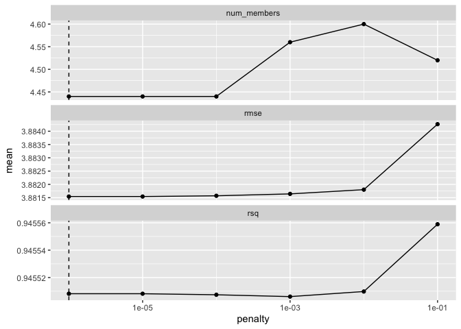
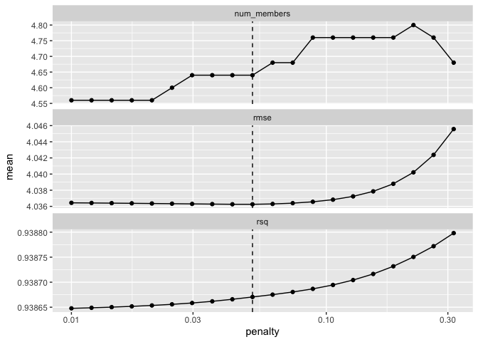
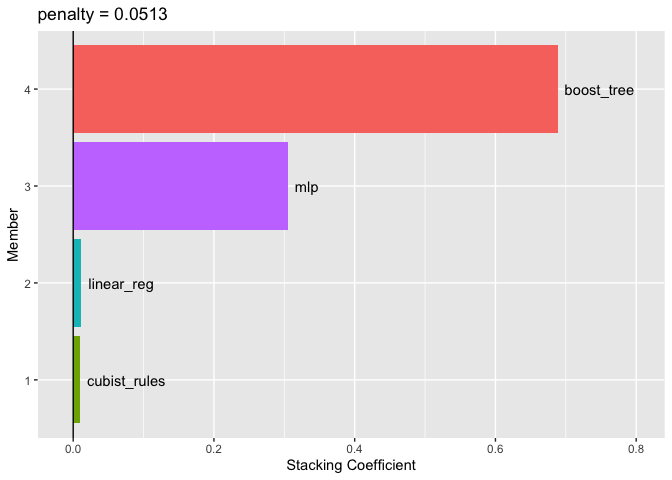

## 20 Ensembles of Models

A model ensemble, where the predictions of multiple single learners are aggregated to make one prediction, can produce a high-performance final model. The most popular methods for creating ensemble models are bagging, random forest, and boosting. Each of these methods combines the predictions from multiple versions of the same type of model (e.g. classification trees). One of the earliest methods for creating ensembles is model stacking. 

Model stacking combines the predictions for multiple models of any type. For example, a logistic regression, classification tree, and support vector machine be can included in a stacking ensemble. 

This chapter shows how to stack predictive models using the stacks package. 

The process of building a stacked ensemble is:

1. Assemble the training set of hold-out predictions (produced via resampling).
2. Create a model to blend these predictions
3. For each member of the ensemble, fit the model on the original training set.

Let's consider the multilayer perceptron (MLP) (a.k.a. neural network). We'll talk about the MLP model as a type of model. Linear regression and support vector machines are other model types. 

Tuning parameters are an important aspect of a model. In the previous chapters, we've called these candidate tuning parameter values or model configurations. In literature on ensembling these have also been called the base models. We'll use the term candidate members to describe the possible model configurations (of all model types) that might be included in the stacking ensemble. 

This means taht a stacking model can include different types of models (e.g. trees and neural networks) as well as different configurations of the same model (e.g. trees with different depths).

### 20.1 Creating the training set for stacking

The first step for building a stacked ensemble relies on the assessment set predictions from a resampling scheme with multiple splits. For each data point in the training set, stacking requires an out-of-sample prediction of some sort. For regression models, this is the predicted outcome. For classification models, the predicted classes or probabilities are available for use. For a set of models, a data set is assembled where rows are the training set samples and columns are the out-of-sample predicitons from the set of multiple models.

In Chapter 15, we used 5 repeates of 10-fold cross-validation to resample the data. This resampling scheme generates 5 assessment set predictions for each training set sample. For the purpose of stacking, any replicate predictions for a data point in the training set are averaged so that there is a single prediction per training set sample per candidate member. 

To start ensembling with the stacks pacakge, create an empty data stack using the stacks() function and then add candidate models. Recall that we used workflow sets to fit a wide variety of models to these data.


```r
library(tidymodels)
```

```
## ── Attaching packages ────────────────────────────────────── tidymodels 1.1.1 ──
```

```
## ✔ broom        1.0.5      ✔ recipes      1.0.10
## ✔ dials        1.2.0      ✔ rsample      1.2.0 
## ✔ dplyr        1.1.3      ✔ tibble       3.2.1 
## ✔ ggplot2      3.4.4      ✔ tidyr        1.3.0 
## ✔ infer        1.0.5      ✔ tune         1.2.1 
## ✔ modeldata    1.2.0      ✔ workflows    1.1.4 
## ✔ parsnip      1.2.1      ✔ workflowsets 1.0.1 
## ✔ purrr        1.0.2      ✔ yardstick    1.3.1
```

```
## ── Conflicts ───────────────────────────────────────── tidymodels_conflicts() ──
## ✖ purrr::discard() masks scales::discard()
## ✖ dplyr::filter()  masks stats::filter()
## ✖ dplyr::lag()     masks stats::lag()
## ✖ recipes::step()  masks stats::step()
## • Dig deeper into tidy modeling with R at https://www.tmwr.org
```

```r
tidymodels_prefer()
data(concrete, package = "modeldata")
glimpse(concrete)
```

```
## Rows: 1,030
## Columns: 9
## $ cement               <dbl> 540.0, 540.0, 332.5, 332.5, 198.6, 266.0, 380.0, …
## $ blast_furnace_slag   <dbl> 0.0, 0.0, 142.5, 142.5, 132.4, 114.0, 95.0, 95.0,…
## $ fly_ash              <dbl> 0, 0, 0, 0, 0, 0, 0, 0, 0, 0, 0, 0, 0, 0, 0, 0, 0…
## $ water                <dbl> 162, 162, 228, 228, 192, 228, 228, 228, 228, 228,…
## $ superplasticizer     <dbl> 2.5, 2.5, 0.0, 0.0, 0.0, 0.0, 0.0, 0.0, 0.0, 0.0,…
## $ coarse_aggregate     <dbl> 1040.0, 1055.0, 932.0, 932.0, 978.4, 932.0, 932.0…
## $ fine_aggregate       <dbl> 676.0, 676.0, 594.0, 594.0, 825.5, 670.0, 594.0, …
## $ age                  <int> 28, 28, 270, 365, 360, 90, 365, 28, 28, 28, 90, 2…
## $ compressive_strength <dbl> 79.99, 61.89, 40.27, 41.05, 44.30, 47.03, 43.70, …
```


```r
concrete <- 
   concrete %>% 
   group_by(across(-compressive_strength)) %>% 
   summarize(compressive_strength = mean(compressive_strength),
             .groups = "drop")
nrow(concrete)
```

```
## [1] 992
```


```r
set.seed(1501)
concrete_split <- initial_split(concrete, strata = compressive_strength)
concrete_train <- training(concrete_split)
concrete_test  <- testing(concrete_split)

set.seed(1502)
concrete_folds <- 
   vfold_cv(concrete_train, strata = compressive_strength, repeats = 5)
```


```r
normalized_rec <- 
   recipe(compressive_strength ~ ., data = concrete_train) %>% 
   step_normalize(all_predictors()) 

poly_recipe <- 
   normalized_rec %>% 
   step_poly(all_predictors()) %>% 
   step_interact(~ all_predictors():all_predictors())
```


```r
library(parsnip)
library(rules)
library(baguette)
library(xgboost)
library(kknn)

linear_reg_spec <- 
   linear_reg(penalty = tune(), mixture = tune()) %>% 
   set_engine("glmnet")

nnet_spec <- 
   mlp(hidden_units = tune(), penalty = tune(), epochs = tune()) %>% 
   set_engine("nnet", MaxNWts = 2600) %>% 
   set_mode("regression")

mars_spec <- 
   mars(prod_degree = tune()) %>%  #<- use GCV to choose terms
   set_engine("earth") %>% 
   set_mode("regression")

svm_r_spec <- 
   svm_rbf(cost = tune(), rbf_sigma = tune()) %>% 
   set_engine("kernlab") %>% 
   set_mode("regression")

svm_p_spec <- 
   svm_poly(cost = tune(), degree = tune()) %>% 
   set_engine("kernlab") %>% 
   set_mode("regression")

knn_spec <- 
   nearest_neighbor(neighbors = tune(), dist_power = tune(), weight_func = tune()) %>% 
   set_engine("kknn") %>% 
   set_mode("regression")

cart_spec <- 
   decision_tree(cost_complexity = tune(), min_n = tune()) %>% 
   set_engine("rpart") %>% 
   set_mode("regression")

bag_cart_spec <- 
   bag_tree() %>% 
   set_engine("rpart", times = 50L) %>% 
   set_mode("regression")

rf_spec <- 
   rand_forest(mtry = tune(), min_n = tune(), trees = 1000) %>% 
   set_engine("ranger") %>% 
   set_mode("regression")

xgb_spec <- 
   boost_tree(tree_depth = tune(), learn_rate = tune(), loss_reduction = tune(), 
              min_n = tune(), sample_size = tune(), trees = tune()) %>% 
   set_engine("xgboost") %>% 
   set_mode("regression")

cubist_spec <- 
   cubist_rules(committees = tune(), neighbors = tune()) %>% 
   set_engine("Cubist") 
```


```r
nnet_param <- 
   nnet_spec %>% 
   extract_parameter_set_dials() %>% 
   update(hidden_units = hidden_units(c(1, 27)))
```


```r
normalized <- 
   workflow_set(
      preproc = list(normalized = normalized_rec), 
      models = list(SVM_radial = svm_r_spec, SVM_poly = svm_p_spec, 
                    KNN = knn_spec, neural_network = nnet_spec)
   )
normalized
```

```
## # A workflow set/tibble: 4 × 4
##   wflow_id                  info             option    result    
##   <chr>                     <list>           <list>    <list>    
## 1 normalized_SVM_radial     <tibble [1 × 4]> <opts[0]> <list [0]>
## 2 normalized_SVM_poly       <tibble [1 × 4]> <opts[0]> <list [0]>
## 3 normalized_KNN            <tibble [1 × 4]> <opts[0]> <list [0]>
## 4 normalized_neural_network <tibble [1 × 4]> <opts[0]> <list [0]>
```


```r
normalized %>% extract_workflow(id = "normalized_KNN")
```

```
## ══ Workflow ════════════════════════════════════════════════════════════════════
## Preprocessor: Recipe
## Model: nearest_neighbor()
## 
## ── Preprocessor ────────────────────────────────────────────────────────────────
## 1 Recipe Step
## 
## • step_normalize()
## 
## ── Model ───────────────────────────────────────────────────────────────────────
## K-Nearest Neighbor Model Specification (regression)
## 
## Main Arguments:
##   neighbors = tune()
##   weight_func = tune()
##   dist_power = tune()
## 
## Computational engine: kknn
```


```r
normalized <- 
   normalized %>% 
   option_add(param_info = nnet_param, id = "normalized_neural_network")
normalized
```

```
## # A workflow set/tibble: 4 × 4
##   wflow_id                  info             option    result    
##   <chr>                     <list>           <list>    <list>    
## 1 normalized_SVM_radial     <tibble [1 × 4]> <opts[0]> <list [0]>
## 2 normalized_SVM_poly       <tibble [1 × 4]> <opts[0]> <list [0]>
## 3 normalized_KNN            <tibble [1 × 4]> <opts[0]> <list [0]>
## 4 normalized_neural_network <tibble [1 × 4]> <opts[1]> <list [0]>
```


```r
model_vars <- 
   workflow_variables(outcomes = compressive_strength, 
                      predictors = everything())

no_pre_proc <- 
   workflow_set(
      preproc = list(simple = model_vars), 
      models = list(MARS = mars_spec, CART = cart_spec, CART_bagged = bag_cart_spec,
                    RF = rf_spec, boosting = xgb_spec, Cubist = cubist_spec)
   )
no_pre_proc
```

```
## # A workflow set/tibble: 6 × 4
##   wflow_id           info             option    result    
##   <chr>              <list>           <list>    <list>    
## 1 simple_MARS        <tibble [1 × 4]> <opts[0]> <list [0]>
## 2 simple_CART        <tibble [1 × 4]> <opts[0]> <list [0]>
## 3 simple_CART_bagged <tibble [1 × 4]> <opts[0]> <list [0]>
## 4 simple_RF          <tibble [1 × 4]> <opts[0]> <list [0]>
## 5 simple_boosting    <tibble [1 × 4]> <opts[0]> <list [0]>
## 6 simple_Cubist      <tibble [1 × 4]> <opts[0]> <list [0]>
```


```r
with_features <- 
   workflow_set(
      preproc = list(full_quad = poly_recipe), 
      models = list(linear_reg = linear_reg_spec, KNN = knn_spec)
   )
```


```r
all_workflows <- 
   bind_rows(no_pre_proc, normalized, with_features) %>% 
   # Make the workflow ID's a little more simple: 
   mutate(wflow_id = gsub("(simple_)|(normalized_)", "", wflow_id))
all_workflows
```

```
## # A workflow set/tibble: 12 × 4
##    wflow_id             info             option    result    
##    <chr>                <list>           <list>    <list>    
##  1 MARS                 <tibble [1 × 4]> <opts[0]> <list [0]>
##  2 CART                 <tibble [1 × 4]> <opts[0]> <list [0]>
##  3 CART_bagged          <tibble [1 × 4]> <opts[0]> <list [0]>
##  4 RF                   <tibble [1 × 4]> <opts[0]> <list [0]>
##  5 boosting             <tibble [1 × 4]> <opts[0]> <list [0]>
##  6 Cubist               <tibble [1 × 4]> <opts[0]> <list [0]>
##  7 SVM_radial           <tibble [1 × 4]> <opts[0]> <list [0]>
##  8 SVM_poly             <tibble [1 × 4]> <opts[0]> <list [0]>
##  9 KNN                  <tibble [1 × 4]> <opts[0]> <list [0]>
## 10 neural_network       <tibble [1 × 4]> <opts[1]> <list [0]>
## 11 full_quad_linear_reg <tibble [1 × 4]> <opts[0]> <list [0]>
## 12 full_quad_KNN        <tibble [1 × 4]> <opts[0]> <list [0]>
```


```r
library(finetune)

race_ctrl <-
   control_race(
      save_pred = TRUE,
      parallel_over = "everything",
      save_workflow = TRUE
   )

race_results <-
   all_workflows %>%
   workflow_map(
      "tune_race_anova",
      seed = 1503,
      resamples = concrete_folds,
      grid = 25,
      control = race_ctrl
   )
```


```r
race_results
```

```
## # A workflow set/tibble: 12 × 4
##    wflow_id             info             option    result   
##    <chr>                <list>           <list>    <list>   
##  1 MARS                 <tibble [1 × 4]> <opts[3]> <race[+]>
##  2 CART                 <tibble [1 × 4]> <opts[3]> <race[+]>
##  3 CART_bagged          <tibble [1 × 4]> <opts[3]> <rsmp[+]>
##  4 RF                   <tibble [1 × 4]> <opts[3]> <race[+]>
##  5 boosting             <tibble [1 × 4]> <opts[3]> <race[+]>
##  6 Cubist               <tibble [1 × 4]> <opts[3]> <race[+]>
##  7 SVM_radial           <tibble [1 × 4]> <opts[3]> <race[+]>
##  8 SVM_poly             <tibble [1 × 4]> <opts[3]> <race[+]>
##  9 KNN                  <tibble [1 × 4]> <opts[3]> <race[+]>
## 10 neural_network       <tibble [1 × 4]> <opts[4]> <race[+]>
## 11 full_quad_linear_reg <tibble [1 × 4]> <opts[3]> <race[+]>
## 12 full_quad_KNN        <tibble [1 × 4]> <opts[3]> <race[+]>
```

In this case, our syntax is:


```r
library(tidymodels)
library(stacks)
tidymodels_prefer()

concrete_stack <- 
  stacks() %>% 
  add_candidates(race_results)

concrete_stack
```

```
## # A data stack with 12 model definitions and 20 candidate members:
## #   MARS: 1 model configuration
## #   CART: 1 model configuration
## #   CART_bagged: 1 model configuration
## #   RF: 1 model configuration
## #   boosting: 1 model configuration
## #   Cubist: 1 model configuration
## #   SVM_radial: 1 model configuration
## #   SVM_poly: 1 model configuration
## #   KNN: 3 model configurations
## #   neural_network: 3 model configurations
## #   full_quad_linear_reg: 5 model configurations
## #   full_quad_KNN: 1 model configuration
## # Outcome: compressive_strength (numeric)
```

My neural network has 1 while theirs has 4 model configurations

Recall that racing methods are more efficient since they might not evaluate all configurations on all resamples. Stacking requires that all candidate members have the complete set of resamples. add_candidates() includes only the model configurations that have complete results.

If we had not used the workflowsets package, objects from the tune and finetune could also be passed to add_candidates(). This can include both grid and iterative search objects.

### 20.2 Blend the predictions

The training set predictions and the corresponding observed outcome data are used to create a meta-learning model where the assessment set predictions are the predictors of the observed outcome data. Meta-learning can be accomplished using any model. The most commonly used model is a regularized generalized linear model, which encompasses linear, logistic, and multinomial models. Specifically, regularization via the lasso penalty, which uses shrinkage to pull points towards a central value, has several advantages.

* Using the lasso penalty can remove candidates (and sometimes whole model types) from the ensemble.
* The correlation between ensemble candidates tends to be very high and regularization helps alleviate this issue.

Breiman also suggested that, when a linear model is used to blend the predictions, it might be helpful to constrain the blending coefficients to be nonnegative. We have generally found this to be good advice and it is the default for the stacks package (but it can be changed via an optional argument).

Since our outcome is numeric, linear regression is used for the metamodel. Fitting the metamodel is as straightforward as using:


```r
set.seed(2001)
ens <- blend_predictions(concrete_stack)
```

This evaluates the meta-learning model over a predefined grid of lasso penalty values and uses an internal resampling method to determine the best value. The autoplot() method, helps us understand if the default penalization method was sufficient. 


```r
autoplot(ens)
```

<!-- -->

The top panel shows the average number of candidate ensemble members retained by the meta-learning model. We can see that the number of members is fairly constant, as it increases, the RMSE also increases.

The default range may not have served us well here. To evaluate the meta-learning model with large penalties, let's pass an additional option


```r
set.seed(2002)
ens <- blend_predictions(concrete_stack, penalty = 10^seq(-2, -0.5, length = 20))
```

Now, we see a range where the ensemble model becomes worse than with our first blend (but not by much). The R-squared values increase with more members and larger penalties.


```r
autoplot(ens)
```

<!-- -->

When blending predictions using a regression model, it is common to constrain the blending parameters to be nonnegative. For these data, this constraint has the effect of eliminating many of the potential ensemble members; even at fairly low penality, the ensemble is limited to a fraction of the original eighteen.

The penalty value associated with the smallest RMSE was 0.051. Printing the object shows the details of the meta-learning model:


```r
ens
```

```
## ── A stacked ensemble model ─────────────────────────────────────
## 
## 
## Out of 20 possible candidate members, the ensemble retained 4.
## 
## Penalty: 0.0513483290743755.
## 
## Mixture: 1.
## 
## 
## The 4 highest weighted members are:
```

```
## # A tibble: 4 × 3
##   member                    type          weight
##   <chr>                     <chr>          <dbl>
## 1 boosting_1_16             boost_tree   0.688  
## 2 neural_network_1_17       mlp          0.305  
## 3 full_quad_linear_reg_1_16 linear_reg   0.0117 
## 4 Cubist_1_25               cubist_rules 0.00971
```

```
## 
## Members have not yet been fitted with `fit_members()`.
```

The regularized linear regression meta-learning model contained seven blending coefficients across four types of models. The autoplot() method can be used again to show the contributions of each model type.


```r
autoplot(ens, "weights") +
  geom_text(aes(x = weight + 0.01, label = model), hjust = 0) + 
  theme(legend.position = "none") +
  lims(x = c(-0.01, 0.8))
```

<!-- -->

The boosted tree and cubist_rules (in my case) have the largest contributions to the ensemble. 

### 20.3 Fit the member models

The ensemble contains seven candidate membes, and we now know how their predictions can be blended into a final prediction for the ensemble. However, these individual model fits have not yet been created. To be able to use the stacking model, seven additional model fits are required. These use the entire training set with the original predictors.

The stacks package has the function, fit_members(), that trains and returns these models:


```r
library(rules)
ens = fit_members(ens)
```

### 20.4 Test set results

Since the blending used resampling, we can estimate that the ensemble with seven members had an estimated RMSE of 4.12. Recall from Chapter 15 that the best boosted tree has a test set RMSE of 3.41. How will the ensemble model compare on the test set? We can predict() to find out:


```r
reg_metrics <- metric_set(rmse, rsq)
ens_test_pred <- 
  predict(ens, concrete_test) %>% 
  bind_cols(concrete_test)

ens_test_pred %>% 
  reg_metrics(compressive_strength, .pred)
```

```
## # A tibble: 2 × 3
##   .metric .estimator .estimate
##   <chr>   <chr>          <dbl>
## 1 rmse    standard       3.43 
## 2 rsq     standard       0.954
```

This is moderately better than our best single model. It is fairly common for stacking to produce incremental benefits when compared ot the best single model.
