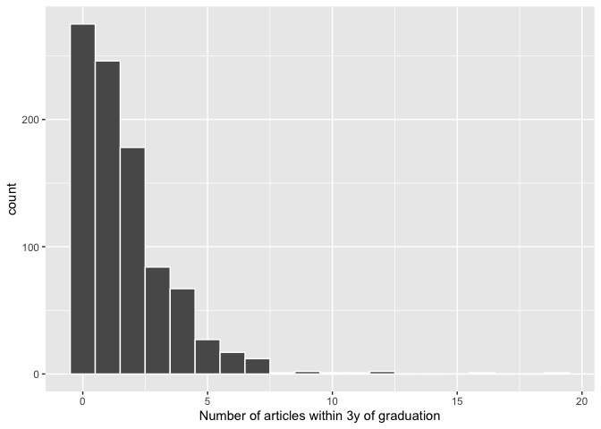
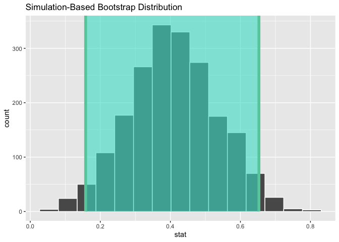
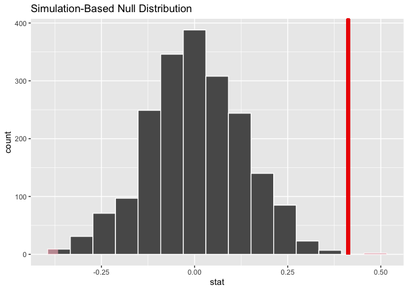
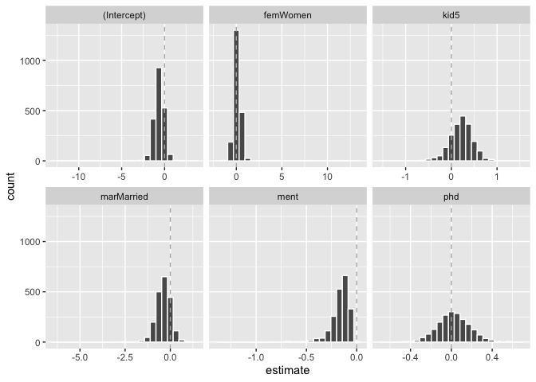

## Chapter 21 Inferential Analysis

Inferential models are usually created not only for their predictions, but also to make inferences or judgements about some component of the model, such as a coefficient value or other parameter. These results are often used to answer some pre-defined questions or hypotheses. Inferential mehods focus on validating the probabilistic or structural assumptions that are made prior to fitting the model.

For example, in ordinary linear regression, the common assumption is that the residual values are independent and follow a Gaussian distribution with a constant variance. The residuals from the fitted model are usually examined to determine if the assumption was a good idea. As a result, the methods for determining if the model's assumptions have been met are not as simple as looking at holdout predictions, although that can be very useful as well.

We will use p-values in this chapter. However, the tidymodels framework tends to promote confidence intervals over p-values as a method of quantifying the evidence for an alternative hypothesis. Bayesian methods are often superior to both p-values and confidence intervals in terms of ease of interpretation, but they can be more computationally expensive. 

### 21.1 Inference for Count Data

Let's focus on an example with count data. We will be using biochemistry publication data from the pscl package. The data reflects biochemistry doctorates who finished their education between 1956 and 1963.

A plot of the data indicates that many graduates did not publish any articles int his time and that the outcome follows a right-skewed distribution:


```r
library(tidymodels)
```

```
## ── Attaching packages ────────────────────────────────────── tidymodels 1.1.1 ──
```

```
## ✔ broom        1.0.5      ✔ recipes      1.0.10
## ✔ dials        1.2.0      ✔ rsample      1.2.0 
## ✔ dplyr        1.1.3      ✔ tibble       3.2.1 
## ✔ ggplot2      3.4.4      ✔ tidyr        1.3.0 
## ✔ infer        1.0.5      ✔ tune         1.2.1 
## ✔ modeldata    1.2.0      ✔ workflows    1.1.4 
## ✔ parsnip      1.2.1      ✔ workflowsets 1.0.1 
## ✔ purrr        1.0.2      ✔ yardstick    1.3.1
```

```
## ── Conflicts ───────────────────────────────────────── tidymodels_conflicts() ──
## ✖ purrr::discard() masks scales::discard()
## ✖ dplyr::filter()  masks stats::filter()
## ✖ dplyr::lag()     masks stats::lag()
## ✖ recipes::step()  masks stats::step()
## • Learn how to get started at https://www.tidymodels.org/start/
```

```r
tidymodels_prefer()

data("bioChemists", package = "pscl")

ggplot(bioChemists, aes(x = art)) + 
  geom_histogram(binwidth = 1, color = "white") + 
  labs(x = "Number of articles within 3y of graduation")
```

<!-- -->

Since the outcome data are counts, the most common distribution assumption to make is that the outcome has a Poisson distribution.

### 21.2 Comparisons with two-sample tests

We can start with hypothesis testing. The original author's goal with this data set on biochemistry publication data was to determine if there is a difference in publications between men and women. The data from the study show:


```r
bioChemists %>% 
  group_by(fem) %>% 
  summarize(counts = sum(art), n = length(art))
```

```
## # A tibble: 2 × 3
##   fem   counts     n
##   <fct>  <int> <int>
## 1 Men      930   494
## 2 Women    619   421
```

There were many more publications by men, although there were also more men in the data. The simplest approach to analysing these data would be to do a two-sample comparison using the poisson.test() function in the stats package. It requires the counts for one or two groups. The hypotheses to compare the two sexes test rates of publication over the same time period.

T in the function is the time base fo event count. Here it is 3 since it is number of publications within 3 years of graduation.


```r
poisson.test(c(930, 619), T = 3)
```

```
## 
## 	Comparison of Poisson rates
## 
## data:  c(930, 619) time base: 3
## count1 = 930, expected count1 = 774.5, p-value = 2.727e-15
## alternative hypothesis: true rate ratio is not equal to 1
## 95 percent confidence interval:
##  1.355716 1.665905
## sample estimates:
## rate ratio 
##   1.502423
```

The function reports a p-value as well as a confidence interval for the ratio of the publication rates. The results indicate that the observed difference is greater than the experiential noise and favors the alternative hypothesis that the rates are not the same. 

One issue with using this function is that the results come back as an htest object. While this type of object has a well-defined structure, it can be difficult to consume for subsequent operations such as reporting or visualizations. The most impactful tool that tidymodels offers for inferential models is the tidy() function in the broom package. As previously seen, this function makes a well-formed, predictably named tibble from the object. We can tidy() the results of our two-sample comparison test.


```r
poisson.test(c(930, 619)) %>% 
  tidy()
```

```
## # A tibble: 1 × 8
##   estimate statistic  p.value parameter conf.low conf.high method    alternative
##      <dbl>     <dbl>    <dbl>     <dbl>    <dbl>     <dbl> <chr>     <chr>      
## 1     1.50       930 2.73e-15      774.     1.36      1.67 Comparis… two.sided
```

While the Poisson distribution is reasonable, we might also want to assess using fewer distributional assumptions. Two methods that might be helpful are bootstrap and permutation tests.

The infer package, part of the tidymodels framework, is a powerful and intuitive tool for hypothesis testing. Its syntax is concise and designed for nonstatisticians.

First, we specify() that we will use the difference in the mean number of articles between the sexes and then calculate() the statistic from the data. Recall that the maximum likelihood estimator for the Poisson mean is the sample mean. The hypotheses tested here are the same as the previous test (but are conducted using a different testing procedure).

With infer, we specify the outcome and covariate, then state the statistic of interest:


```r
library(infer)

observed <- 
  bioChemists %>%
  specify(art ~ fem) %>%
  calculate(stat = "diff in means", order = c("Men", "Women"))
observed
```

```
## Response: art (numeric)
## Explanatory: fem (factor)
## # A tibble: 1 × 1
##    stat
##   <dbl>
## 1 0.412
```

From here, we compute a confidence interval for this mean by creating the bootstrap distribution via generate(); the same statistic is computed for each resample version of the data:


```r
set.seed(2101)
bootstrapped <- 
  bioChemists %>%
  specify(art ~ fem)  %>%
  generate(reps = 2000, type = "bootstrap") %>%
  calculate(stat = "diff in means", order = c("Men", "Women"))
bootstrapped
```

```
## Response: art (numeric)
## Explanatory: fem (factor)
## # A tibble: 2,000 × 2
##    replicate  stat
##        <int> <dbl>
##  1         1 0.467
##  2         2 0.107
##  3         3 0.467
##  4         4 0.308
##  5         5 0.369
##  6         6 0.428
##  7         7 0.272
##  8         8 0.587
##  9         9 0.468
## 10        10 0.432
## # ℹ 1,990 more rows
```

A percentile interval is calculated using:


```r
percentile_ci <- get_ci(bootstrapped)
percentile_ci
```

```
## # A tibble: 1 × 2
##   lower_ci upper_ci
##      <dbl>    <dbl>
## 1    0.158    0.653
```

The infer package has a high-level API for showing the analysis results.


```r
visualize(bootstrapped) +
    shade_confidence_interval(endpoints = percentile_ci)
```

<!-- -->

Since the interval visualized does not include zero, these results indicate that men have published mroe articles than women.

If we require a p-value, the infer package can compute the value via a permutation test, shown in the following code. The syntax is very similar to the bootstrapping code we used earlier. We add a hypothesize() verb to state the type of assumption to test and the generate() call contains an option to shuffle the data.


```r
set.seed(2102)
permuted <- 
  bioChemists %>%
  specify(art ~ fem)  %>%
  hypothesize(null = "independence") %>%
  generate(reps = 2000, type = "permute") %>%
  calculate(stat = "diff in means", order = c("Men", "Women"))
permuted
```

```
## Response: art (numeric)
## Explanatory: fem (factor)
## Null Hypothesis: independence
## # A tibble: 2,000 × 2
##    replicate     stat
##        <int>    <dbl>
##  1         1  0.201  
##  2         2 -0.133  
##  3         3  0.109  
##  4         4 -0.195  
##  5         5 -0.00128
##  6         6 -0.102  
##  7         7 -0.102  
##  8         8 -0.0497 
##  9         9  0.0119 
## 10        10 -0.146  
## # ℹ 1,990 more rows
```

This following visualization code is also very similar to the bootstrap approach. The vertical line signifies the observed value:


```r
visualize(permuted) +
    shade_p_value(obs_stat = observed, direction = "two-sided")
```

<!-- -->

The actual p-value is:


```r
permuted %>%
  get_p_value(obs_stat = observed, direction = "two-sided")
```

```
## # A tibble: 1 × 1
##   p_value
##     <dbl>
## 1   0.002
```

The vertical line representing the null hypothesis is far away from the permutation distribution. This means, if in fact the null hypothesis were true, the likelihood is exceedingly small of observing data at least as extreme as what is at hand. 

The two-sample tests shown in this section are probably suboptimal because they do not account for other factors that might explain the observed relationship between publications rate and sex. 

### 21.3 log-linear models

The focus of the rest of this chapter will be on a generalized linear model where we assume that counts follow a Poisson distribution. For this model, the covariates/predictors enter the model in a log-linear fashion.

Let's fit a simple model that contains all of the predictor columns. The poissonreg package, a parsnip extension package in tidymodels, will fit this model specification.


```r
library(poissonreg)

# default engine is 'glm'
log_lin_spec <- poisson_reg()

log_lin_fit <- 
  log_lin_spec %>% 
  fit(art ~ ., data = bioChemists)
log_lin_fit
```

```
## parsnip model object
## 
## 
## Call:  stats::glm(formula = art ~ ., family = stats::poisson, data = data)
## 
## Coefficients:
## (Intercept)     femWomen   marMarried         kid5          phd         ment  
##     0.30462     -0.22459      0.15524     -0.18488      0.01282      0.02554  
## 
## Degrees of Freedom: 914 Total (i.e. Null);  909 Residual
## Null Deviance:	    1817 
## Residual Deviance: 1634 	AIC: 3314
```

The tidy() method succinctly summarizes the coefficients for the model (along with 90% confidence intervals):


```r
tidy(log_lin_fit, conf.int = TRUE, conf.level = 0.90)
```

```
## # A tibble: 6 × 7
##   term        estimate std.error statistic  p.value conf.low conf.high
##   <chr>          <dbl>     <dbl>     <dbl>    <dbl>    <dbl>     <dbl>
## 1 (Intercept)   0.305    0.103       2.96  3.10e- 3   0.134     0.473 
## 2 femWomen     -0.225    0.0546     -4.11  3.92e- 5  -0.315    -0.135 
## 3 marMarried    0.155    0.0614      2.53  1.14e- 2   0.0545    0.256 
## 4 kid5         -0.185    0.0401     -4.61  4.08e- 6  -0.251    -0.119 
## 5 phd           0.0128   0.0264      0.486 6.27e- 1  -0.0305    0.0563
## 6 ment          0.0255   0.00201    12.7   3.89e-37   0.0222    0.0288
```

In this output, the p-values correspond to separate hypothesis tests for each parameter. Looking at these results, phd (the prestige of their department) may not have any relationship with the outcome.

While the Poisson distribution is the routine assumption for data like these, it may be beneficial to conduct a rough check of the model assumptions by fitting the models without using the Poisson likelihood to calculate the confidence intervals. The rsample package has a convenience function to compute bootstrap confidence intervals for lm() and glm() models. We can use this function, while explicitly declaring family=poisson, to compute a large number of model fits. By default, we compute a 90% confidence bootstrap-t interval (percentile intervals are also available).


```r
set.seed(2103)
glm_boot <- 
  reg_intervals(art ~ ., data = bioChemists, model_fn = "glm", family = poisson)
glm_boot
```

```
## # A tibble: 5 × 6
##   term          .lower .estimate  .upper .alpha .method  
##   <chr>          <dbl>     <dbl>   <dbl>  <dbl> <chr>    
## 1 femWomen   -0.358      -0.226  -0.0856   0.05 student-t
## 2 kid5       -0.298      -0.184  -0.0789   0.05 student-t
## 3 marMarried  0.000264    0.155   0.317    0.05 student-t
## 4 ment        0.0182      0.0256  0.0322   0.05 student-t
## 5 phd        -0.0707      0.0130  0.102    0.05 student-t
```

When we compare these results to the purely parametric results from glm(), the bootstrap intervals are somewhat wider. If the data were truly Poisson, these interval swould have more similar widths.

Determining which predictors to include in the model is a difficult problem. One approach is to conduct likelihood ratio test (LRT) between nested models. Based on the confidence intervals, we have evidence that a simpler model without phd may be sufficient. Let's fit a smaller model, then conduct a statistical test.

This hypothesis was previously tested when we showed the tidied results for log_lin_fit. That particular approach used results from a single model fit via a Wald statistic (i.e. the parameter divided by its standard error). From that approach, the p-value was 0.63. We can tidy the results from the LRT to get the p-value.


```r
log_lin_reduced <- 
  log_lin_spec %>% 
  fit(art ~ ment + kid5 + fem + mar, data = bioChemists)

anova(
  extract_fit_engine(log_lin_reduced),
  extract_fit_engine(log_lin_fit),
  test = "LRT"
) %>%
  tidy()
```

```
## # A tibble: 2 × 6
##   term                      df.residual residual.deviance    df deviance p.value
##   <chr>                           <dbl>             <dbl> <dbl>    <dbl>   <dbl>
## 1 art ~ ment + kid5 + fem …         910             1635.    NA   NA      NA    
## 2 art ~ fem + mar + kid5 +…         909             1634.     1    0.236   0.627
```

The results are the same and, based on these and the confidence interval for this parameter, we'll exclude phd from further analyses since it does not appear to be associated with the outcome.

### 21.4 A more complex model

For count data, there are occasions where the number of zero counts is larger than what a simple Poisson distribution would prescribe. A more complex model appropriate for this situation is a zero-inflated Poisson (ZIP) model. Here, there are two sets of covariates: one for the count data and others that affect the probability (denoted as pie) of zeros. 

We'll fit a model with a full set of z covariates.


```r
zero_inflated_spec <- poisson_reg() %>% set_engine("zeroinfl")

zero_inflated_fit <- 
  zero_inflated_spec %>% 
  fit(art ~ fem + mar + kid5 + ment | fem + mar + kid5 + phd + ment,
      data = bioChemists)

zero_inflated_fit
```

```
## parsnip model object
## 
## 
## Call:
## pscl::zeroinfl(formula = art ~ fem + mar + kid5 + ment | fem + mar + 
##     kid5 + phd + ment, data = data)
## 
## Count model coefficients (poisson with log link):
## (Intercept)     femWomen   marMarried         kid5         ment  
##     0.62116     -0.20907      0.10505     -0.14281      0.01798  
## 
## Zero-inflation model coefficients (binomial with logit link):
## (Intercept)     femWomen   marMarried         kid5          phd         ment  
##    -0.60864      0.10927     -0.35293      0.21946      0.01236     -0.13509
```

Since the coefficients for this model are also estimated using maximum likelihood, let's try to use another likelihood ratio test to understand if the new model terms are helpful. 


```r
anova(
  extract_fit_engine(zero_inflated_fit),
  extract_fit_engine(log_lin_reduced),
  test = "LRT"
) %>%
  tidy()
```

An anova() method isn't implemented for zeroinfl objects!

An alternative is to use an information criterion statistic, such as AIC. This computes the log-likelihood (from the training set) and penalizes that value based on the training set size and the number of model parameters. In R's parameterization, smaller AIC values are better. In this case, we are not conducting a formal statistical test but estimating the ability of the data to fit the data.

The results indicate taht the ZIP model is preferable:


```r
zero_inflated_fit %>% extract_fit_engine() %>% AIC()
```

```
## [1] 3231.585
```

```r
log_lin_reduced   %>% extract_fit_engine() %>% AIC()
```

```
## [1] 3312.349
```

However, it's hard to contextualize this pair of single values and assess how different they actually are. To solve this problem, we'll resample a large number of each of these two models. From these, we can compute the AIC values for each and determine how often the results favor the ZIP model. Basically, we will be characterizing the uncertainity of the AIC statistics to gauge their difference relative to the noise in the data.

We'll also compute more bootstrap confidence intervals for the parameters in a bit so we specify the apparen=TRUE option when creating the bootstrap samples. This is required for some types of intervals.

First, we create the 4,000 model fits:


```r
zip_form <- art ~ fem + mar + kid5 + ment | fem + mar + kid5 + phd + ment
glm_form <- art ~ fem + mar + kid5 + ment

set.seed(2104)
bootstrap_models <-
  bootstraps(bioChemists, times = 2000, apparent = TRUE) %>%
  mutate(
    glm = map(splits, ~ fit(log_lin_spec,       glm_form, data = analysis(.x))),
    zip = map(splits, ~ fit(zero_inflated_spec, zip_form, data = analysis(.x)))
  )
bootstrap_models
```

```
## # Bootstrap sampling with apparent sample 
## # A tibble: 2,001 × 4
##    splits            id            glm      zip     
##    <list>            <chr>         <list>   <list>  
##  1 <split [915/355]> Bootstrap0001 <fit[+]> <fit[+]>
##  2 <split [915/333]> Bootstrap0002 <fit[+]> <fit[+]>
##  3 <split [915/337]> Bootstrap0003 <fit[+]> <fit[+]>
##  4 <split [915/344]> Bootstrap0004 <fit[+]> <fit[+]>
##  5 <split [915/351]> Bootstrap0005 <fit[+]> <fit[+]>
##  6 <split [915/354]> Bootstrap0006 <fit[+]> <fit[+]>
##  7 <split [915/326]> Bootstrap0007 <fit[+]> <fit[+]>
##  8 <split [915/336]> Bootstrap0008 <fit[+]> <fit[+]>
##  9 <split [915/338]> Bootstrap0009 <fit[+]> <fit[+]>
## 10 <split [915/349]> Bootstrap0010 <fit[+]> <fit[+]>
## # ℹ 1,991 more rows
```

Now we can extract the model fits and their corresponding AIC values.


```r
bootstrap_models <-
  bootstrap_models %>%
  mutate(
    glm_aic = map_dbl(glm, ~ extract_fit_engine(.x) %>% AIC()),
    zip_aic = map_dbl(zip, ~ extract_fit_engine(.x) %>% AIC())
  )
mean(bootstrap_models$zip_aic < bootstrap_models$glm_aic)
```

```
## [1] 1
```

It seems definitive from these results that accounting for the excessive number of zero counts is a good idea.

Since we have computed the resample model fits, let's create bootstrap intervals for the zero probability model coefficients. We can extract these with the tidy() method and use the type="zero" option to obtain these estimates. 


```r
bootstrap_models <-
  bootstrap_models %>%
  mutate(zero_coefs  = map(zip, ~ tidy(.x, type = "zero")))

# One example:
bootstrap_models$zero_coefs[[1]]
```

```
## # A tibble: 6 × 6
##   term        type  estimate std.error statistic   p.value
##   <chr>       <chr>    <dbl>     <dbl>     <dbl>     <dbl>
## 1 (Intercept) zero   -0.128     0.497     -0.257 0.797    
## 2 femWomen    zero   -0.0763    0.319     -0.240 0.811    
## 3 marMarried  zero   -0.112     0.365     -0.307 0.759    
## 4 kid5        zero    0.270     0.186      1.45  0.147    
## 5 phd         zero   -0.178     0.132     -1.35  0.177    
## 6 ment        zero   -0.123     0.0315    -3.91  0.0000936
```

It's a good idea to visualize the bootstrap distributions of the coefficients.


```r
bootstrap_models %>% 
  unnest(zero_coefs) %>% 
  ggplot(aes(x = estimate)) +
  geom_histogram(bins = 25, color = "white") + 
  facet_wrap(~ term, scales = "free_x") + 
  geom_vline(xintercept = 0, lty = 2, color = "gray70")
```

<!-- -->

One of the covariates (ment) that appears to be important has a very skewed distribution. The extra space in some of the facets indicates there are some outliers in the estimates. This might occur when models did not converge; those results probably should be excluded from the resamples. For the visualized results, the outliers are due only to extreme parameter estimates; all of the models converged. 

The rsample package contains a set of functions named int_*() that compute different types of bootstrap intervals. Since the tidy() method contains standard error estimates, the bootstrap-t intervals can be computed. We'll also compute the standard percentile intervals. By default, 90% confidence intervals are computed.


```r
bootstrap_models %>% int_pctl(zero_coefs)
```

```
## # A tibble: 6 × 6
##   term        .lower .estimate  .upper .alpha .method   
##   <chr>        <dbl>     <dbl>   <dbl>  <dbl> <chr>     
## 1 (Intercept) -1.76    -0.624   0.420    0.05 percentile
## 2 femWomen    -0.523    0.116   0.818    0.05 percentile
## 3 kid5        -0.327    0.217   0.677    0.05 percentile
## 4 marMarried  -1.20    -0.381   0.362    0.05 percentile
## 5 ment        -0.401   -0.162  -0.0515   0.05 percentile
## 6 phd         -0.274    0.0229  0.333    0.05 percentile
```

```r
bootstrap_models %>% int_t(zero_coefs)
```

```
## # A tibble: 6 × 6
##   term        .lower .estimate  .upper .alpha .method  
##   <chr>        <dbl>     <dbl>   <dbl>  <dbl> <chr>    
## 1 (Intercept) -1.61    -0.624   0.332    0.05 student-t
## 2 femWomen    -0.486    0.116   0.671    0.05 student-t
## 3 kid5        -0.211    0.217   0.599    0.05 student-t
## 4 marMarried  -0.988   -0.381   0.293    0.05 student-t
## 5 ment        -0.322   -0.162  -0.0275   0.05 student-t
## 6 phd         -0.276    0.0229  0.291    0.05 student-t
```

From these results, we can get a good idea of which predictor(s) to include in the zero count probability model. It may be sensible to refit a smaller model to assess if the bootstrap distribution for ment is still skewed. 

### 21.5 More inferential analysis

Arguably, Bayesian analysis is a very effective and often superior approach for inference. Additionally, the multilevelmod package enables users to fit hierarachical Bayesian and non-Bayesian models (e.g. mixed models). The broom.mixed and tidybayes packages are excellent tools for extracting the data for plots and summaries. Finally, for data sets with a single hierarchy, such as simple longitudinal or repeated measures data, rsample's group_vfold_cv() function facilitats straightforward out-of-sample characterization of model performance. 
