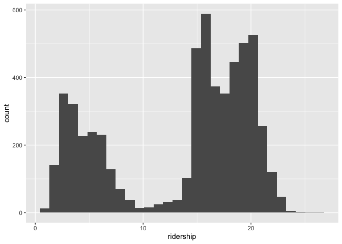
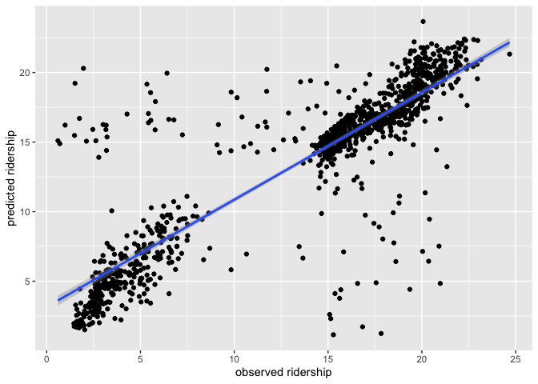

Practice will use Chicago data set on public transit ridership.


```r
library(tidymodels)
```

```
## ── Attaching packages ────────────────────────────────────── tidymodels 1.1.1 ──
```

```
## ✔ broom        1.0.5     ✔ recipes      1.0.8
## ✔ dials        1.2.0     ✔ rsample      1.2.0
## ✔ dplyr        1.1.3     ✔ tibble       3.2.1
## ✔ ggplot2      3.4.4     ✔ tidyr        1.3.0
## ✔ infer        1.0.5     ✔ tune         1.1.2
## ✔ modeldata    1.2.0     ✔ workflows    1.1.3
## ✔ parsnip      1.1.1     ✔ workflowsets 1.0.1
## ✔ purrr        1.0.2     ✔ yardstick    1.2.0
```

```
## ── Conflicts ───────────────────────────────────────── tidymodels_conflicts() ──
## ✖ purrr::discard() masks scales::discard()
## ✖ dplyr::filter()  masks stats::filter()
## ✖ dplyr::lag()     masks stats::lag()
## ✖ recipes::step()  masks stats::step()
## • Learn how to get started at https://www.tidymodels.org/start/
```

```r
tidymodels_prefer()
library(modeldata)
library(ggplot2)
data("Chicago")
Chicago
```

```
## # A tibble: 5,698 × 50
##    ridership Austin Quincy_Wells Belmont Archer_35th Oak_Park Western Clark_Lake
##        <dbl>  <dbl>        <dbl>   <dbl>       <dbl>    <dbl>   <dbl>      <dbl>
##  1     15.7   1.46         8.37     4.60       2.01     1.42    3.32       15.6 
##  2     15.8   1.50         8.35     4.72       2.09     1.43    3.34       15.7 
##  3     15.9   1.52         8.36     4.68       2.11     1.49    3.36       15.6 
##  4     15.9   1.49         7.85     4.77       2.17     1.44    3.36       15.7 
##  5     15.4   1.50         7.62     4.72       2.06     1.42    3.27       15.6 
##  6      2.42  0.693        0.911    2.27       0.624    0.426   1.11        2.41
##  7      1.47  0.408        0.414    1.63       0.378    0.225   0.567       1.37
##  8     15.5   0.987        4.81     3.52       1.34     0.879   1.94        9.02
##  9     15.9   1.55         8.23     4.71       2.22     1.46    3.46       16.0 
## 10     15.9   1.59         8.25     4.77       2.23     1.48    3.51       15.8 
## # ℹ 5,688 more rows
## # ℹ 42 more variables: Clinton <dbl>, Merchandise_Mart <dbl>,
## #   Irving_Park <dbl>, Washington_Wells <dbl>, Harlem <dbl>, Monroe <dbl>,
## #   Polk <dbl>, Ashland <dbl>, Kedzie <dbl>, Addison <dbl>,
## #   Jefferson_Park <dbl>, Montrose <dbl>, California <dbl>, temp_min <dbl>,
## #   temp <dbl>, temp_max <dbl>, temp_change <dbl>, dew <dbl>, humidity <dbl>,
## #   pressure <dbl>, pressure_change <dbl>, wind <dbl>, wind_max <dbl>, …
```

Chicago ridership data contains an abbreviated training set for modeling the number of people (in thousands) who enter the Clark and Lake L station.

## 1 Explore the data

Make a histogram of ridership.


```r
ggplot(data = Chicago, aes(ridership)) +
  geom_histogram()
```

```
## `stat_bin()` using `bins = 30`. Pick better value with `binwidth`.
```

<!-- -->

What might be causing the two peaks? Is there a predictor variable that can account for this (or that can be used to make a new variable to account for it)?

1. good versus bad weather
2. when there is not/is a sporting event

## Training and Test

Make an 80/20 train/test split.  Do you need to stratify over anything?


```r
set.seed(010324)
ride_split = initial_split(Chicago, prop = 0.80)
ride_train = training(ride_split)
ride_test = testing(ride_split)
```

## 3. Workflow Set

Let's compare the effectiveness  of the temp and percip [sic] predictors.

### 3A
Use a workflow set (see chapter 7) to fit six models, each of which has your predictor from Q1 along with one of the following variables:
temp_min, temp, temp_max, temp_change, percip, percip_max


```r
lm_model <- 
  linear_reg() %>% 
  set_engine("lm")
```


```r
climate = list(
  temp_min = ridership ~ temp_min + weather_storm,
  temp = ridership ~ temp + weather_storm,
  temp_max = ridership ~ temp_max + weather_storm,
  temp_change = ridership ~ temp_change + weather_storm,
  precip = ridership ~ percip + weather_storm,
  precip_max = ridership ~ percip_max + weather_storm
)
```


```r
library(workflowsets)
climate_models = workflow_set(preproc = climate, models = list(lm = lm_model))
climate_models
```

```
## # A workflow set/tibble: 6 × 4
##   wflow_id       info             option    result    
##   <chr>          <list>           <list>    <list>    
## 1 temp_min_lm    <tibble [1 × 4]> <opts[0]> <list [0]>
## 2 temp_lm        <tibble [1 × 4]> <opts[0]> <list [0]>
## 3 temp_max_lm    <tibble [1 × 4]> <opts[0]> <list [0]>
## 4 temp_change_lm <tibble [1 × 4]> <opts[0]> <list [0]>
## 5 precip_lm      <tibble [1 × 4]> <opts[0]> <list [0]>
## 6 precip_max_lm  <tibble [1 × 4]> <opts[0]> <list [0]>
```


```r
climate_models_fit <-
   climate_models %>%
   mutate(fit = map(info, ~ fit(.x$workflow[[1]], ride_train)))
climate_models_fit
```

```
## # A workflow set/tibble: 6 × 5
##   wflow_id       info             option    result     fit       
##   <chr>          <list>           <list>    <list>     <list>    
## 1 temp_min_lm    <tibble [1 × 4]> <opts[0]> <list [0]> <workflow>
## 2 temp_lm        <tibble [1 × 4]> <opts[0]> <list [0]> <workflow>
## 3 temp_max_lm    <tibble [1 × 4]> <opts[0]> <list [0]> <workflow>
## 4 temp_change_lm <tibble [1 × 4]> <opts[0]> <list [0]> <workflow>
## 5 precip_lm      <tibble [1 × 4]> <opts[0]> <list [0]> <workflow>
## 6 precip_max_lm  <tibble [1 × 4]> <opts[0]> <list [0]> <workflow>
```

### 3B 
Compare the model fits / predictors (this can be using any of the p-value of the predictor, R2, AIC, log-lik).  Don't worry about the test set, just compare goodness of fit when fit with the training set.


```r
climate_models_compare = 
climate_models_fit %>%
  mutate(lm_glance = map(fit, broom::glance),
    lm_tidy = map(fit, broom::tidy))
climate_models_compare$lm_glance
```

```
## [[1]]
## # A tibble: 1 × 12
##   r.squared adj.r.squared sigma statistic  p.value    df  logLik    AIC    BIC
##       <dbl>         <dbl> <dbl>     <dbl>    <dbl> <dbl>   <dbl>  <dbl>  <dbl>
## 1    0.0172        0.0168  6.46      39.8 7.13e-18     2 -14972. 29951. 29977.
## # ℹ 3 more variables: deviance <dbl>, df.residual <int>, nobs <int>
## 
## [[2]]
## # A tibble: 1 × 12
##   r.squared adj.r.squared sigma statistic  p.value    df  logLik    AIC    BIC
##       <dbl>         <dbl> <dbl>     <dbl>    <dbl> <dbl>   <dbl>  <dbl>  <dbl>
## 1    0.0168        0.0164  6.46      38.9 1.80e-17     2 -14972. 29953. 29979.
## # ℹ 3 more variables: deviance <dbl>, df.residual <int>, nobs <int>
## 
## [[3]]
## # A tibble: 1 × 12
##   r.squared adj.r.squared sigma statistic  p.value    df  logLik    AIC    BIC
##       <dbl>         <dbl> <dbl>     <dbl>    <dbl> <dbl>   <dbl>  <dbl>  <dbl>
## 1    0.0151        0.0146  6.47      34.8 9.90e-16     2 -14976. 29961. 29987.
## # ℹ 3 more variables: deviance <dbl>, df.residual <int>, nobs <int>
## 
## [[4]]
## # A tibble: 1 × 12
##   r.squared adj.r.squared sigma statistic p.value    df  logLik    AIC    BIC
##       <dbl>         <dbl> <dbl>     <dbl>   <dbl> <dbl>   <dbl>  <dbl>  <dbl>
## 1   0.00116      0.000723  6.52      2.65  0.0709     2 -15008. 30025. 30050.
## # ℹ 3 more variables: deviance <dbl>, df.residual <int>, nobs <int>
## 
## [[5]]
## # A tibble: 1 × 12
##   r.squared adj.r.squared sigma statistic p.value    df  logLik    AIC    BIC
##       <dbl>         <dbl> <dbl>     <dbl>   <dbl> <dbl>   <dbl>  <dbl>  <dbl>
## 1   0.00117      0.000733  6.52      2.67  0.0693     2 -15008. 30025. 30050.
## # ℹ 3 more variables: deviance <dbl>, df.residual <int>, nobs <int>
## 
## [[6]]
## # A tibble: 1 × 12
##   r.squared adj.r.squared sigma statistic p.value    df  logLik    AIC    BIC
##       <dbl>         <dbl> <dbl>     <dbl>   <dbl> <dbl>   <dbl>  <dbl>  <dbl>
## 1   0.00230       0.00186  6.51      5.24 0.00532     2 -15006. 30020. 30045.
## # ℹ 3 more variables: deviance <dbl>, df.residual <int>, nobs <int>
```

Model with temp_min has highest adjusted R-squared, lowest p value, lowest AIC

## 4 Recipes
### 4A
Create a workflow recipe that does the following:
* normalizes all weather and station predictors
* creates a set of PCs for the weather-related predictors, keeping enough PCs to explain 75% of the variance in the weather variables
* creates a second set of PCs for the station-related predictors, keeping enough PCs to explaining 75% of the variance in these variables

Hint: tidy(), prep(), and bake() methods for recipes may be helpful in examining what you have done.  The help file on recipe is good too.

Hint2: You can use various dplyr::select functions and regular expressions to avoid having to type out the variable names.  But as a fair-warning, it took me a lot longer to figure that out than it would have to just type then out.  (But next time it might be faster).  I can demo.


```r
ride_recipe = 
  recipe(ridership ~ ., data = ride_train) %>%
  step_normalize(Austin,Quincy_Wells,Belmont,Archer_35th,Oak_Park,Western,Clark_Lake,Clinton,Merchandise_Mart,Irving_Park,Washington_Wells,Harlem,Monroe,Polk,Ashland,Kedzie,Addison,Jefferson_Park,Montrose,California,temp_min,temp,temp_max,temp_change,dew,humidity,pressure,pressure_change,wind,wind_max,gust,gust_max,percip,percip_max,weather_rain,weather_snow,weather_cloud,weather_storm) %>%
  step_pca(temp_min,temp,temp_max,temp_change,dew,humidity,pressure,pressure_change,wind,wind_max,gust,gust_max,percip,percip_max,weather_rain,weather_snow,weather_cloud,weather_storm,threshold = .75, prefix = "weather") %>%
  step_pca(Austin,Quincy_Wells,Belmont,Archer_35th,Oak_Park,Western,Clark_Lake,Clinton,Merchandise_Mart,Irving_Park,Washington_Wells,Harlem,Monroe,Polk,Ashland,Kedzie,Addison,Jefferson_Park,Montrose,California, threshold = .75, prefix = "station")
```

Had to add prefix since we have two step_pca so instead of both making PC1, one makes weather_1, and the other makes station_1
### 4B
Use the recipe from 4A to fit a linear regression of ridership on the new PCs and all remaining predictors (i.e. those not used in making the PCs).  Use the training data.


```r
lm_model <- 
  linear_reg() %>% 
  set_engine("lm")
```


```r
lm_wflow <- 
  workflow() %>% 
  add_model(lm_model) %>%
  add_recipe(ride_recipe)
```


```r
lm_fit_recipe = fit(lm_wflow, ride_train)
lm_fit_recipe
```

```
## ══ Workflow [trained] ══════════════════════════════════════════════════════════
## Preprocessor: Recipe
## Model: linear_reg()
## 
## ── Preprocessor ────────────────────────────────────────────────────────────────
## 3 Recipe Steps
## 
## • step_normalize()
## • step_pca()
## • step_pca()
## 
## ── Model ───────────────────────────────────────────────────────────────────────
## 
## Call:
## stats::lm(formula = ..y ~ ., data = data)
## 
## Coefficients:
##     (Intercept)  Blackhawks_Away  Blackhawks_Home       Bulls_Away  
##      11.0997571       -0.2893533        0.1748701        0.0820764  
##      Bulls_Home       Bears_Away       Bears_Home    WhiteSox_Away  
##       0.2979696       -1.0917525       -0.8294980       -0.0793383  
##   WhiteSox_Home        Cubs_Away        Cubs_Home             date  
##              NA               NA               NA        0.0001833  
##        weather1         weather2         weather3         weather4  
##      -0.1395809       -0.0331458        0.0278325        0.0236463  
##        weather5         weather6         station1  
##       0.0452772       -0.0661341       -1.2736650
```

### 4C
Use the fit from 4B to predict ridership in the test data.  Evaluate the predictions.
Note sure if use predict or last_fit

```r
ride_predict = predict(lm_fit_recipe, ride_test)
```

```
## Warning in predict.lm(object = object$fit, newdata = new_data, type =
## "response", : prediction from a rank-deficient fit may be misleading
```


```r
ride_predict_2 = 
  bind_cols(ride_predict, ride_test %>% select(ridership)) 
```


```r
ggplot(ride_predict_2, aes(x = ridership, y = .pred)) +
  geom_point()+
  geom_smooth(method = "lm")+
  labs(y = "predicted ridership", x = "observed ridership")
```

```
## `geom_smooth()` using formula = 'y ~ x'
```

<!-- -->


```r
final_lm <- last_fit(lm_wflow, ride_split)
```

```
## → A | warning: prediction from a rank-deficient fit may be misleading
```

```
## 
There were issues with some computations   A: x1

There were issues with some computations   A: x1
```

```r
final_lm
```

```
## # Resampling results
## # Manual resampling 
## # A tibble: 1 × 6
##   splits              id               .metrics .notes   .predictions .workflow 
##   <list>              <chr>            <list>   <list>   <list>       <list>    
## 1 <split [4558/1140]> train/test split <tibble> <tibble> <tibble>     <workflow>
## 
## There were issues with some computations:
## 
##   - Warning(s) x1: prediction from a rank-deficient fit may be misleading
## 
## Run `show_notes(.Last.tune.result)` for more information.
```


```r
collect_metrics(final_lm)
```

```
## # A tibble: 2 × 4
##   .metric .estimator .estimate .config             
##   <chr>   <chr>          <dbl> <chr>               
## 1 rmse    standard       3.22  Preprocessor1_Model1
## 2 rsq     standard       0.771 Preprocessor1_Model1
```


```r
collect_predictions(final_lm)
```

```
## # A tibble: 1,140 × 5
##    id               .pred  .row ridership .config             
##    <chr>            <dbl> <int>     <dbl> <chr>               
##  1 train/test split 15.3      2     15.8  Preprocessor1_Model1
##  2 train/test split 15.1      3     15.9  Preprocessor1_Model1
##  3 train/test split  4.01     6      2.42 Preprocessor1_Model1
##  4 train/test split  1.75     7      1.47 Preprocessor1_Model1
##  5 train/test split 15.3     11     16.0  Preprocessor1_Model1
##  6 train/test split  1.73    21      1.79 Preprocessor1_Model1
##  7 train/test split  1.69    28      1.60 Preprocessor1_Model1
##  8 train/test split 14.9     31     15.7  Preprocessor1_Model1
##  9 train/test split 14.4     33     15.6  Preprocessor1_Model1
## 10 train/test split 14.8     46     16.2  Preprocessor1_Model1
## # ℹ 1,130 more rows
```

