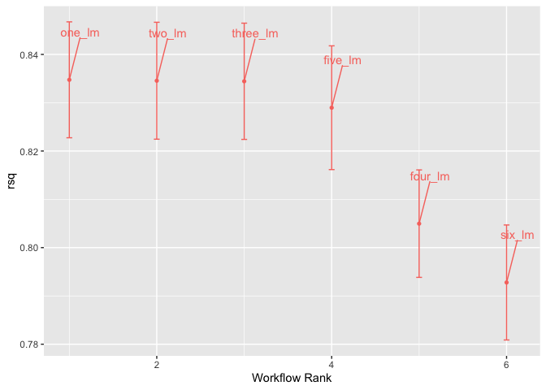
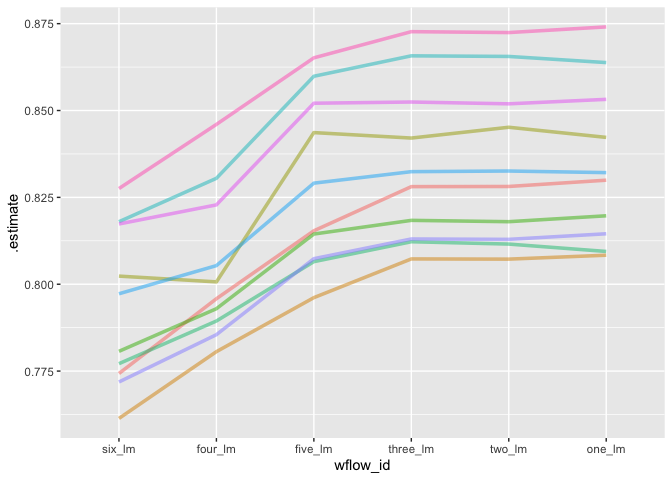
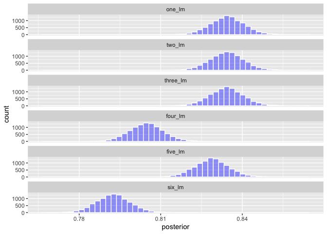
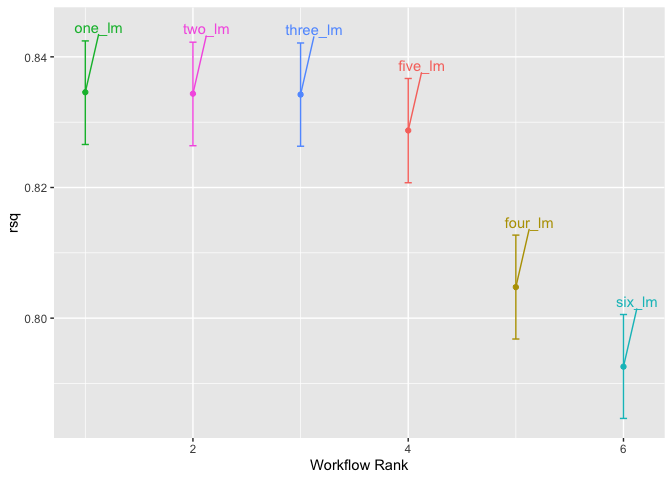
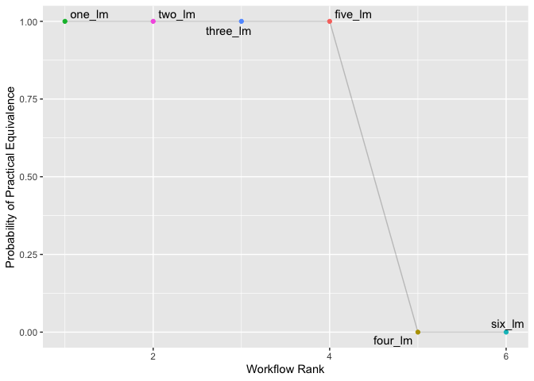

```r
library(tidymodels)
```

```
## ── Attaching packages ────────────────────────────────────── tidymodels 1.1.1 ──
```

```
## ✔ broom        1.0.5     ✔ recipes      1.0.8
## ✔ dials        1.2.0     ✔ rsample      1.2.0
## ✔ dplyr        1.1.3     ✔ tibble       3.2.1
## ✔ ggplot2      3.4.4     ✔ tidyr        1.3.0
## ✔ infer        1.0.5     ✔ tune         1.1.2
## ✔ modeldata    1.2.0     ✔ workflows    1.1.3
## ✔ parsnip      1.1.1     ✔ workflowsets 1.0.1
## ✔ purrr        1.0.2     ✔ yardstick    1.2.0
```

```
## ── Conflicts ───────────────────────────────────────── tidymodels_conflicts() ──
## ✖ purrr::discard() masks scales::discard()
## ✖ dplyr::filter()  masks stats::filter()
## ✖ dplyr::lag()     masks stats::lag()
## ✖ recipes::step()  masks stats::step()
## • Use suppressPackageStartupMessages() to eliminate package startup messages
```

```r
tidymodels_prefer()
library(modeldata)
library(ggplot2)
library(workflowsets)
library(ggrepel)
library(tidyposterior)
library(rstanarm)
```

```
## Loading required package: Rcpp
```

```
## 
## Attaching package: 'Rcpp'
```

```
## The following object is masked from 'package:rsample':
## 
##     populate
```

```
## This is rstanarm version 2.32.1
```

```
## - See https://mc-stan.org/rstanarm/articles/priors for changes to default priors!
```

```
## - Default priors may change, so it's safest to specify priors, even if equivalent to the defaults.
```

```
## - For execution on a local, multicore CPU with excess RAM we recommend calling
```

```
##   options(mc.cores = parallel::detectCores())
```


```r
data("Chicago")
Chicago
```

```
## # A tibble: 5,698 × 50
##    ridership Austin Quincy_Wells Belmont Archer_35th Oak_Park Western Clark_Lake
##        <dbl>  <dbl>        <dbl>   <dbl>       <dbl>    <dbl>   <dbl>      <dbl>
##  1     15.7   1.46         8.37     4.60       2.01     1.42    3.32       15.6 
##  2     15.8   1.50         8.35     4.72       2.09     1.43    3.34       15.7 
##  3     15.9   1.52         8.36     4.68       2.11     1.49    3.36       15.6 
##  4     15.9   1.49         7.85     4.77       2.17     1.44    3.36       15.7 
##  5     15.4   1.50         7.62     4.72       2.06     1.42    3.27       15.6 
##  6      2.42  0.693        0.911    2.27       0.624    0.426   1.11        2.41
##  7      1.47  0.408        0.414    1.63       0.378    0.225   0.567       1.37
##  8     15.5   0.987        4.81     3.52       1.34     0.879   1.94        9.02
##  9     15.9   1.55         8.23     4.71       2.22     1.46    3.46       16.0 
## 10     15.9   1.59         8.25     4.77       2.23     1.48    3.51       15.8 
## # ℹ 5,688 more rows
## # ℹ 42 more variables: Clinton <dbl>, Merchandise_Mart <dbl>,
## #   Irving_Park <dbl>, Washington_Wells <dbl>, Harlem <dbl>, Monroe <dbl>,
## #   Polk <dbl>, Ashland <dbl>, Kedzie <dbl>, Addison <dbl>,
## #   Jefferson_Park <dbl>, Montrose <dbl>, California <dbl>, temp_min <dbl>,
## #   temp <dbl>, temp_max <dbl>, temp_change <dbl>, dew <dbl>, humidity <dbl>,
## #   pressure <dbl>, pressure_change <dbl>, wind <dbl>, wind_max <dbl>, …
```

set up the weekend variable:

```r
Chicago <- Chicago %>%
  mutate(weekend = timeDate::isBizday(timeDate::as.timeDate(date)))
```


## Training and Test

Make an 80/20 train/test split.  Strata with ridership


```r
set.seed(010324)
ride_split = initial_split(Chicago, prop = 0.80, strata = ridership)
ride_train = training(ride_split)
ride_test = testing(ride_split)
```

## 3. Workflow Set


```r
lm_model <- 
  linear_reg() %>% 
  set_engine("lm")
```


```r
climate = list(
  temp_min = ridership ~ temp_min + weather_storm,
  temp = ridership ~ temp + weather_storm,
  temp_max = ridership ~ temp_max + weather_storm,
  temp_change = ridership ~ temp_change + weather_storm,
  precip = ridership ~ percip + weather_storm,
  precip_max = ridership ~ percip_max + weather_storm)
```


```r
climate_models = workflow_set(preproc = climate, models = list(lm = lm_model))
climate_models
```

```
## # A workflow set/tibble: 6 × 4
##   wflow_id       info             option    result    
##   <chr>          <list>           <list>    <list>    
## 1 temp_min_lm    <tibble [1 × 4]> <opts[0]> <list [0]>
## 2 temp_lm        <tibble [1 × 4]> <opts[0]> <list [0]>
## 3 temp_max_lm    <tibble [1 × 4]> <opts[0]> <list [0]>
## 4 temp_change_lm <tibble [1 × 4]> <opts[0]> <list [0]>
## 5 precip_lm      <tibble [1 × 4]> <opts[0]> <list [0]>
## 6 precip_max_lm  <tibble [1 × 4]> <opts[0]> <list [0]>
```


```r
climate_models_fit <-
   climate_models %>%
   mutate(fit = map(info, ~ fit(.x$workflow[[1]], ride_train)))
climate_models_fit
```

```
## # A workflow set/tibble: 6 × 5
##   wflow_id       info             option    result     fit       
##   <chr>          <list>           <list>    <list>     <list>    
## 1 temp_min_lm    <tibble [1 × 4]> <opts[0]> <list [0]> <workflow>
## 2 temp_lm        <tibble [1 × 4]> <opts[0]> <list [0]> <workflow>
## 3 temp_max_lm    <tibble [1 × 4]> <opts[0]> <list [0]> <workflow>
## 4 temp_change_lm <tibble [1 × 4]> <opts[0]> <list [0]> <workflow>
## 5 precip_lm      <tibble [1 × 4]> <opts[0]> <list [0]> <workflow>
## 6 precip_max_lm  <tibble [1 × 4]> <opts[0]> <list [0]> <workflow>
```

## 4 Recipes


```r
ride_recipe = 
  recipe(ridership ~ ., data = ride_train) %>%
  update_role(date, new_role = "date") %>%
  step_normalize(Austin:weather_storm) %>%
  step_pca(temp_min:weather_storm,threshold = .75, prefix = "weather") %>%
  step_pca(Austin:California, threshold = .75, prefix = "station")
ride_recipe
```

```
## 
```

```
## ── Recipe ──────────────────────────────────────────────────────────────────────
```

```
## 
```

```
## ── Inputs
```

```
## Number of variables by role
```

```
## outcome:    1
## predictor: 49
## date:       1
```

```
## 
```

```
## ── Operations
```

```
## • Centering and scaling for: Austin:weather_storm
```

```
## • PCA extraction with: temp_min:weather_storm
```

```
## • PCA extraction with: Austin:California
```

### 4B
Use the recipe from 4A to fit a linear regression of ridership on the new PCs and all remaining predictors (i.e. those not used in making the PCs).  Use the training data.


```r
lm_wflow <- 
  workflow() %>% 
  add_model(lm_model) %>%
  add_recipe(ride_recipe)
```


```r
lm_fit_recipe = fit(lm_wflow, ride_train)
lm_fit_recipe
```

```
## ══ Workflow [trained] ══════════════════════════════════════════════════════════
## Preprocessor: Recipe
## Model: linear_reg()
## 
## ── Preprocessor ────────────────────────────────────────────────────────────────
## 3 Recipe Steps
## 
## • step_normalize()
## • step_pca()
## • step_pca()
## 
## ── Model ───────────────────────────────────────────────────────────────────────
## 
## Call:
## stats::lm(formula = ..y ~ ., data = data)
## 
## Coefficients:
##     (Intercept)  Blackhawks_Away  Blackhawks_Home       Bulls_Away  
##         7.62422          0.28418          0.43433          0.02125  
##      Bulls_Home       Bears_Away       Bears_Home    WhiteSox_Away  
##         0.52001         -0.17491          0.01850         -0.04395  
##   WhiteSox_Home        Cubs_Away        Cubs_Home      weekendTRUE  
##              NA               NA               NA          8.23612  
##        weather1         weather2         weather3         weather4  
##         0.29779         -0.01250          0.01077          0.02647  
##        weather5         weather6         station1  
##        -0.04999          0.03733          0.55180
```

## New Exercise Material

Use Cross-fold validation and the model selection techniques shown in chapter 12 to compare models with:

1. All PCs and remaining predictors (same as Q4)
2. The PCs + the weekend variable (no sports team data)
3. 1 weather PC, 1 station PC, + the weekend variable
4. 1 weather PC + the weekend variable
5. 1 station PC + the weekend variable
6. the weekend variable only

New simple recipe


```r
ride_recipe = 
  recipe(ridership ~ ., data = ride_train) %>%
  update_role(date, new_role = "date") %>%
  update_role(Austin:California, new_role = "station") %>%
  update_role(temp_min:weather_storm, new_role = "weather") %>%
  update_role(Blackhawks_Away:Cubs_Home, new_role = "sports") %>%
  step_normalize(has_role("station"), has_role("weather"))
ride_recipe
```

```
## 
```

```
## ── Recipe ──────────────────────────────────────────────────────────────────────
```

```
## 
```

```
## ── Inputs
```

```
## Number of variables by role
```

```
## outcome:    1
## predictor:  1
## station:   20
## weather:   18
## sports:    10
## date:       1
```

```
## 
```

```
## ── Operations
```

```
## • Centering and scaling for: has_role("station"), has_role("weather")
```

adding new small recipes based on models


```r
# Build each recipe
rec_1 <- ride_recipe %>%
  step_pca(has_role("station"), threshold = .75, prefix = "station_PC", id = "station_pca") %>%
  step_pca(has_role("weather"), threshold = .75, prefix = "weather_PC", id = "weather_pca") %>%
  update_role(has_role("sports"), new_role = "predictor")

rec_2 <- ride_recipe %>%
  step_pca(has_role("station"), threshold = .75, prefix = "station_PC", id = "station_pca") %>%
  step_pca(has_role("weather"), threshold = .75, prefix = "weather_PC", id = "weather_pca")

rec_3 <- ride_recipe %>%
  step_pca(has_role("station"), num_comp = 1, prefix = "station_PC", id = "station_pca") %>%
  step_pca(has_role("weather"), num_comp = 1, prefix = "weather_PC", id = "weather_pca")
  
rec_4 <- ride_recipe %>%
  step_pca(has_role("weather"), num_comp = 1, prefix = "weather_PC", id = "weather_pca")

rec_5 <- ride_recipe %>%
  step_pca(has_role("station"), num_comp = 1, prefix = "station_PC", id = "station_pca")

rec_6 <- ride_recipe

preproc <- list(
  one = rec_1,
  two = rec_2,
  three = rec_3,
  four = rec_4,
  five = rec_5,
  six = rec_6
)
```


```r
lm_models <- workflow_set(preproc, list(lm = linear_reg()), cross = FALSE)
lm_models
```

```
## # A workflow set/tibble: 6 × 4
##   wflow_id info             option    result    
##   <chr>    <list>           <list>    <list>    
## 1 one_lm   <tibble [1 × 4]> <opts[0]> <list [0]>
## 2 two_lm   <tibble [1 × 4]> <opts[0]> <list [0]>
## 3 three_lm <tibble [1 × 4]> <opts[0]> <list [0]>
## 4 four_lm  <tibble [1 × 4]> <opts[0]> <list [0]>
## 5 five_lm  <tibble [1 × 4]> <opts[0]> <list [0]>
## 6 six_lm   <tibble [1 × 4]> <opts[0]> <list [0]>
```

Get folds


```r
chicago_folds <- vfold_cv(ride_train, v = 10)
chicago_folds
```

```
## #  10-fold cross-validation 
## # A tibble: 10 × 2
##    splits             id    
##    <list>             <chr> 
##  1 <split [4101/456]> Fold01
##  2 <split [4101/456]> Fold02
##  3 <split [4101/456]> Fold03
##  4 <split [4101/456]> Fold04
##  5 <split [4101/456]> Fold05
##  6 <split [4101/456]> Fold06
##  7 <split [4101/456]> Fold07
##  8 <split [4102/455]> Fold08
##  9 <split [4102/455]> Fold09
## 10 <split [4102/455]> Fold10
```

```r
keep_pred <- control_resamples(save_pred = TRUE, save_workflow = TRUE)
```


```r
lm_models <- 
  lm_models %>% 
  workflow_map("fit_resamples", 
               seed = 1101, verbose = TRUE,
               # Options to `fit_resamples()`: 
               resamples = chicago_folds, control = keep_pred)
```

```
## i 1 of 6 resampling: one_lm
```

```
## → A | warning: prediction from a rank-deficient fit may be misleading
```

```
## 
There were issues with some computations   A: x1

There were issues with some computations   A: x4

There were issues with some computations   A: x7

There were issues with some computations   A: x10

There were issues with some computations   A: x10
## ✔ 1 of 6 resampling: one_lm (744ms)
## i 2 of 6 resampling: two_lm
## ✔ 2 of 6 resampling: two_lm (601ms)
## i 3 of 6 resampling: three_lm
## ✔ 3 of 6 resampling: three_lm (587ms)
## i 4 of 6 resampling: four_lm
## ✔ 4 of 6 resampling: four_lm (464ms)
## i 5 of 6 resampling: five_lm
## ✔ 5 of 6 resampling: five_lm (484ms)
## i 6 of 6 resampling: six_lm
## ✔ 6 of 6 resampling: six_lm (356ms)
```


```r
lm_models
```

```
## # A workflow set/tibble: 6 × 4
##   wflow_id info             option    result   
##   <chr>    <list>           <list>    <list>   
## 1 one_lm   <tibble [1 × 4]> <opts[2]> <rsmp[+]>
## 2 two_lm   <tibble [1 × 4]> <opts[2]> <rsmp[+]>
## 3 three_lm <tibble [1 × 4]> <opts[2]> <rsmp[+]>
## 4 four_lm  <tibble [1 × 4]> <opts[2]> <rsmp[+]>
## 5 five_lm  <tibble [1 × 4]> <opts[2]> <rsmp[+]>
## 6 six_lm   <tibble [1 × 4]> <opts[2]> <rsmp[+]>
```


```r
collect_metrics(lm_models) %>% 
  filter(.metric == "rmse")
```

```
## # A tibble: 6 × 9
##   wflow_id .config          preproc model .metric .estimator  mean     n std_err
##   <chr>    <chr>            <chr>   <chr> <chr>   <chr>      <dbl> <int>   <dbl>
## 1 one_lm   Preprocessor1_M… recipe  line… rmse    standard    2.66    10  0.0652
## 2 two_lm   Preprocessor1_M… recipe  line… rmse    standard    2.66    10  0.0650
## 3 three_lm Preprocessor1_M… recipe  line… rmse    standard    2.66    10  0.0652
## 4 four_lm  Preprocessor1_M… recipe  line… rmse    standard    2.89    10  0.0596
## 5 five_lm  Preprocessor1_M… recipe  line… rmse    standard    2.70    10  0.0663
## 6 six_lm   Preprocessor1_M… recipe  line… rmse    standard    2.98    10  0.0581
```


```r
autoplot(lm_models, metric = "rsq") +
  geom_text_repel(aes(label = wflow_id), nudge_x = 1/8, nudge_y = 1/100) +
  theme(legend.position = "none")
```

<!-- -->


```r
rsq_indiv_estimates <- 
  collect_metrics(lm_models, summarize = FALSE) %>% 
  filter(.metric == "rsq") 

rsq_wider <- 
  rsq_indiv_estimates %>% 
  select(wflow_id, .estimate, id) %>% 
  pivot_wider(id_cols = "id", names_from = "wflow_id", values_from = ".estimate")

corrr::correlate(rsq_wider %>% select(-id), quiet = TRUE)
```

```
## # A tibble: 6 × 7
##   term     one_lm two_lm three_lm four_lm five_lm six_lm
##   <chr>     <dbl>  <dbl>    <dbl>   <dbl>   <dbl>  <dbl>
## 1 one_lm   NA      0.997    0.998   0.970   0.980  0.954
## 2 two_lm    0.997 NA        0.999   0.963   0.988  0.961
## 3 three_lm  0.998  0.999   NA       0.973   0.985  0.962
## 4 four_lm   0.970  0.963    0.973  NA       0.948  0.953
## 5 five_lm   0.980  0.988    0.985   0.948  NA      0.987
## 6 six_lm    0.954  0.961    0.962   0.953   0.987 NA
```


```r
rsq_indiv_estimates %>% 
  mutate(wflow_id = reorder(wflow_id, .estimate)) %>% 
  ggplot(aes(x = wflow_id, y = .estimate, group = id, color = id)) + 
  geom_line(alpha = .5, linewidth = 1.25) + 
  theme(legend.position = "none")
```

<!-- -->


```r
rsq_anova <-
  perf_mod(
    lm_models,
    metric = "rsq",
    prior_intercept = rstanarm::student_t(df = 1),
    chains = 4,
    iter = 5000,
    seed = 1102
  )
```

```
## 
## SAMPLING FOR MODEL 'continuous' NOW (CHAIN 1).
## Chain 1: 
## Chain 1: Gradient evaluation took 4.7e-05 seconds
## Chain 1: 1000 transitions using 10 leapfrog steps per transition would take 0.47 seconds.
## Chain 1: Adjust your expectations accordingly!
## Chain 1: 
## Chain 1: 
## Chain 1: Iteration:    1 / 5000 [  0%]  (Warmup)
## Chain 1: Iteration:  500 / 5000 [ 10%]  (Warmup)
## Chain 1: Iteration: 1000 / 5000 [ 20%]  (Warmup)
## Chain 1: Iteration: 1500 / 5000 [ 30%]  (Warmup)
## Chain 1: Iteration: 2000 / 5000 [ 40%]  (Warmup)
## Chain 1: Iteration: 2500 / 5000 [ 50%]  (Warmup)
## Chain 1: Iteration: 2501 / 5000 [ 50%]  (Sampling)
## Chain 1: Iteration: 3000 / 5000 [ 60%]  (Sampling)
## Chain 1: Iteration: 3500 / 5000 [ 70%]  (Sampling)
## Chain 1: Iteration: 4000 / 5000 [ 80%]  (Sampling)
## Chain 1: Iteration: 4500 / 5000 [ 90%]  (Sampling)
## Chain 1: Iteration: 5000 / 5000 [100%]  (Sampling)
## Chain 1: 
## Chain 1:  Elapsed Time: 4.526 seconds (Warm-up)
## Chain 1:                2.335 seconds (Sampling)
## Chain 1:                6.861 seconds (Total)
## Chain 1: 
## 
## SAMPLING FOR MODEL 'continuous' NOW (CHAIN 2).
## Chain 2: 
## Chain 2: Gradient evaluation took 1.3e-05 seconds
## Chain 2: 1000 transitions using 10 leapfrog steps per transition would take 0.13 seconds.
## Chain 2: Adjust your expectations accordingly!
## Chain 2: 
## Chain 2: 
## Chain 2: Iteration:    1 / 5000 [  0%]  (Warmup)
## Chain 2: Iteration:  500 / 5000 [ 10%]  (Warmup)
## Chain 2: Iteration: 1000 / 5000 [ 20%]  (Warmup)
## Chain 2: Iteration: 1500 / 5000 [ 30%]  (Warmup)
## Chain 2: Iteration: 2000 / 5000 [ 40%]  (Warmup)
## Chain 2: Iteration: 2500 / 5000 [ 50%]  (Warmup)
## Chain 2: Iteration: 2501 / 5000 [ 50%]  (Sampling)
## Chain 2: Iteration: 3000 / 5000 [ 60%]  (Sampling)
## Chain 2: Iteration: 3500 / 5000 [ 70%]  (Sampling)
## Chain 2: Iteration: 4000 / 5000 [ 80%]  (Sampling)
## Chain 2: Iteration: 4500 / 5000 [ 90%]  (Sampling)
## Chain 2: Iteration: 5000 / 5000 [100%]  (Sampling)
## Chain 2: 
## Chain 2:  Elapsed Time: 4.168 seconds (Warm-up)
## Chain 2:                2.772 seconds (Sampling)
## Chain 2:                6.94 seconds (Total)
## Chain 2: 
## 
## SAMPLING FOR MODEL 'continuous' NOW (CHAIN 3).
## Chain 3: 
## Chain 3: Gradient evaluation took 1.4e-05 seconds
## Chain 3: 1000 transitions using 10 leapfrog steps per transition would take 0.14 seconds.
## Chain 3: Adjust your expectations accordingly!
## Chain 3: 
## Chain 3: 
## Chain 3: Iteration:    1 / 5000 [  0%]  (Warmup)
## Chain 3: Iteration:  500 / 5000 [ 10%]  (Warmup)
## Chain 3: Iteration: 1000 / 5000 [ 20%]  (Warmup)
## Chain 3: Iteration: 1500 / 5000 [ 30%]  (Warmup)
## Chain 3: Iteration: 2000 / 5000 [ 40%]  (Warmup)
## Chain 3: Iteration: 2500 / 5000 [ 50%]  (Warmup)
## Chain 3: Iteration: 2501 / 5000 [ 50%]  (Sampling)
## Chain 3: Iteration: 3000 / 5000 [ 60%]  (Sampling)
## Chain 3: Iteration: 3500 / 5000 [ 70%]  (Sampling)
## Chain 3: Iteration: 4000 / 5000 [ 80%]  (Sampling)
## Chain 3: Iteration: 4500 / 5000 [ 90%]  (Sampling)
## Chain 3: Iteration: 5000 / 5000 [100%]  (Sampling)
## Chain 3: 
## Chain 3:  Elapsed Time: 4.18 seconds (Warm-up)
## Chain 3:                2.729 seconds (Sampling)
## Chain 3:                6.909 seconds (Total)
## Chain 3: 
## 
## SAMPLING FOR MODEL 'continuous' NOW (CHAIN 4).
## Chain 4: 
## Chain 4: Gradient evaluation took 1.4e-05 seconds
## Chain 4: 1000 transitions using 10 leapfrog steps per transition would take 0.14 seconds.
## Chain 4: Adjust your expectations accordingly!
## Chain 4: 
## Chain 4: 
## Chain 4: Iteration:    1 / 5000 [  0%]  (Warmup)
## Chain 4: Iteration:  500 / 5000 [ 10%]  (Warmup)
## Chain 4: Iteration: 1000 / 5000 [ 20%]  (Warmup)
## Chain 4: Iteration: 1500 / 5000 [ 30%]  (Warmup)
## Chain 4: Iteration: 2000 / 5000 [ 40%]  (Warmup)
## Chain 4: Iteration: 2500 / 5000 [ 50%]  (Warmup)
## Chain 4: Iteration: 2501 / 5000 [ 50%]  (Sampling)
## Chain 4: Iteration: 3000 / 5000 [ 60%]  (Sampling)
## Chain 4: Iteration: 3500 / 5000 [ 70%]  (Sampling)
## Chain 4: Iteration: 4000 / 5000 [ 80%]  (Sampling)
## Chain 4: Iteration: 4500 / 5000 [ 90%]  (Sampling)
## Chain 4: Iteration: 5000 / 5000 [100%]  (Sampling)
## Chain 4: 
## Chain 4:  Elapsed Time: 4.296 seconds (Warm-up)
## Chain 4:                1.952 seconds (Sampling)
## Chain 4:                6.248 seconds (Total)
## Chain 4:
```


```r
model_post <- 
  rsq_anova %>% 
  # Take a random sample from the posterior distribution
  # so set the seed again to be reproducible. 
  tidy(seed = 1103) 

glimpse(model_post)
```

```
## Rows: 60,000
## Columns: 2
## $ model     <chr> "one_lm", "two_lm", "three_lm", "four_lm", "five_lm", "six_l…
## $ posterior <dbl> 0.8432605, 0.8428820, 0.8410928, 0.8141160, 0.8348621, 0.800…
```


```r
model_post %>% 
  mutate(model = forcats::fct_inorder(model)) %>%
  ggplot(aes(x = posterior)) + 
  geom_histogram(bins = 50, color = "white", fill = "blue", alpha = 0.4) + 
  facet_wrap(~ model, ncol = 1)
```

<!-- -->


```r
autoplot(rsq_anova) +
  geom_text_repel(aes(label = workflow), nudge_x = 1/8, nudge_y = 1/100) +
  theme(legend.position = "none")
```

<!-- -->


```r
autoplot(rsq_anova, type = "ROPE", size = 0.02) +
  geom_text_repel(aes(label = workflow)) +
  theme(legend.position = "none")
```

<!-- -->

