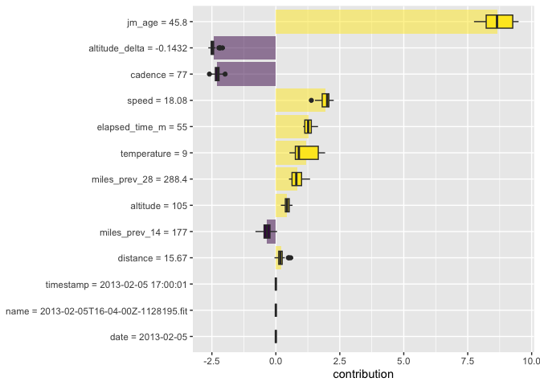
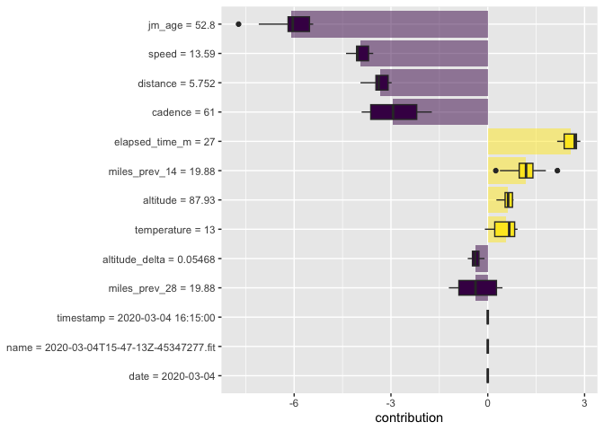
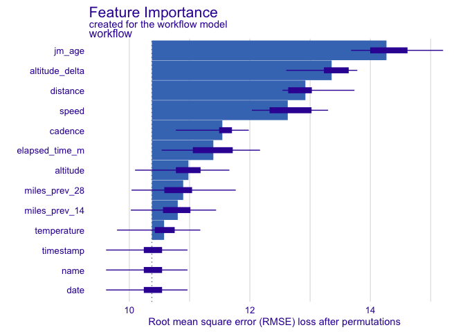
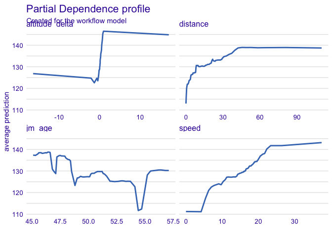

```r
library(tidyverse)
```

```
## ── Attaching core tidyverse packages ──────────────────────── tidyverse 2.0.0 ──
## ✔ dplyr     1.1.3     ✔ readr     2.1.4
## ✔ forcats   1.0.0     ✔ stringr   1.5.0
## ✔ ggplot2   3.4.4     ✔ tibble    3.2.1
## ✔ lubridate 1.9.2     ✔ tidyr     1.3.0
## ✔ purrr     1.0.2     
## ── Conflicts ────────────────────────────────────────── tidyverse_conflicts() ──
## ✖ dplyr::filter() masks stats::filter()
## ✖ dplyr::lag()    masks stats::lag()
## ℹ Use the conflicted package (<http://conflicted.r-lib.org/>) to force all conflicts to become errors
```

```r
library(tidymodels)
```

```
## ── Attaching packages ────────────────────────────────────── tidymodels 1.1.1 ──
## ✔ broom        1.0.5      ✔ rsample      1.2.0 
## ✔ dials        1.2.0      ✔ tune         1.2.1 
## ✔ infer        1.0.5      ✔ workflows    1.1.4 
## ✔ modeldata    1.2.0      ✔ workflowsets 1.0.1 
## ✔ parsnip      1.2.1      ✔ yardstick    1.3.1 
## ✔ recipes      1.0.10     
## ── Conflicts ───────────────────────────────────────── tidymodels_conflicts() ──
## ✖ scales::discard() masks purrr::discard()
## ✖ dplyr::filter()   masks stats::filter()
## ✖ recipes::fixed()  masks stringr::fixed()
## ✖ dplyr::lag()      masks stats::lag()
## ✖ yardstick::spec() masks readr::spec()
## ✖ recipes::step()   masks stats::step()
## • Search for functions across packages at https://www.tidymodels.org/find/
```

```r
tidymodels_prefer()
library(DALEXtra)
```

```
## Loading required package: DALEX
## Welcome to DALEX (version: 2.4.3).
## Find examples and detailed introduction at: http://ema.drwhy.ai/
## 
## 
## Attaching package: 'DALEX'
## 
## The following object is masked from 'package:dplyr':
## 
##     explain
```

```r
library(vip)
```


Load the data


```r
load("../Practice/TMWR_wrapup_all_race_results.Rdata")
```


## Exercise 1

Retrieve the best model and fit it to the _rides_train_ data set.


```r
all_results %>% 
   rank_results(rank_metric = "rsq") %>% 
  # filter(.metric == "rsq") %>% 
   select(wflow_id, model, .config, rsq = mean, rank)
```

```
## # A tibble: 192 × 5
##    wflow_id        model      .config                  rsq  rank
##    <chr>           <chr>      <chr>                  <dbl> <int>
##  1 simple_boosting boost_tree Preprocessor1_Model10 12.5       1
##  2 simple_boosting boost_tree Preprocessor1_Model10  0.519     1
##  3 simple_boosting boost_tree Preprocessor1_Model23 12.5       2
##  4 simple_boosting boost_tree Preprocessor1_Model23  0.518     2
##  5 simple_boosting boost_tree Preprocessor1_Model24 12.6       3
##  6 simple_boosting boost_tree Preprocessor1_Model24  0.514     3
##  7 simple_boosting boost_tree Preprocessor1_Model15 12.7       4
##  8 simple_boosting boost_tree Preprocessor1_Model15  0.512     4
##  9 simple_boosting boost_tree Preprocessor1_Model13 12.7       5
## 10 simple_boosting boost_tree Preprocessor1_Model13  0.508     5
## # ℹ 182 more rows
```


```r
best_results <- 
   all_results %>% 
   extract_workflow_set_result("simple_boosting") %>% 
   select_best(metric = "rmse")
best_results
```

```
## # A tibble: 1 × 7
##   trees min_n tree_depth learn_rate loss_reduction sample_size .config          
##   <int> <int>      <int>      <dbl>          <dbl>       <dbl> <chr>            
## 1   953    16          4     0.0131       8.60e-10       0.379 Preprocessor1_Mo…
```


```r
boosting_test_results <- 
   all_results %>% 
   extract_workflow("simple_boosting") %>% 
   finalize_workflow(best_results) %>% 
   last_fit(split = rides_split)
```


```r
model.fit.2 <-
  boosting_test_results %>% 
  extract_workflow("simple_boosting") %>%
  fit(data = rides_train)
```

## Exercise 2

Find local explanations for how the model predicts the 1000th and 10000th observation in the training data set.  Plot the results.

Prepare appropriate data and then create an explainer


```r
vip_features <- c("distance", "altitude", "speed", "cadence", "temperature", "miles_prev_14", "miles_prev_28", "altitude_delta", "jm_age", "elapsed_time_m","name","date","timestamp")

vip_train <- 
  rides_train %>% 
  select(all_of(vip_features))

explainer <- 
  explain_tidymodels(
    model.fit.2, 
    data = vip_train, 
    y = rides_train$heart_rate,
    verbose = FALSE
  )
```


```r
hr.1000 = vip_train[1000,]
hr.1000
```

```
## # A tibble: 1 × 13
##   distance altitude speed cadence temperature miles_prev_14 miles_prev_28
##      <dbl>    <dbl> <dbl>   <dbl>       <dbl>         <dbl>         <dbl>
## 1     15.7     105.  18.1      77           9          177.          288.
## # ℹ 6 more variables: altitude_delta <dbl>, jm_age <dbl>, elapsed_time_m <dbl>,
## #   name <chr>, date <date>, timestamp <dttm>
```


```r
hr.10000 = vip_train[10000,]
hr.10000
```

```
## # A tibble: 1 × 13
##   distance altitude speed cadence temperature miles_prev_14 miles_prev_28
##      <dbl>    <dbl> <dbl>   <dbl>       <dbl>         <dbl>         <dbl>
## 1     5.75     87.9  13.6      61          13          19.9          19.9
## # ℹ 6 more variables: altitude_delta <dbl>, jm_age <dbl>, elapsed_time_m <dbl>,
## #   name <chr>, date <date>, timestamp <dttm>
```
jm_age is most important, positive


```r
mod_breakdown.1000 <- predict_parts(explainer = explainer, new_observation = hr.1000)
mod_breakdown.1000
```

```
##                                                   contribution
## workflow: intercept                                    130.505
## workflow: jm_age = 45.8                                  7.793
## workflow: altitude_delta = -0.14316392269148            -2.518
## workflow: cadence = 77                                  -2.453
## workflow: speed = 18.0811560486757                       2.325
## workflow: elapsed_time_m = 55                            1.046
## workflow: miles_prev_28 = 288.3654209417                 1.177
## workflow: temperature = 9                                1.651
## workflow: altitude = 104.98687664042                     0.421
## workflow: miles_prev_14 = 176.983503837588              -0.179
## workflow: distance = 15.6672035313768                    0.154
## workflow: name = 2013-02-05T16-04-00Z-1128195.fit        0.000
## workflow: date = 2013-02-05                              0.000
## workflow: timestamp = 2013-02-05 17:00:01                0.000
## workflow: prediction                                   139.922
```

jm.age is most important but in opposite direction (negative)


```r
mod_breakdown.10000 <- predict_parts(explainer = explainer, new_observation = hr.10000)
mod_breakdown.10000
```

```
##                                                    contribution
## workflow: intercept                                     130.505
## workflow: jm_age = 52.8                                  -5.411
## workflow: cadence = 61                                   -2.403
## workflow: speed = 13.5916249105225                       -4.135
## workflow: distance = 5.7519212797264                     -3.038
## workflow: elapsed_time_m = 27                             2.393
## workflow: miles_prev_14 = 19.8846735067207                0.855
## workflow: altitude = 87.9265091863516                     0.383
## workflow: altitude_delta = 0.0546806649168853            -0.415
## workflow: miles_prev_28 = 19.8846735067207               -1.205
## workflow: temperature = 13                                0.833
## workflow: name = 2020-03-04T15-47-13Z-45347277.fit        0.000
## workflow: date = 2020-03-04                               0.000
## workflow: timestamp = 2020-03-04 16:15:00                 0.000
## workflow: prediction                                    118.363
```


```r
set.seed(1801)
ride_1000 <- 
  predict_parts(
    explainer = explainer, new_observation = hr.1000, 
    type = "shap",
    B = 20
  )
```


```r
ride_1000 %>%
  group_by(variable) %>%
  mutate(mean_val = mean(contribution)) %>%
  ungroup() %>%
  mutate(variable = fct_reorder(variable, abs(mean_val))) %>%
  ggplot(aes(contribution, variable, fill = mean_val > 0)) +
  geom_col(data = ~distinct(., variable, mean_val), 
           aes(mean_val, variable), 
           alpha = 0.5) +
  geom_boxplot(width = 0.5) +
  theme(legend.position = "none") +
  scale_fill_viridis_d() +
  labs(y = NULL)
```

<!-- -->


```r
set.seed(1801)
ride_10000 <- 
  predict_parts(
    explainer = explainer, new_observation = hr.10000, 
    type = "shap",
    B = 20
  )
```


```r
ride_10000 %>%
  group_by(variable) %>%
  mutate(mean_val = mean(contribution)) %>%
  ungroup() %>%
  mutate(variable = fct_reorder(variable, abs(mean_val))) %>%
  ggplot(aes(contribution, variable, fill = mean_val > 0)) +
  geom_col(data = ~distinct(., variable, mean_val), 
           aes(mean_val, variable), 
           alpha = 0.5) +
  geom_boxplot(width = 0.5) +
  theme(legend.position = "none") +
  scale_fill_viridis_d() +
  labs(y = NULL)
```

<!-- -->


## Exercise 3

Determine global variable importance and plot the results. Feel free to use the default plotting methods instead of the one in the book. Explain the x-axis.
 

```r
set.seed(1803)
vip_global <- model_parts(explainer, loss_function = loss_root_mean_square)
```

The x-axis tells us how much worse the RMSE is when that variable is removed from the model.


```r
plot(vip_global)
```

<!-- -->


## Exercise 4

Create a partial dependence profile for the four most important variables from exercise 3.  Plot (again using the default instead of the code from the book is fine).  Does this help explain why the boosting tree model is better than linear regression?


```r
set.seed(1806)
pdp_liv <- model_profile(explainer, N = 1000, 
                         variables = c("jm_age","altitude_delta","distance","speed"))
```


```r
plot(pdp_liv)
```

<!-- -->

