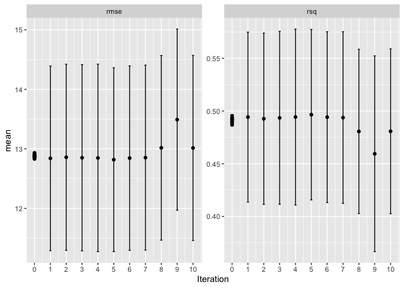

We will practice our skills from chapters 11-15 on a new data set.  (We will cover the remaining chapters in the next set of exercises.)

The data set is a sampling of my cycling data from over the last 12 years.  I want to know how well we can predict heart rate from other information in the data sheet.  The original data had a resolution of 1 observation per second for each of the 1,000 or so rides in the data set.  I've reduced this to 1 observation per 5 minutes so that it can be fit in a somewhat reasonable time.

The data set is [ride_data_smaller.csv.gz](https://github.com/jnmaloof/tidy-models/blob/main/ride_data_smaller.csv.gz), which should be attached to the message where you received this file, but if not you can download at the link.

Objectives are to review/practice

* resampling
* recipes
* workflows
* workflow sets
* tuning

They way I have structured the exercises, we build up from from workflows to a small workflow set, to a large one.  Hopefully this helps with the review.


```r
library(tidymodels)
```

```
## ── Attaching packages ────────────────────────────────────── tidymodels 1.1.1 ──
```

```
## ✔ broom        1.0.5      ✔ recipes      1.0.10
## ✔ dials        1.2.0      ✔ rsample      1.2.0 
## ✔ dplyr        1.1.3      ✔ tibble       3.2.1 
## ✔ ggplot2      3.4.4      ✔ tidyr        1.3.0 
## ✔ infer        1.0.5      ✔ tune         1.2.1 
## ✔ modeldata    1.2.0      ✔ workflows    1.1.4 
## ✔ parsnip      1.2.1      ✔ workflowsets 1.0.1 
## ✔ purrr        1.0.2      ✔ yardstick    1.3.1
```

```
## ── Conflicts ───────────────────────────────────────── tidymodels_conflicts() ──
## ✖ purrr::discard() masks scales::discard()
## ✖ dplyr::filter()  masks stats::filter()
## ✖ dplyr::lag()     masks stats::lag()
## ✖ recipes::step()  masks stats::step()
## • Learn how to get started at https://www.tidymodels.org/start/
```

```r
tidymodels_prefer()
library(GGally)
```

```
## Registered S3 method overwritten by 'GGally':
##   method from   
##   +.gg   ggplot2
```

```r
library(corrplot)
```

```
## corrplot 0.92 loaded
```

## Exercise 1.  Training/test/cross validation split

Load the data.  Maybe make some diagnostic plaints (hint: ggpairs from GGally is one nice way to do it; hint: you will probably want to subsamble the data before using ggpairs).


```r
dat = read.csv("ride_data_smaller.csv.gz")
head(dat)
```

```
##                              name            timestamp distance  altitude
## 1 2012-05-26T13-42-00Z-696102.fit 2012-05-26T13:45:00Z 0.352827  265.0919
## 2 2012-05-26T13-42-00Z-696102.fit 2012-05-26T13:50:00Z 1.015557  503.2808
## 3 2012-05-26T13-42-00Z-696102.fit 2012-05-26T13:55:01Z 1.737559  713.2546
## 4 2012-05-26T13-42-00Z-696102.fit 2012-05-26T14:00:02Z 2.562199  931.7585
## 5 2012-05-26T13-42-00Z-696102.fit 2012-05-26T14:05:00Z 3.420555 1088.5827
## 6 2012-05-26T13-42-00Z-696102.fit 2012-05-26T14:10:01Z 4.245662 1222.4409
##       speed heart_rate cadence temperature       date miles_prev_14
## 1  8.283375        137      65          20 2012-05-26      111.6315
## 2  6.364084        157      58          16 2012-05-26      111.6315
## 3 10.815587        147      73          14 2012-05-26      111.6315
## 4  8.046260        140      55          12 2012-05-26      111.6315
## 5 11.142180        146      76          11 2012-05-26      111.6315
## 6  7.176092        146      63          11 2012-05-26      111.6315
##   miles_prev_28 altitude_delta jm_age elapsed_time_m
## 1      111.6315      0.5640742   45.1            0.9
## 2      111.6315      0.8858268   45.1            6.0
## 3      111.6315      0.5996018   45.1           11.0
## 4      111.6315      0.4974177   45.1           16.0
## 5      111.6315      0.5577428   45.1           21.0
## 6      111.6315      0.6238974   45.1           26.0
```

Making some plots


```r
ggpairs(data = dat, columns = 3:6, progress = FALSE)
```

<!-- -->

miles_prev_14 and miles_prev_28 are highly correlated (r = 0.81)


```r
cor.mat.all = cor(dat[,c(3:8,10:14)],use = "pairwise") 
corrplot(cor.mat.all, method="number",tl.col = "black", bg = "gray70",is.corr = TRUE,
         col.lim = c(-1,1), col = COL2('BrBG', 200), addgrid.col = "black")
```

<!-- -->

```r
ggplot(data = dat, aes(heart_rate)) +
  geom_histogram()
```

```
## `stat_bin()` using `bins = 30`. Pick better value with `binwidth`.
```

<!-- -->

Set.seed to 707 and make a 75/25 training/test split.  Make a v=5 cross validation set.  Should you be grouping by anything when you make these splits?

Would we maybe group by date?


```r
set.seed(707)
hr_split = group_initial_split(dat, group = name)
hr_train = training(hr_split)
hr_test = testing(hr_split)
hr_folds <- group_vfold_cv(hr_train, group = name, v = 5)
```

## Exercise 2. Create some recipes

Create a recipe `rec_simple` that specifies your outcome variable `heart_rate` and predictors (everything but `name`, `date`, and `timestamp`)


```r
rec_simple <- 
  recipe(heart_rate ~ distance + altitude + speed + cadence + temperature + miles_prev_14 + miles_prev_28 + altitude_delta + jm_age + elapsed_time_m, data = hr_train)
rec_simple
```

```
## 
```

```
## ── Recipe ──────────────────────────────────────────────────────────────────────
```

```
## 
```

```
## ── Inputs
```

```
## Number of variables by role
```

```
## outcome:    1
## predictor: 10
```

Create a recipe `rec_normal` that normalizes (centers and scales) all predictors


```r
rec_normal <- 
  recipe(heart_rate ~ distance + altitude + speed + cadence + temperature + miles_prev_14 + miles_prev_28 + altitude_delta + jm_age + elapsed_time_m, data = hr_train) %>%
  step_normalize(all_predictors())
rec_normal
```

```
## 
```

```
## ── Recipe ──────────────────────────────────────────────────────────────────────
```

```
## 
```

```
## ── Inputs
```

```
## Number of variables by role
```

```
## outcome:    1
## predictor: 10
```

```
## 
```

```
## ── Operations
```

```
## • Centering and scaling for: all_predictors()
```

Check to make sure your recipes are working as expected


```r
rec_simple %>% prep() %>% bake(hr_train) %>% head()
```

```
## # A tibble: 6 × 11
##   distance altitude speed cadence temperature miles_prev_14 miles_prev_28
##      <dbl>    <dbl> <dbl>   <int>       <int>         <dbl>         <dbl>
## 1     7.00     85.3  5.80      58          25          57.9          169.
## 2     7.62    314.   9.70      80          26          57.9          169.
## 3     8.43    509.   6.98      71          26          57.9          169.
## 4     9.15    701.   8.16      72          28          57.9          169.
## 5     9.73    912.   9.78      81          28          57.9          169.
## 6    11.0     913.  13.9       78          27          57.9          169.
## # ℹ 4 more variables: altitude_delta <dbl>, jm_age <dbl>, elapsed_time_m <dbl>,
## #   heart_rate <int>
```


```r
rec_normal %>% prep() %>% bake(hr_train) %>% summary()
```

```
##     distance          altitude           speed            cadence       
##  Min.   :-1.1616   Min.   :-0.4122   Min.   :-3.9765   Min.   :-3.4567  
##  1st Qu.:-0.6973   1st Qu.:-0.2957   1st Qu.:-0.3666   1st Qu.:-0.1534  
##  Median :-0.2018   Median :-0.2267   Median : 0.1375   Median : 0.2595  
##  Mean   : 0.0000   Mean   : 0.0000   Mean   : 0.0000   Mean   : 0.0000  
##  3rd Qu.: 0.3913   3rd Qu.:-0.1275   3rd Qu.: 0.5494   3rd Qu.: 0.5806  
##  Max.   : 5.9387   Max.   :15.4013   Max.   : 5.2656   Max.   : 2.3699  
##   temperature      miles_prev_14      miles_prev_28       altitude_delta      
##  Min.   :-2.7289   Min.   :-1.82147   Min.   :-2.104147   Min.   :-24.699660  
##  1st Qu.:-0.7252   1st Qu.:-0.72021   1st Qu.:-0.735043   1st Qu.: -0.055021  
##  Median :-0.1086   Median :-0.01862   Median :-0.009229   Median : -0.005633  
##  Mean   : 0.0000   Mean   : 0.00000   Mean   : 0.000000   Mean   :  0.000000  
##  3rd Qu.: 0.6621   3rd Qu.: 0.67554   3rd Qu.: 0.757002   3rd Qu.:  0.076681  
##  Max.   : 4.3613   Max.   : 2.82696   Max.   : 2.516224   Max.   : 25.676156  
##      jm_age        elapsed_time_m      heart_rate   
##  Min.   :-1.5105   Min.   :-0.6367   Min.   : 30.0  
##  1st Qu.:-0.8067   1st Qu.:-0.4087   1st Qu.:120.0  
##  Median :-0.1640   Median :-0.1655   Median :131.0  
##  Mean   : 0.0000   Mean   : 0.0000   Mean   :130.5  
##  3rd Qu.: 0.7846   3rd Qu.: 0.1121   3rd Qu.:142.0  
##  Max.   : 2.1618   Max.   :22.8836   Max.   :189.0
```

## Exercise 3 Create two model specifications

Create a model specification `spec_lm_pen` for a penalized regression (hint see `?details_linear_reg_glmnet` for help).  Set the 2 hyperparameters for tuning.

Create a second model specification `spec_rf` for a random forest regression using ranger (see `?details_rand_forest_ranger`).  Set mtry and min_n for tuning


```r
spec_lm_pen <- linear_reg(penalty = tune(), mixture = tune(), engine = "glmnet")
spec_lm_pen
```

```
## Linear Regression Model Specification (regression)
## 
## Main Arguments:
##   penalty = tune()
##   mixture = tune()
## 
## Computational engine: glmnet
```


```r
spec_rf <- rand_forest(mtry=tune(), min_n=tune(), mode = "regression", engine = "ranger")
spec_rf
```

```
## Random Forest Model Specification (regression)
## 
## Main Arguments:
##   mtry = tune()
##   min_n = tune()
## 
## Computational engine: ranger
```

## Exercise 4, Workflow + grid tune

Create a workflow that includes the `rec_simple` recipe and the `spec_lm_pen` model specification.   (Note that while penalized regression is best with normalized predictors, `glmnet` does this conversion by default, do we can just use the simple recipe for it).


```r
lm_pen_wkflow <-
  workflow() %>%
  add_recipe(rec_simple) %>%
  add_model(spec_lm_pen) 
lm_pen_wkflow
```

```
## ══ Workflow ════════════════════════════════════════════════════════════════════
## Preprocessor: Recipe
## Model: linear_reg()
## 
## ── Preprocessor ────────────────────────────────────────────────────────────────
## 0 Recipe Steps
## 
## ── Model ───────────────────────────────────────────────────────────────────────
## Linear Regression Model Specification (regression)
## 
## Main Arguments:
##   penalty = tune()
##   mixture = tune()
## 
## Computational engine: glmnet
```

Use the v-fold resampling to fit models and tune the hyper parameters using a grid search with a grid size of 10 (the default).  You'll want to set up parallel processing for this.  How long does it take?

I recommend leaving `save_pred = FALSE` and `save_workflow = FALSE` (these are the defaults).  This is contrary to some of the scripts in the book, but I think Rstudio stays happier with these settings.


```r
parallel::detectCores(logical = FALSE)
```

```
## [1] 8
```


```r
library(doMC)
```

```
## Loading required package: foreach
```

```
## 
## Attaching package: 'foreach'
```

```
## The following objects are masked from 'package:purrr':
## 
##     accumulate, when
```

```
## Loading required package: iterators
```

```
## Loading required package: parallel
```

```r
registerDoMC(cores = 4)
```

What is the difference between grid = 10 and grid_random(size = 10)


```r
system.time(lm_pen_tune <-
  lm_pen_wkflow %>%
  tune_grid(resamples = hr_folds,
            grid = 10))
```

```
##    user  system elapsed 
##   1.543   0.333   0.727
```

```r
 lm_pen_tune 
```

```
## # Tuning results
## # Group 5-fold cross-validation 
## # A tibble: 5 × 4
##   splits               id        .metrics          .notes          
##   <list>               <chr>     <list>            <list>          
## 1 <split [10581/2687]> Resample1 <tibble [20 × 6]> <tibble [0 × 3]>
## 2 <split [10425/2843]> Resample2 <tibble [20 × 6]> <tibble [0 × 3]>
## 3 <split [10501/2767]> Resample3 <tibble [20 × 6]> <tibble [0 × 3]>
## 4 <split [10818/2450]> Resample4 <tibble [20 × 6]> <tibble [0 × 3]>
## 5 <split [10747/2521]> Resample5 <tibble [20 × 6]> <tibble [0 × 3]>
```


Plot the results and also print a table of the best hyperparameters


```r
autoplot(lm_pen_tune)
```

<!-- -->


```r
show_best(lm_pen_tune)
```

```
## Warning in show_best(lm_pen_tune): No value of `metric` was given; "rmse" will
## be used.
```

```
## # A tibble: 5 × 8
##    penalty mixture .metric .estimator  mean     n std_err .config              
##      <dbl>   <dbl> <chr>   <chr>      <dbl> <int>   <dbl> <chr>                
## 1 3.83e- 1  0.0734 rmse    standard    16.5     5   0.595 Preprocessor1_Model01
## 2 1.05e- 2  0.431  rmse    standard    18.5     5   2.45  Preprocessor1_Model05
## 3 1.95e- 4  0.146  rmse    standard    18.6     5   2.50  Preprocessor1_Model02
## 4 9.50e-10  0.993  rmse    standard    18.6     5   2.50  Preprocessor1_Model10
## 5 2.14e- 8  0.290  rmse    standard    18.6     5   2.50  Preprocessor1_Model03
```


## Exercise 5: Racing

Repeat Ex 4 but use a grid size of 25 and racing to reduced the amount of time (how much time does it take?)


I recommend leaving `save_pred = FALSE` and `save_workflow = FALSE` (these are the defaults).  This is contrary to some of the scripts in the book, but I think Rstudio stays happier with these settings.


```r
library(finetune)
```


```r
race_ctrl = control_race(save_pred = FALSE, parallel_over = "everything")
system.time(lm_pen_tune_25 <-
  lm_pen_wkflow %>%
  tune_race_anova(resamples = hr_folds,
                  grid = 25, control = race_ctrl))
```

```
##    user  system elapsed 
##   4.523   0.832   1.873
```

```r
 lm_pen_tune_25 
```

```
## # Tuning results
## # Group 5-fold cross-validation 
## # A tibble: 5 × 5
##   splits               id        .order .metrics          .notes          
##   <list>               <chr>      <int> <list>            <list>          
## 1 <split [10425/2843]> Resample2      3 <tibble [50 × 6]> <tibble [0 × 3]>
## 2 <split [10818/2450]> Resample4      2 <tibble [50 × 6]> <tibble [0 × 3]>
## 3 <split [10747/2521]> Resample5      1 <tibble [50 × 6]> <tibble [0 × 3]>
## 4 <split [10581/2687]> Resample1      4 <tibble [50 × 6]> <tibble [0 × 3]>
## 5 <split [10501/2767]> Resample3      5 <tibble [6 × 6]>  <tibble [0 × 3]>
```


Plot the results and also print a table of the best models


```r
autoplot(lm_pen_tune_25)
```

<!-- -->


```r
show_best(lm_pen_tune_25)
```

```
## Warning in show_best(lm_pen_tune_25): No value of `metric` was given; "rmse"
## will be used.
```

```
## # A tibble: 3 × 8
##   penalty mixture .metric .estimator  mean     n std_err .config              
##     <dbl>   <dbl> <chr>   <chr>      <dbl> <int>   <dbl> <chr>                
## 1  0.511    0.886 rmse    standard    15.9     5   0.520 Preprocessor1_Model22
## 2  0.237    0.394 rmse    standard    16.4     5   0.548 Preprocessor1_Model10
## 3  0.0743   0.622 rmse    standard    17.5     5   1.49  Preprocessor1_Model16
```

## Exercise 6 workflow set, tuning

Now create a workflow set that uses the `rec_simple` recipe and both of the model specifications that you created earlier. Tune them using racing.  Plot the results and print summaries of the best.  Did the penalized regression or the random forests provide a better fit?  


```r
preproc <- list(simple = rec_simple)
both_wkflow <-
  workflow_set(preproc, models = list(lm_pen = spec_lm_pen, rf = spec_rf), cross = TRUE)
both_wkflow
```

```
## # A workflow set/tibble: 2 × 4
##   wflow_id      info             option    result    
##   <chr>         <list>           <list>    <list>    
## 1 simple_lm_pen <tibble [1 × 4]> <opts[0]> <list [0]>
## 2 simple_rf     <tibble [1 × 4]> <opts[0]> <list [0]>
```


```r
both_wkflow %>% extract_workflow(id = "simple_lm_pen")
```

```
## ══ Workflow ════════════════════════════════════════════════════════════════════
## Preprocessor: Recipe
## Model: linear_reg()
## 
## ── Preprocessor ────────────────────────────────────────────────────────────────
## 0 Recipe Steps
## 
## ── Model ───────────────────────────────────────────────────────────────────────
## Linear Regression Model Specification (regression)
## 
## Main Arguments:
##   penalty = tune()
##   mixture = tune()
## 
## Computational engine: glmnet
```

```r
both_wkflow %>% extract_workflow(id = "simple_rf")
```

```
## ══ Workflow ════════════════════════════════════════════════════════════════════
## Preprocessor: Recipe
## Model: rand_forest()
## 
## ── Preprocessor ────────────────────────────────────────────────────────────────
## 0 Recipe Steps
## 
## ── Model ───────────────────────────────────────────────────────────────────────
## Random Forest Model Specification (regression)
## 
## Main Arguments:
##   mtry = tune()
##   min_n = tune()
## 
## Computational engine: ranger
```


```r
system.time(both_tune_racing <-
  both_wkflow %>%
  workflow_map("tune_race_anova",
               resamples = hr_folds,
               grid = 25,
               control=race_ctrl))
```

```
## i Creating pre-processing data to finalize unknown parameter: mtry
```

```
##    user  system elapsed 
## 664.087  11.501 175.542
```

```r
 both_tune_racing 
```

```
## # A workflow set/tibble: 2 × 4
##   wflow_id      info             option    result   
##   <chr>         <list>           <list>    <list>   
## 1 simple_lm_pen <tibble [1 × 4]> <opts[3]> <race[+]>
## 2 simple_rf     <tibble [1 × 4]> <opts[3]> <race[+]>
```

(This takes about 2.5 minutes on my mac with 8 cores)


```r
autoplot(
   both_tune_racing,
   rank_metric = "rmse",  
   metric = "rmse",       
   select_best = TRUE)
```

<!-- -->


```r
matched_results <- 
   rank_results(both_tune_racing, select_best = TRUE)
matched_results
```

```
## # A tibble: 4 × 9
##   wflow_id      .config    .metric   mean std_err     n preprocessor model  rank
##   <chr>         <chr>      <chr>    <dbl>   <dbl> <int> <chr>        <chr> <int>
## 1 simple_rf     Preproces… rmse    12.8    0.602      5 recipe       rand…     1
## 2 simple_rf     Preproces… rsq      0.496  0.0316     5 recipe       rand…     1
## 3 simple_lm_pen Preproces… rmse    15.9    0.516      5 recipe       line…     2
## 4 simple_lm_pen Preproces… rsq      0.229  0.0280     5 recipe       line…     2
```


## Exercise 7
Can you figure out how to extract and plot/summarize the data for just the random forest spec?  (create output analagous to what you did for Exercise 5)


```r
rf_only = both_tune_racing %>%
  extract_workflow_set_result(id = "simple_rf")
rf_only
```

```
## # Tuning results
## # Group 5-fold cross-validation 
## # A tibble: 5 × 5
##   splits               id        .order .metrics          .notes          
##   <list>               <chr>      <int> <list>            <list>          
## 1 <split [10581/2687]> Resample1      3 <tibble [50 × 6]> <tibble [0 × 3]>
## 2 <split [10818/2450]> Resample4      2 <tibble [50 × 6]> <tibble [0 × 3]>
## 3 <split [10747/2521]> Resample5      1 <tibble [50 × 6]> <tibble [0 × 3]>
## 4 <split [10501/2767]> Resample3      4 <tibble [36 × 6]> <tibble [0 × 3]>
## 5 <split [10425/2843]> Resample2      5 <tibble [28 × 6]> <tibble [0 × 3]>
```


```r
autoplot(rf_only)
```

<!-- -->


```r
show_best(rf_only)
```

```
## Warning in show_best(rf_only): No value of `metric` was given; "rmse" will be
## used.
```

```
## # A tibble: 5 × 8
##    mtry min_n .metric .estimator  mean     n std_err .config              
##   <int> <int> <chr>   <chr>      <dbl> <int>   <dbl> <chr>                
## 1     4    34 rmse    standard    12.8     5   0.602 Preprocessor1_Model25
## 2     5    22 rmse    standard    12.9     5   0.601 Preprocessor1_Model09
## 3     6    31 rmse    standard    12.9     5   0.600 Preprocessor1_Model15
## 4     5    13 rmse    standard    12.9     5   0.594 Preprocessor1_Model14
## 5     3    16 rmse    standard    12.9     5   0.604 Preprocessor1_Model02
```

## Exercise 8

Using the results from Exercise 6 as a starting point, use a Bayesian tune to see if you can further improve the random forest fit.

Hint: you will neeed to use `extract_parameter_set_dials(spec_rf) %>%
  finalize(rides_train)`  to create a parameter set to feed into the Bayesian tuning function
  
Remove doing this from the previous model and just extract from raw set-up  
  

```r
bayes_param <- 
  extract_parameter_set_dials(spec_rf) %>%
  finalize(hr_train)
bayes_param
```

```
## Collection of 2 parameters for tuning
## 
##  identifier  type    object
##        mtry  mtry nparam[+]
##       min_n min_n nparam[+]
```

```r
rf_wkflow = both_wkflow %>% extract_workflow(id = "simple_rf")
rf_wkflow
```

```
## ══ Workflow ════════════════════════════════════════════════════════════════════
## Preprocessor: Recipe
## Model: rand_forest()
## 
## ── Preprocessor ────────────────────────────────────────────────────────────────
## 0 Recipe Steps
## 
## ── Model ───────────────────────────────────────────────────────────────────────
## Random Forest Model Specification (regression)
## 
## Main Arguments:
##   mtry = tune()
##   min_n = tune()
## 
## Computational engine: ranger
```


```r
bayes_tune <-
  rf_wkflow %>%
  tune_bayes(resamples = hr_folds,
             initial = rf_only,
             param_info = bayes_param)
bayes_tune
```

```
## # Tuning results
## # Group 5-fold cross-validation 
## # A tibble: 55 × 5
##    splits               id        .metrics          .notes           .iter
##    <list>               <chr>     <list>            <list>           <int>
##  1 <split [10581/2687]> Resample1 <tibble [28 × 6]> <tibble [0 × 3]>     0
##  2 <split [10818/2450]> Resample4 <tibble [28 × 6]> <tibble [0 × 3]>     0
##  3 <split [10747/2521]> Resample5 <tibble [28 × 6]> <tibble [0 × 3]>     0
##  4 <split [10501/2767]> Resample3 <tibble [28 × 6]> <tibble [0 × 3]>     0
##  5 <split [10425/2843]> Resample2 <tibble [28 × 6]> <tibble [0 × 3]>     0
##  6 <split [10581/2687]> Resample1 <tibble [2 × 6]>  <tibble [0 × 3]>     1
##  7 <split [10425/2843]> Resample2 <tibble [2 × 6]>  <tibble [0 × 3]>     1
##  8 <split [10501/2767]> Resample3 <tibble [2 × 6]>  <tibble [0 × 3]>     1
##  9 <split [10818/2450]> Resample4 <tibble [2 × 6]>  <tibble [0 × 3]>     1
## 10 <split [10747/2521]> Resample5 <tibble [2 × 6]>  <tibble [0 × 3]>     1
## # ℹ 45 more rows
## 
## There were issues with some computations:
## 
##   - Warning(s) x5: 13 columns were requested but there were 10 predictors in the dat...
## 
## Run `show_notes(.Last.tune.result)` for more information.
```


```r
show_best(bayes_tune)
```

```
## Warning in show_best(bayes_tune): No value of `metric` was given; "rmse" will
## be used.
```

```
## # A tibble: 5 × 9
##    mtry min_n .metric .estimator  mean     n std_err .config               .iter
##   <int> <int> <chr>   <chr>      <dbl> <int>   <dbl> <chr>                 <int>
## 1     4    31 rmse    standard    12.8     5   0.601 Iter5                     5
## 2     4    34 rmse    standard    12.8     5   0.602 Preprocessor1_Model25     0
## 3     5    39 rmse    standard    12.8     5   0.603 Iter1                     1
## 4     4    29 rmse    standard    12.8     5   0.602 Iter6                     6
## 5     4    40 rmse    standard    12.8     5   0.612 Iter4                     4
```

```r
autoplot(bayes_tune, type = "performance")
```

<!-- -->

```r
autoplot(bayes_tune, type = "parameters")
```

<!-- -->

## Exercise 9
Now that we have reviewed how this works, fit as many extra models as you would like to come up with the best predictive fit that you can (using racing).  See Chapter 15 for a bunch of possibilities.  Do this is a workflow set (or several workflow sets).  If you use multiple workflow sets you can combine them in the end with `bind_rows`.  Create a table of best models and also plot the metric or metrics from the best models.  (See chapter 15.4)

I did all models from Chapter 15, used racing, used a grid size of 25, and it took a bit under 4 hours

__SAVE THE RESULTS AS AN .Rdata OBJECT FOR FUTURE USE!!__


## Exercise 10

Extract the best model from exercise 9 (with its tuned parameters), fit to the test set, check metrics, and plot observed versus predicted (see Chapter 15.5)
