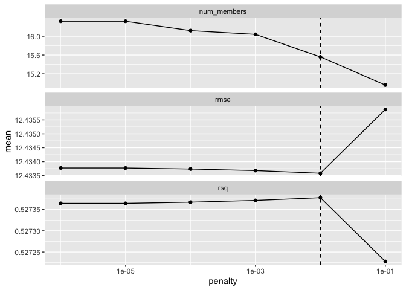
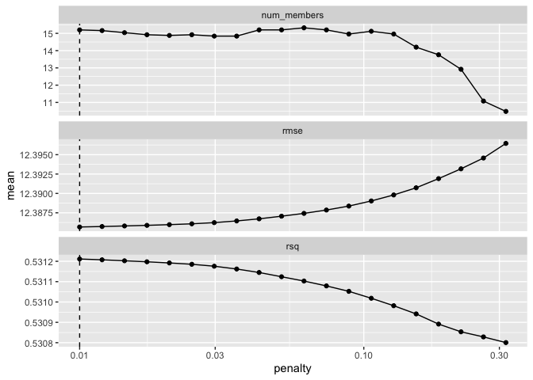
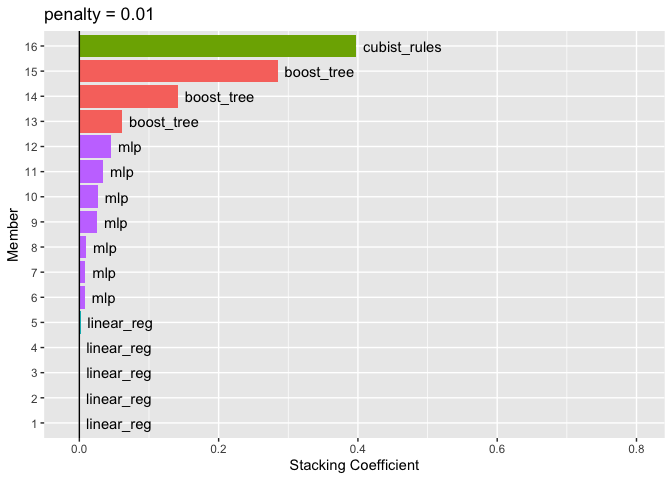

```r
library(tidyverse)
```

```
## ── Attaching core tidyverse packages ──────────────────────── tidyverse 2.0.0 ──
## ✔ dplyr     1.1.3     ✔ readr     2.1.4
## ✔ forcats   1.0.0     ✔ stringr   1.5.0
## ✔ ggplot2   3.4.4     ✔ tibble    3.2.1
## ✔ lubridate 1.9.2     ✔ tidyr     1.3.0
## ✔ purrr     1.0.2     
## ── Conflicts ────────────────────────────────────────── tidyverse_conflicts() ──
## ✖ dplyr::filter() masks stats::filter()
## ✖ dplyr::lag()    masks stats::lag()
## ℹ Use the conflicted package (<http://conflicted.r-lib.org/>) to force all conflicts to become errors
```

```r
library(tidymodels)
```

```
## ── Attaching packages ────────────────────────────────────── tidymodels 1.1.1 ──
## ✔ broom        1.0.5      ✔ rsample      1.2.0 
## ✔ dials        1.2.0      ✔ tune         1.2.1 
## ✔ infer        1.0.5      ✔ workflows    1.1.4 
## ✔ modeldata    1.2.0      ✔ workflowsets 1.0.1 
## ✔ parsnip      1.2.1      ✔ yardstick    1.3.1 
## ✔ recipes      1.0.10     
## ── Conflicts ───────────────────────────────────────── tidymodels_conflicts() ──
## ✖ scales::discard() masks purrr::discard()
## ✖ dplyr::filter()   masks stats::filter()
## ✖ recipes::fixed()  masks stringr::fixed()
## ✖ dplyr::lag()      masks stats::lag()
## ✖ yardstick::spec() masks readr::spec()
## ✖ recipes::step()   masks stats::step()
## • Use suppressPackageStartupMessages() to eliminate package startup messages
```

```r
tidymodels_prefer()
library(stacks)
library(rules)
library(baguette)
library(finetune)
```

Load the data


```r
load("../Practice/TMWR_wrapup_all_race_results_save.Rdata")
```

Create empty data stack then add models


```r
hr_stack = stacks() %>%
  add_candidates(all_race_results_save)
hr_stack
```

```
## # A data stack with 12 model definitions and 96 candidate members:
## #   MARS: 2 model configurations
## #   CART: 2 model configurations
## #   CART_bagged: 1 model configuration
## #   RF: 15 model configurations
## #   boosting: 6 model configurations
## #   Cubist: 1 model configuration
## #   SVM_radial: 1 model configuration
## #   SVM_poly: 22 model configurations
## #   KNN: 2 model configurations
## #   neural_network: 21 model configurations
## #   full_quad_linear_reg: 21 model configurations
## #   full_quad_KNN: 2 model configurations
## # Outcome: heart_rate (numeric)
```

Blend the predictions


```r
set.seed(2001)
ens <- blend_predictions(hr_stack)
```


```r
autoplot(ens)
```

<!-- -->


```r
set.seed(2002)
ens <- blend_predictions(hr_stack, penalty = 10^seq(-2, -0.5, length = 20))
```


```r
autoplot(ens)
```

<!-- -->


```r
ens
```

```
## ── A stacked ensemble model ─────────────────────────────────────
## 
## 
## Out of 96 possible candidate members, the ensemble retained 16.
## 
## Penalty: 0.01.
## 
## Mixture: 1.
## 
## 
## The 10 highest weighted members are:
```

```
## # A tibble: 10 × 3
##    member              type          weight
##    <chr>               <chr>          <dbl>
##  1 Cubist_1_13         cubist_rules 0.398  
##  2 boosting_1_24       boost_tree   0.285  
##  3 boosting_1_23       boost_tree   0.141  
##  4 boosting_1_10       boost_tree   0.0618 
##  5 neural_network_1_12 mlp          0.0457 
##  6 neural_network_1_22 mlp          0.0345 
##  7 neural_network_1_18 mlp          0.0266 
##  8 neural_network_1_02 mlp          0.0256 
##  9 neural_network_1_05 mlp          0.00990
## 10 neural_network_1_15 mlp          0.00877
```

```
## 
## Members have not yet been fitted with `fit_members()`.
```


```r
autoplot(ens, "weights") +
  geom_text(aes(x = weight + 0.01, label = model), hjust = 0) + 
  theme(legend.position = "none") +
  lims(x = c(-0.01, 0.8))
```

<!-- -->

Fit the member models


```r
ens <- fit_members(ens)
```

Test set results


```r
reg_metrics <- metric_set(rmse, rsq)
ens_test_pred <- 
  predict(ens, rides_test) %>% 
  bind_cols(rides_test)

ens_test_pred %>% 
  reg_metrics(heart_rate, .pred)
```

```
## # A tibble: 2 × 3
##   .metric .estimator .estimate
##   <chr>   <chr>          <dbl>
## 1 rmse    standard      12.4  
## 2 rsq     standard       0.484
```

